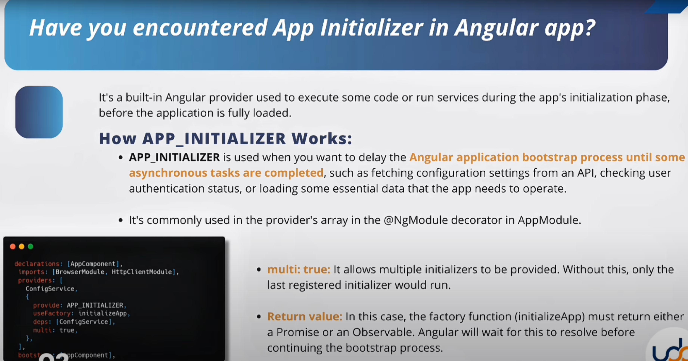
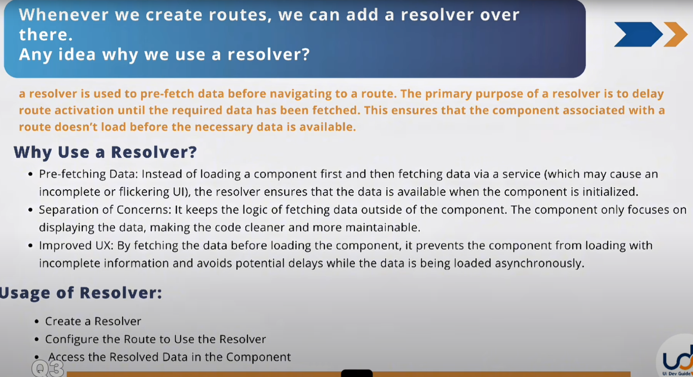
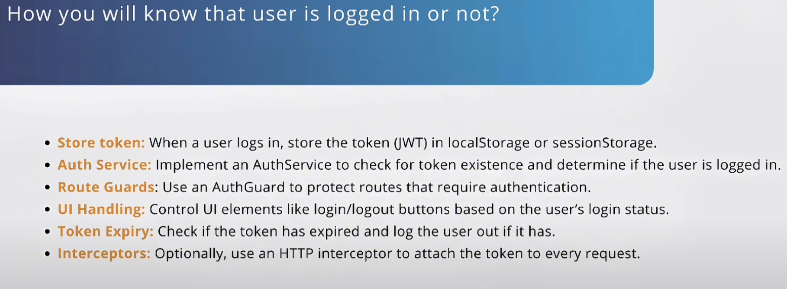
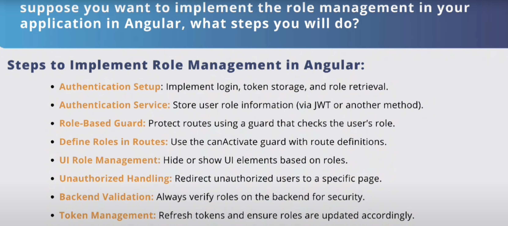

## ***1.Angular ecommerce application breakdown structure***

Creating an Angular e-commerce application involves several key components and steps. Here's a breakdown of the structure:

### 1. **Project Setup**

- **Install Angular CLI**: Set up a new Angular project using Angular CLI.
- **Dependencies**: Install necessary packages like Angular Material, AngularFire, etc.

### 2. **Core Components**

- **Product Listing**: Display a list of products with images, names, and prices.
- **Product Details**: Allow users to view detailed information about products on a separate page.
- **Search and Filter**: Implement functionality for users to find or filter products easily.
- **Shopping Cart**: Enable users to add products to their cart from both the product listing and product details pages.
- **Checkout**: Allow users to proceed to checkout from the cart.

### 3. **User Authentication**

- **Login/Signup**: Implement user authentication and authorization.
- **Profile Management**: Allow users to manage their profiles and saved information.

### 4. **Backend Integration**

- **API Integration**: Connect to a backend server to fetch and update product data, manage user accounts, and handle transactions.
- **Payment Gateway**: Integrate payment gateways for processing transactions.

### 5. **State Management**

- **State Management**: Use state management libraries like NgRx or Akita to manage the application state efficiently.

### 6. **Testing and Deployment**

- **Testing**: Write unit tests and integration tests to ensure the application works correctly.
- **Deployment**: Deploy the application to a hosting service or cloud platform.

### 7. **Optimization**

- **Performance Optimization**: Optimize the application for performance and security.
- **Responsive Design**: Ensure the application is responsive and works well on different devices.

### 8. **Additional Features (Optional)**

- **Reviews and Ratings**: Allow users to leave reviews and ratings for products.
- **Recommendations**: Implement a recommendation system to suggest products to users.
- **Order Tracking**: Provide order tracking functionality for users.

This breakdown should give you a solid foundation to start building your Angular e-commerce application.

Sure! Here's a typical folder structure for an Angular e-commerce application:

```
ecommerce-app/
|-- e2e/                   # End-to-end tests
|-- node_modules/          # npm packages
|-- src/
|   |-- app/
|   |   |-- components/    # Reusable components
|   |   |   |-- product-list/
|   |   |   |-- product-details/
|   |   |   |-- shopping-cart/
|   |   |   |-- checkout/
|   |   |-- services/      # Services for data fetching and business logic
|   |   |   |-- product.service.ts
|   |   |   |-- auth.service.ts
|   |   |-- models/        # Application models
|   |   |   |-- product.model.ts
|   |   |-- guards/        # Route guards
|   |   |   |-- auth.guard.ts
|   |   |-- pipes/         # Custom pipes
|   |   |-- directives/    # Custom directives
|   |   |-- app-routing.module.ts # Routing configuration
|   |   |-- app.module.ts  # Main application module
|   |-- assets/            # Static assets like images and styles
|   |-- environments/      # Environment-specific configurations
|   |   |-- environment.ts
|   |   |-- environment.prod.ts
|   |-- index.html         # Main HTML file
|   |-- main.ts            # Main entry point of the application
|   |-- polyfills.ts       # Polyfills for different browsers
|   |-- styles.scss        # Global styles
|-- .editorconfig          # Editor configuration
|-- .gitignore             # Git ignore file
|-- angular.json           # Angular CLI configuration
|-- package.json           # npm configuration
|-- README.md              # Project documentation
|-- tsconfig.json          # TypeScript configuration
```

### Explanation

- **e2e/**: Folder for end-to-end tests.
- **node_modules/**: Contains all the npm packages.
- **src/**: Contains the main source code of the application.
- **src/app/components/**: Contains reusable components like product list, product details, shopping cart, and checkout.
- **src/app/services/**: Contains services for data fetching and business logic.
- **src/app/models/**: Contains application models, such as the product model.
- **src/app/guards/**: Contains route guards for authentication.
- **src/app/pipes/**: Contains custom pipes.
- **src/app/directives/**: Contains custom directives.
- **src/app-routing.module.ts**: Routing configuration for the application.
- **src/app.module.ts**: Main application module.
- **src/assets/**: Static assets like images and styles.
- **src/environments/**: Environment-specific configurations for different builds (e.g., development and production).
- **index.html**: Main HTML file.
- **main.ts**: Main entry point of the application.
- **polyfills.ts**: Polyfills for different browsers.
- **styles.scss**: Global styles.
- **angular.json**: Configuration for Angular CLI.
- **package.json**: Configuration for npm packages.
- **README.md**: Documentation for the project.

This structure should help you get started with your Angular e-commerce application.

## ***2.Angular Change Detection***

Angular's Change Detection is a vital part of the Angular framework. It ensures that the user interface (UI) always reflects the most recent state of the application data. Here's a concise overview:

### Angular Change Detection

1. **What It Is**:
    - Change Detection keeps track of changes in the application's state and updates the DOM to reflect these changes.

2. **How It Works**:
    - Angular creates a component tree to detect changes. When an event such as user input, HTTP request, or a timer triggers a change, Angular runs its change detection cycle.
    - Each component in the tree has a change detector. When a change occurs, the change detector checks the new state against the old state and updates the DOM if there are differences.

3. **Strategies**:
    - **Default**: Angular runs change detection on all components.
    - **OnPush**: Change detection only runs when a specific input changes or when an event occurs within the component.

4. **Lifecycle Hooks**:
    - Hooks like `ngOnChanges`, `ngDoCheck`, and `ngAfterViewChecked` allow developers to run custom logic during the change detection cycle.

5. **Optimizations**:
    - Use `OnPush` strategy for performance-critical components.
    - Manually trigger change detection using `ChangeDetectorRef` for fine-grained control.

### Example

Here's a simple example to illustrate:

```typescript
import { Component, ChangeDetectionStrategy, Input } from '@angular/core';

@Component({
  selector: 'app-my-component',
  template: `<div>{{ data }}</div>`,
  changeDetection: ChangeDetectionStrategy.OnPush
})
export class MyComponent {
  @Input() data: string;
}
```

In this example, `MyComponent` uses the `OnPush` change detection strategy, which only updates the component when the `data` input changes.

Understanding and optimizing Angular's Change Detection can significantly improve the performance and responsiveness of your application.

## ***3.Angular App Initializer***

In Angular, the `APP_INITIALIZER` token is a powerful feature used to execute logic before the application is fully initialized. It allows you to run a function or a set of functions that return a promise or observable during the application's bootstrap process. This is particularly useful for tasks that need to be completed before the application starts, such as fetching configuration settings, initializing services, or loading data from a server.



Here's a brief overview of how it works and some common use cases:

### Use Cases

1. **Fetching Configuration Settings:**
   Load configuration settings from a server or local storage and make them available globally before the app starts.

2. **Initial Data Load:**
   Fetch initial data required for the app to function properly, such as user data, localization settings, etc.

3. **Initializing Services:**
   Initialize services that need to perform some asynchronous tasks before the app is ready, such as authentication services.

### Example

```typescript
import { NgModule, APP_INITIALIZER } from '@angular/core';
import { BrowserModule } from '@angular/platform-browser';
import { AppComponent } from './app.component';
import { HttpClientModule } from '@angular/common/http';
import { AppConfigService } from './app-config.service';

export function initializeApp(appConfig: AppConfigService) {
  return (): Promise<any> => { 
    return appConfig.loadAppConfig();
  }
}

@NgModule({
  declarations: [
    AppComponent
  ],
  imports: [
    BrowserModule,
    HttpClientModule
  ],
  providers: [
    AppConfigService,
    {
      provide: APP_INITIALIZER,
      useFactory: initializeApp,
      deps: [AppConfigService],
      multi: true
    }
  ],
  bootstrap: [AppComponent]
})
export class AppModule { }
```

### AppConfigService Example

```typescript
import { Injectable } from '@angular/core';
import { HttpClient } from '@angular/common/http';

@Injectable({
  providedIn: 'root'
})
export class AppConfigService {
  private appConfig: any;

  constructor(private http: HttpClient) { }

  loadAppConfig() {
    return this.http.get('/assets/app-config.json')
      .toPromise()
      .then(data => {
        this.appConfig = data;
      });
  }

  get config() {
    return this.appConfig;
  }
}
```

### Explanation

1. **AppConfigService:** This service is responsible for loading the configuration data from a JSON file.
2. **initializeApp Function:** This function returns a function that returns a promise, which resolves when the configuration is loaded.
3. **APP_INITIALIZER Provider:** This provider uses `APP_INITIALIZER` token to run `initializeApp` function during the application initialization process.

By using `APP_INITIALIZER`, you ensure that all necessary setup steps are completed before your Angular application starts running. This is especially useful for scenarios where the app relies on external configurations or needs to perform certain tasks before being fully operational.

## ***4.What is the use of resolver in Angular?***

In Angular, resolvers are used to pre-fetch data before navigating to a route. They help ensure that necessary data is available when a component loads, enhancing the user experience by preventing the display of incomplete or uninitialized states. Here's a deeper look:

### Key Benefits of Resolvers

1. **Data Availability:**
   Resolvers ensure that required data is fetched and ready before the component is loaded. This can prevent components from appearing empty or uninitialized while waiting for data.

2. **Separation of Concerns:**
   By using resolvers, data-fetching logic can be separated from the component logic, making the code cleaner and more maintainable.

3. **Improved User Experience:**
   Users won't see loading spinners or blank screens, as data is pre-fetched and available when the route is activated.



### How to Use Resolvers

1. **Create a Resolver Service:**
   Create a resolver service that implements the `Resolve` interface. This service will fetch the data.

   ```typescript
   import { Injectable } from '@angular/core';
   import { Resolve, ActivatedRouteSnapshot, RouterStateSnapshot } from '@angular/router';
   import { Observable } from 'rxjs';
   import { DataService } from './data.service';

   @Injectable({
     providedIn: 'root'
   })
   export class DataResolver implements Resolve<any> {
     constructor(private dataService: DataService) {}

     resolve(route: ActivatedRouteSnapshot, state: RouterStateSnapshot): Observable<any> {
       return this.dataService.getData();
     }
   }
   ```

2. **Register the Resolver in Routes:**
   Add the resolver to the route configuration. This tells Angular to fetch the data before activating the route.

   ```typescript
   import { NgModule } from '@angular/core';
   import { RouterModule, Routes } from '@angular/router';
   import { MyComponent } from './my-component/my-component.component';
   import { DataResolver } from './data-resolver.service';

   const routes: Routes = [
     {
       path: 'my-route',
       component: MyComponent,
       resolve: {
         myData: DataResolver
       }
     }
   ];

   @NgModule({
     imports: [RouterModule.forRoot(routes)],
     exports: [RouterModule]
   })
   export class AppRoutingModule { }
   ```

3. **Access the Resolved Data in the Component:**
   Access the resolved data in the component using `ActivatedRoute`.

   ```typescript
   import { Component, OnInit } from '@angular/core';
   import { ActivatedRoute } from '@angular/router';

   @Component({
     selector: 'app-my-component',
     templateUrl: './my-component.component.html',
     styleUrls: ['./my-component.component.css']
   })
   export class MyComponent implements OnInit {
     myData: any;

     constructor(private route: ActivatedRoute) {}

     ngOnInit(): void {
       this.myData = this.route.snapshot.data['myData'];
     }
   }
   ```

### Example Workflow

1. **User navigates to a route** (e.g., `/my-route`).
2. **Resolver service fetches the data** required for `MyComponent` using the `DataService`.
3. **Data is fetched before** the route is activated.
4. **Component loads with data** readily available, preventing blank states or loading spinners.

Using resolvers can significantly enhance the performance and user experience of an Angular application. It ensures a smoother transition between routes with all necessary data loaded and ready for use.

## ***5.How you will know that user is logged in or not***

In Angular, you can determine if a user is logged in by implementing an authentication service that manages the user's authentication state. Here's a step-by-step approach to achieve this:



### 1. Create an Authentication Service

Create a service that handles authentication logic, such as login, logout, and checking if the user is authenticated.

```typescript
import { Injectable } from '@angular/core';
import { HttpClient } from '@angular/common/http';
import { Router } from '@angular/router';
import { Observable, of } from 'rxjs';
import { tap, catchError } from 'rxjs/operators';

@Injectable({
  providedIn: 'root'
})
export class AuthService {
  private isLoggedIn: boolean = false;
  private loginUrl = 'your-api-url'; // Replace with your actual API URL

  constructor(private http: HttpClient, private router: Router) {}

  login(username: string, password: string): Observable<boolean> {
    return this.http.post<boolean>(this.loginUrl, { username, password })
      .pipe(
        tap(response => this.isLoggedIn = response),
        catchError(() => of(false))
      );
  }

  logout() {
    this.isLoggedIn = false;
    this.router.navigate(['/login']);
  }

  isAuthenticated(): boolean {
    return this.isLoggedIn;
  }
}
```

### 2. Protect Routes Using a Guard

Use an Angular guard to protect routes that require authentication.

```typescript
import { Injectable } from '@angular/core';
import { CanActivate, ActivatedRouteSnapshot, RouterStateSnapshot, Router } from '@angular/router';
import { AuthService } from './auth.service';

@Injectable({
  providedIn: 'root'
})
export class AuthGuard implements CanActivate {
  constructor(private authService: AuthService, private router: Router) {}

  canActivate(
    route: ActivatedRouteSnapshot,
    state: RouterStateSnapshot): boolean {
    if (this.authService.isAuthenticated()) {
      return true;
    } else {
      this.router.navigate(['/login']);
      return false;
    }
  }
}
```

### 3. Define Routes and Apply the Guard

Update the routing module to include the guard on protected routes.

```typescript
import { NgModule } from '@angular/core';
import { RouterModule, Routes } from '@angular/router';
import { HomeComponent } from './home/home.component';
import { LoginComponent } from './login/login.component';
import { AuthGuard } from './auth.guard';

const routes: Routes = [
  { path: 'home', component: HomeComponent, canActivate: [AuthGuard] },
  { path: 'login', component: LoginComponent },
  { path: '**', redirectTo: 'login' }
];

@NgModule({
  imports: [RouterModule.forRoot(routes)],
  exports: [RouterModule]
})
export class AppRoutingModule { }
```

### 4. Implement Login and Logout Logic in Components

Create components to handle login and logout functionality.

#### Login Component

```typescript
import { Component } from '@angular/core';
import { AuthService } from '../auth.service';
import { Router } from '@angular/router';

@Component({
  selector: 'app-login',
  templateUrl: './login.component.html'
})
export class LoginComponent {
  username: string;
  password: string;

  constructor(private authService: AuthService, private router: Router) {}

  login() {
    this.authService.login(this.username, this.password).subscribe(isLoggedIn => {
      if (isLoggedIn) {
        this.router.navigate(['/home']);
      } else {
        alert('Login failed');
      }
    });
  }
}
```

#### Home Component

```typescript
import { Component } from '@angular/core';
import { AuthService } from '../auth.service';
import { Router } from '@angular/router';

@Component({
  selector: 'app-home',
  templateUrl: './home.component.html'
})
export class HomeComponent {
  constructor(private authService: AuthService, private router: Router) {}

  logout() {
    this.authService.logout();
  }
}
```

### Summary

1. **AuthService:** Manages login, logout, and authentication state.
2. **AuthGuard:** Protects routes based on authentication status.
3. **Routing Module:** Applies guard to routes that require authentication.
4. **Components:** Handle login and logout logic.

This approach ensures that you have a clean and maintainable way to manage user authentication and protect routes in your Angular application.

## ***6.How do you implement Role Management in Angular?***

Implementing role management in an Angular application involves creating and enforcing access controls based on user roles. Here are the steps to achieve this:



### 1. Define Roles

Define the roles that your application will support, such as `Admin`, `User`, `Editor`, etc.

### 2. Create an Authentication Service

Create a service to manage authentication and store user roles.

```typescript
import { Injectable } from '@angular/core';
import { HttpClient } from '@angular/common/http';
import { Router } from '@angular/router';
import { Observable, of } from 'rxjs';
import { tap, catchError } from 'rxjs/operators';

@Injectable({
  providedIn: 'root'
})
export class AuthService {
  private roles: string[] = [];
  private loginUrl = 'your-api-url'; // Replace with your actual API URL

  constructor(private http: HttpClient, private router: Router) {}

  login(username: string, password: string): Observable<boolean> {
    return this.http.post<{ roles: string[] }>(this.loginUrl, { username, password })
      .pipe(
        tap(response => this.roles = response.roles),
        catchError(() => of(false))
      );
  }

  logout() {
    this.roles = [];
    this.router.navigate(['/login']);
  }

  getUserRoles(): string[] {
    return this.roles;
  }

  hasRole(role: string): boolean {
    return this.roles.includes(role);
  }
}
```

### 3. Create a Role Guard

Create a guard to protect routes based on user roles.

```typescript
import { Injectable } from '@angular/core';
import { CanActivate, ActivatedRouteSnapshot, RouterStateSnapshot, Router } from '@angular/router';
import { AuthService } from './auth.service';

@Injectable({
  providedIn: 'root'
})
export class RoleGuard implements CanActivate {
  constructor(private authService: AuthService, private router: Router) {}

  canActivate(
    route: ActivatedRouteSnapshot,
    state: RouterStateSnapshot): boolean {
    const expectedRole = route.data.expectedRole;
    if (this.authService.hasRole(expectedRole)) {
      return true;
    } else {
      this.router.navigate(['/unauthorized']);
      return false;
    }
  }
}
```

### 4. Define Routes with Role Guard

Update your routing module to include role-based access control.

```typescript
import { NgModule } from '@angular/core';
import { RouterModule, Routes } from '@angular/router';
import { AdminComponent } from './admin/admin.component';
import { UserComponent } from './user/user.component';
import { LoginComponent } from './login/login.component';
import { UnauthorizedComponent } from './unauthorized/unauthorized.component';
import { RoleGuard } from './role.guard';

const routes: Routes = [
  { path: 'admin', component: AdminComponent, canActivate: [RoleGuard], data: { expectedRole: 'Admin' } },
  { path: 'user', component: UserComponent, canActivate: [RoleGuard], data: { expectedRole: 'User' } },
  { path: 'login', component: LoginComponent },
  { path: 'unauthorized', component: UnauthorizedComponent },
  { path: '**', redirectTo: 'login' }
];

@NgModule({
  imports: [RouterModule.forRoot(routes)],
  exports: [RouterModule]
})
export class AppRoutingModule { }
```

### 5. Handle Unauthorized Access

Create a component to handle unauthorized access attempts.

```typescript
import { Component } from '@angular/core';

@Component({
  selector: 'app-unauthorized',
  template: '<h1>Unauthorized Access</h1><p>You do not have permission to view this page.</p>'
})
export class UnauthorizedComponent {}
```

### 6. Update Login and Role Management Logic in Components

Implement login logic and ensure roles are managed correctly.

#### Login Component

```typescript
import { Component } from '@angular/core';
import { AuthService } from '../auth.service';
import { Router } from '@angular/router';

@Component({
  selector: 'app-login',
  templateUrl: './login.component.html'
})
export class LoginComponent {
  username: string;
  password: string;

  constructor(private authService: AuthService, private router: Router) {}

  login() {
    this.authService.login(this.username, this.password).subscribe(isLoggedIn => {
      if (isLoggedIn) {
        this.router.navigate(['/home']);
      } else {
        alert('Login failed');
      }
    });
  }
}
```

### 7. Enforce Role-Based Access in Templates

Use directives in templates to show or hide elements based on user roles.

```html
<!-- Example in an Admin component template -->
<div *ngIf="authService.hasRole('Admin')">
  <h2>Admin Panel</h2>
  <!-- Admin-specific content -->
</div>
```

### Summary

1. **Define Roles:** Establish the roles that your application will support.
2. **AuthService:** Manage authentication and user roles.
3. **Role Guard:** Protect routes based on user roles.
4. **Routes:** Apply the role guard to routes.
5. **Unauthorized Component:** Handle unauthorized access attempts.
6. **Login Logic:** Implement login and manage roles.
7. **Template Directives:** Enforce role-based access in templates.

Implementing role management ensures that only authorized users can access specific parts of your Angular application, enhancing security and user experience.

## ***7.How to increase the performance of the angular application***
Improving the performance of an Angular application involves a combination of strategies at various levels, such as optimizing code, reducing resource usage, and enhancing browser rendering. Here's a comprehensive guide:

---

### **1. Optimize Change Detection**
- **Use `OnPush` Change Detection Strategy**: This minimizes how often Angular checks for changes.
  ```typescript
  @Component({
    changeDetection: ChangeDetectionStrategy.OnPush
  })
  export class MyComponent { }
  ```
- **Detach Change Detector**: Use `ChangeDetectorRef` to detach change detection for components where updates are not frequent.

---

### **2. Lazy Load Modules**
- Split your app into feature modules and load them on demand.
  ```typescript
  const routes: Routes = [
    { path: 'feature', loadChildren: () => import('./feature/feature.module').then(m => m.FeatureModule) }
  ];
  ```

---

### **3. Tree Shaking and AOT Compilation**
- **Ahead-of-Time (AOT) Compilation**: Compile templates and components at build time, reducing runtime overhead.
  ```bash
  ng build --aot
  ```
- **Enable Tree Shaking**: Ensure unused code is removed during bundling.

---

### **4. Optimize Assets**
- Minify and compress CSS, JavaScript, and images.
- Use `sourceMap: false` in production builds.
  ```bash
  ng build --prod --source-map=false
  ```
- Implement lazy loading for images using libraries like `ngx-lazy-load-image`.

---

### **5. Use Angular CLI Best Practices**
- Use `--build-optimizer` for production builds to remove Angular decorators and unused parts of the code.
  ```bash
  ng build --prod --build-optimizer
  ```

---

### **6. Use Efficient RxJS Practices**
- Use `take`, `takeUntil`, or `first` to manage subscriptions.
- Use operators like `debounceTime` and `distinctUntilChanged` to reduce unnecessary processing.

---

### **7. Virtual Scrolling for Large Lists**
For long lists, use Angular Material's virtual scrolling to load items on demand:
```html
<cdk-virtual-scroll-viewport itemSize="50">
  <div *cdkVirtualFor="let item of items">{{ item }}</div>
</cdk-virtual-scroll-viewport>
```

---

### **8. Reduce Third-Party Dependencies**
- Audit and remove unused dependencies.
- Use lightweight alternatives where possible.

---

### **9. Preload and Cache Resources**
- Use Angular's `PreloadAllModules` strategy to preload critical modules.
  ```typescript
  RouterModule.forRoot(routes, { preloadingStrategy: PreloadAllModules })
  ```
- Implement service workers for caching with Angular PWA.
  ```bash
  ng add @angular/pwa
  ```

---

### **10. Optimize Template Rendering**
- Use trackBy with `*ngFor` to minimize DOM updates.
  ```html
  <div *ngFor="let item of items; trackBy: trackByFn">{{ item }}</div>
  ```
- Avoid heavy logic in templates.

---

### **11. Monitor and Debug Performance**
- Use tools like **Lighthouse**, **WebPageTest**, and **Chrome DevTools** to identify bottlenecks.
- Use Angular’s **Performance Profiler** to debug specific issues.

---

### **12. Reduce Bundle Size**
- Eliminate unused imports and use module-specific imports for Angular Material:
  ```typescript
  import { MatButtonModule } from '@angular/material/button';
  ```
- Use dynamic imports for rarely used modules.

---

### **13. Enable HTTP Caching**
- Use `Cache-Control` headers to leverage browser caching.
- Implement caching with Angular HTTP interceptors.

---
