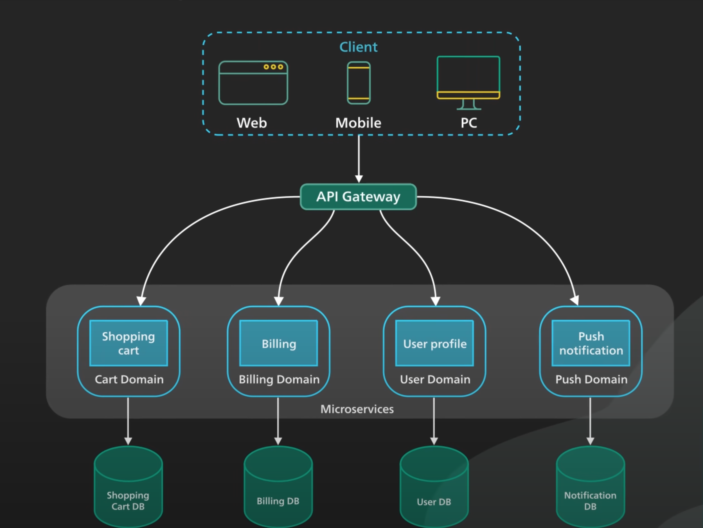

Domain-Driven Design (DDD) is a software development approach that emphasizes modeling the domain based on the real-world business context. It aims to create a shared understanding between developers and domain experts, focusing on the core domain logic and avoiding technical complexities. Here's an example of how you might implement a simple domain-driven architecture in C#.

### **Example Scenario: Online Bookstore**

#### **1. Domain Layer**
The domain layer includes entities, value objects, aggregates, and domain services. It represents the core business logic.

**Entity**:
```csharp
public class Book
{
    public Guid Id { get; private set; }
    public string Title { get; private set; }
    public string Author { get; private set; }
    public decimal Price { get; private set; }

    public Book(Guid id, string title, string author, decimal price)
    {
        Id = id;
        Title = title;
        Author = author;
        Price = price;
    }

    public void UpdatePrice(decimal newPrice)
    {
        Price = newPrice;
    }
}
```

**Value Object**:
```csharp
public class Money
{
    public decimal Amount { get; private set; }
    public string Currency { get; private set; }

    public Money(decimal amount, string currency)
    {
        Amount = amount;
        Currency = currency;
    }
}
```

**Repository Interface**:
```csharp
public interface IBookRepository
{
    Book GetById(Guid id);
    void Add(Book book);
    void Update(Book book);
}
```

**Domain Service**:
```csharp
public class BookPricingService
{
    private readonly IBookRepository _bookRepository;

    public BookPricingService(IBookRepository bookRepository)
    {
        _bookRepository = bookRepository;
    }

    public void UpdateBookPrice(Guid bookId, decimal newPrice)
    {
        var book = _bookRepository.GetById(bookId);
        book.UpdatePrice(newPrice);
        _bookRepository.Update(book);
    }
}
```

#### **2. Application Layer**
The application layer orchestrates domain logic by coordinating domain services, repositories, and other components.

**Application Service**:
```csharp
public class BookService
{
    private readonly IBookRepository _bookRepository;
    private readonly BookPricingService _bookPricingService;

    public BookService(IBookRepository bookRepository, BookPricingService bookPricingService)
    {
        _bookRepository = bookRepository;
        _bookPricingService = bookPricingService;
    }

    public void AddNewBook(string title, string author, decimal price)
    {
        var book = new Book(Guid.NewGuid(), title, author, price);
        _bookRepository.Add(book);
    }

    public void ChangeBookPrice(Guid bookId, decimal newPrice)
    {
        _bookPricingService.UpdateBookPrice(bookId, newPrice);
    }
}
```

#### **3. Infrastructure Layer**
The infrastructure layer implements the repository interfaces and handles data persistence.

**Repository Implementation**:
```csharp
public class BookRepository : IBookRepository
{
    private readonly List<Book> _books = new List<Book>();

    public Book GetById(Guid id)
    {
        return _books.FirstOrDefault(b => b.Id == id);
    }

    public void Add(Book book)
    {
        _books.Add(book);
    }

    public void Update(Book book)
    {
        var existingBook = GetById(book.Id);
        if (existingBook != null)
        {
            _books.Remove(existingBook);
            _books.Add(book);
        }
    }
}
```

### **4. Presentation Layer**
The presentation layer interacts with users and calls the application services.

**Example Console Application**:
```csharp
class Program
{
    static void Main(string[] args)
    {
        IBookRepository bookRepository = new BookRepository();
        BookPricingService bookPricingService = new BookPricingService(bookRepository);
        BookService bookService = new BookService(bookRepository, bookPricingService);

        // Add a new book
        bookService.AddNewBook("Domain-Driven Design", "Eric Evans", 45.99m);

        // Change the price of the book
        var book = bookRepository.GetById(Guid.NewGuid());
        if (book != null)
        {
            bookService.ChangeBookPrice(book.Id, 39.99m);
        }
    }
}
```

### **Explanation**:

1. **Domain Layer**: Defines the core business logic and rules. Entities, value objects, repositories, and domain services are part of this layer.
2. **Application Layer**: Orchestrates domain logic and coordinates between different components.
3. **Infrastructure Layer**: Implements data access and persistence.
4. **Presentation Layer**: Interacts with users and calls application services.

This example illustrates a simple domain-driven architecture for an online bookstore. 
The concepts can be expanded and refined based on the complexity and specific requirements of your application.



# what are the different domains for online shopping application

An online shopping application can encompass several domains, each focusing on different aspects of the business and technology stack. Here are some of the primary domains to consider:

### **1. User Management**
- **User Registration and Authentication**: Handling user sign-ups, logins, and authentication methods.
- **User Profiles**: Managing user profiles, preferences, and personal information.
- **Role-Based Access Control**: Implementing roles and permissions for different user types (e.g., customers, administrators).

### **2. Product Management**
- **Product Catalog**: Maintaining a database of products, including details like names, descriptions, prices, and images.
- **Inventory Management**: Tracking stock levels, availability, and warehouse locations.
- **Product Search and Filtering**: Enabling users to search for and filter products based on various criteria.

### **3. Order Management**
- **Shopping Cart**: Managing items added to the shopping cart, and providing functionality to update quantities or remove items.
- **Order Processing**: Handling the steps involved in placing an order, including order creation, confirmation, and tracking.
- **Payment Processing**: Integrating with payment gateways to handle payments securely.

### **4. Customer Support**
- **Help Desk**: Providing support through FAQs, help articles, and customer service chatbots.
- **Ticketing System**: Managing customer service requests and tracking their resolution.
- **Feedback and Reviews**: Allowing customers to leave reviews and feedback on products and services.

### **5. Marketing and Promotions**
- **Promotions and Discounts**: Managing promotional codes, discounts, and special offers.
- **Email Marketing**: Sending newsletters, promotional emails, and personalized recommendations.
- **Loyalty Programs**: Implementing rewards programs to encourage repeat purchases.

### **6. Analytics and Reporting**
- **Sales Analytics**: Tracking sales performance, revenue, and key performance indicators (KPIs).
- **Customer Insights**: Analyzing customer behavior, preferences, and purchase patterns.
- **Inventory Reports**: Generating reports on inventory levels, turnover rates, and reorder points.

### **7. Logistics and Shipping**
- **Order Fulfillment**: Managing the process of picking, packing, and shipping orders.
- **Shipping Integration**: Integrating with shipping carriers to provide shipping options, rates, and tracking.
- **Returns Management**: Handling product returns, refunds, and exchanges.

### **8. Security and Compliance**
- **Data Protection**: Ensuring the security of user data, payment information, and transaction details.
- **Compliance**: Adhering to relevant regulations and standards, such as GDPR, PCI DSS, and others.

### **9. Content Management**
- **CMS Integration**: Integrating with a Content Management System to manage content like blog posts, articles, and banners.
- **SEO Optimization**: Implementing SEO best practices to improve search engine rankings and visibility.

### **10. Mobile and Web Platforms**
- **Responsive Design**: Ensuring the application works seamlessly across different devices and screen sizes.
- **Mobile Apps**: Developing native or hybrid mobile applications for a better user experience.

These domains work together to provide a comprehensive and user-friendly online shopping experience. Each domain has its own set of challenges and requirements, and focusing on these areas can help you build a robust and scalable online shopping application.

# Architecture

Creating a robust architecture for an online shopping application involves several key components and layers to ensure scalability, maintainability, and flexibility. Here’s a high-level overview of the architecture based on the domains discussed:

### **1. Presentation Layer**

- **Web Application**: Built using frameworks like Angular, React, or Vue.js for a responsive and interactive user experience.
- **Mobile Application**: Native (iOS and Android) or hybrid apps using frameworks like React Native or Flutter.

### **2. API Gateway**

- **API Gateway**: Manages and routes requests to various microservices. It handles authentication, rate limiting, and request/response transformation.

### **3. Microservices Layer**

- **User Management Service**: Handles user registration, authentication, profile management, and role-based access control.
- **Product Management Service**: Manages product catalog, inventory, search, and filtering.
- **Order Management Service**: Manages shopping cart, order processing, and payment integration.
- **Customer Support Service**: Manages help desk, ticketing, feedback, and reviews.
- **Marketing Service**: Handles promotions, discounts, email marketing, and loyalty programs.
- **Analytics Service**: Collects and analyzes sales data, customer insights, and inventory reports.
- **Logistics and Shipping Service**: Manages order fulfillment, shipping integration, and returns.
- **Content Management Service**: Integrates with a CMS for managing content like blogs, articles, and banners.

### **4. Data Management Layer**

- **Database**: Distributed databases like SQL (Azure SQL Database) and NoSQL (Azure Cosmos DB) to handle structured and unstructured data.
- **Caching**: Use of caching mechanisms like Azure Cache for Redis to improve performance and reduce database load.
- **Blob Storage**: Azure Blob Storage for storing large files such as product images and documents.

### **5. Integration Layer**

- **Payment Gateway Integration**: Integration with payment gateways like Stripe, PayPal, or Square for secure payment processing.
- **Shipping Carrier Integration**: Integration with shipping carriers like FedEx, UPS, and DHL for real-time shipping rates and tracking.

### **6. Security and Compliance**

- **Identity Management**: Azure Active Directory for managing user identities and access control.
- **Data Encryption**: Encryption of data at rest and in transit to ensure data security.
- **Compliance**: Implementing measures to comply with regulations such as GDPR, PCI DSS, and others.

### **7. Monitoring and Logging**

- **Monitoring**: Azure Monitor and Application Insights for monitoring application performance and health.
- **Logging**: Centralized logging using tools like Azure Log Analytics to track application logs and errors.

### **8. DevOps and CI/CD**

- **Continuous Integration/Continuous Deployment (CI/CD)**: Azure DevOps or GitHub Actions for automated building, testing, and deployment of microservices.
- **Infrastructure as Code (IaC)**: Tools like Azure Resource Manager (ARM) templates, Terraform, or Ansible for managing infrastructure.

### **9. Event-Driven Architecture**

- **Event Hubs**: Azure Event Hubs for real-time event streaming and processing.
- **Service Bus**: Azure Service Bus for reliable message queuing and integration between microservices.
- **Event Grid**: Azure Event Grid for event routing and handling external events.

### **High-Level Architecture Diagram**:

```plaintext
                +---------------------+
                |   User Interface    |
                | (Web & Mobile Apps) |
                +----------+----------+
                           |
                           v
                +----------+----------+
                |      API Gateway     |
                +----------+----------+
                           |
                           v
+------------+   +--------------+    +------------+   +--------------+   +------------+
| User Mgmt  |   | Product Mgmt |    | Order Mgmt |   | Cust Support |   | Marketing  |
|  Service   |   |   Service    |    |   Service  |   |    Service   |   |   Service  |
+------------+    +-------------+    +------------+   +--------------+   +------------+
                           |
                           v
+------------+   +------------+   +-------------+   +------------+
| Analytics  |   | Logistics  |   | Content     |   |   Payment  |
|  Service   |   |   Service  |   | Mgmt Service|   |  Gateway   |
+------------+   +------------+   +-------------+   +------------+
                           |
                           v
                +----------+------------+
                |      Data Management  |
                |  (DB, Cache, Storage) |
                +-----------------------+
                           |
                           v
                +----------+------------+
                | Security & Compliance|
                +-----------------------+
                           |
                           v
                +----------+-----------+
                | Monitoring & Logging |
                +----------------------+
                           |
                           v
                +----------+-----------+
                |  Event-Driven Arch.  |
                +----------------------+
                           |
                           v
                +----------+----------+
                |   DevOps & CI/CD    |
                +---------------------+
```

This high-level architecture provides a modular and scalable approach to building an online shopping application, leveraging the benefits of microservices and cloud services.
