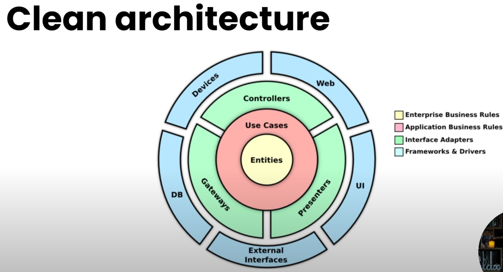
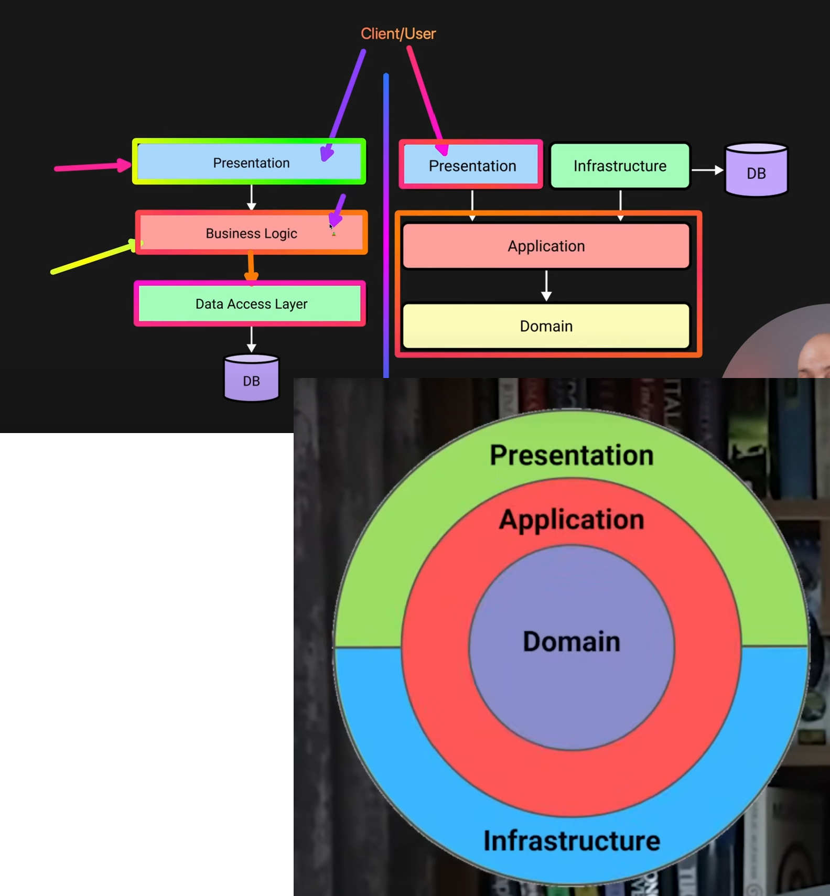
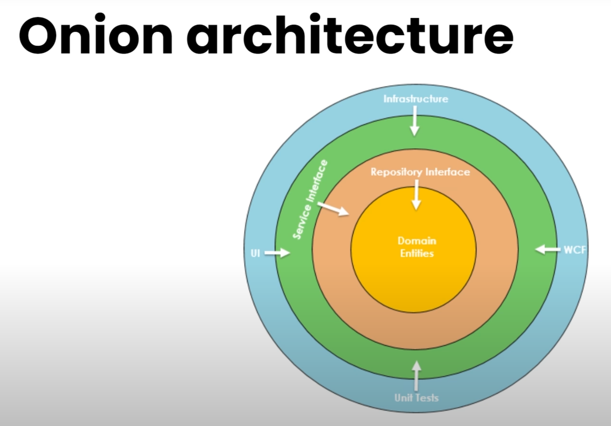

## ***1. Clean Architecture***

Clean Architecture is a software design philosophy that emphasizes separation of concerns and organizing code into layers. The goal is to create systems that are easy to maintain, test, and extend. In this architecture, dependencies flow inward, and the outer layers depend on the inner layers. Let's break down the key concepts and provide a detailed example with project structure and diagrams.

### **Core Principles of Clean Architecture**

1. **Separation of Concerns**: Each layer has a distinct responsibility and should only interact with adjacent layers.
2. **Dependency Inversion**: High-level modules should not depend on low-level modules. Both should depend on abstractions.
3. **Testability**: By decoupling the components, the system becomes more testable.
4. **Flexibility**: The architecture allows for easy replacement and modification of components.

### **Layered Architecture**

Clean Architecture typically consists of the following layers:

1. **Entities (Core)**
2. **Use Cases (Application)**
3. **Interface Adapters (Presentation)**
4. **Frameworks and Drivers (Infrastructure)**




### **Project Structure**

Here’s an example project structure for a Clean Architecture setup in C#:

```plaintext
MyCleanArchitectureProject/
├── src/
│   ├── Core/
│   │   ├── Entities/
│   │   │   └── User.cs
│   │   ├── Interfaces/
│   │   │   └── IUserRepository.cs
│   │   └── Services/
│   │       └── UserService.cs
│   ├── Application/
│   │   └── UseCases/
│   │       └── CreateUser/
│   │           ├── CreateUserRequest.cs
│   │           ├── CreateUserResponse.cs
│   │           └── CreateUserInteractor.cs
│   ├── Presentation/
│   │   └── Controllers/
│   │       └── UserController.cs
│   ├── Infrastructure/
│   │   └── Data/
│   │       └── UserRepository.cs
│   ├── Web/
│       ├── Program.cs
│       └── Startup.cs
└── tests/
    └── UnitTests/
        └── UserServiceTests.cs
```

### **Explanation of the Layers**

1. **Core (Entities and Interfaces)**
    - **Entities**: Basic business objects that have no dependencies on any other layer.
    - **Interfaces**: Abstractions for the repository pattern to decouple the application from the database layer.

    ```csharp
    // src/Core/Entities/User.cs
    public class User
    {
        public int Id { get; set; }
        public string Name { get; set; }
        public string Email { get; set; }
    }

    // src/Core/Interfaces/IUserRepository.cs
    public interface IUserRepository
    {
        void AddUser(User user);
        User GetUserById(int id);
    }
    ```

2. **Application (Use Cases)**
    - **Use Cases**: Application-specific business rules. These are the operations or services the application offers.

    ```csharp
    // src/Application/UseCases/CreateUser/CreateUserRequest.cs
    public class CreateUserRequest
    {
        public string Name { get; set; }
        public string Email { get; set; }
    }

    // src/Application/UseCases/CreateUser/CreateUserResponse.cs
    public class CreateUserResponse
    {
        public int UserId { get; set; }
        public string Message { get; set; }
    }

    // src/Application/UseCases/CreateUser/CreateUserInteractor.cs
    public class CreateUserInteractor
    {
        private readonly IUserRepository _userRepository;

        public CreateUserInteractor(IUserRepository userRepository)
        {
            _userRepository = userRepository;
        }

        public CreateUserResponse Handle(CreateUserRequest request)
        {
            var user = new User
            {
                Name = request.Name,
                Email = request.Email
            };
            _userRepository.AddUser(user);

            return new CreateUserResponse
            {
                UserId = user.Id,
                Message = "User created successfully"
            };
        }
    }
    ```

3. **Presentation (Interface Adapters)**
    - **Controllers**: Handle HTTP requests and responses, interacting with the use case layer.

    ```csharp
    // src/Presentation/Controllers/UserController.cs
    [ApiController]
    [Route("api/[controller]")]
    public class UserController : ControllerBase
    {
        private readonly CreateUserInteractor _createUserInteractor;

        public UserController(CreateUserInteractor createUserInteractor)
        {
            _createUserInteractor = createUserInteractor;
        }

        [HttpPost]
        public IActionResult CreateUser([FromBody] CreateUserRequest request)
        {
            var response = _createUserInteractor.Handle(request);
            return Ok(response);
        }
    }
    ```

4. **Infrastructure (Frameworks and Drivers)**
    - **Data**: Implementations of the repositories, typically interacting with the database.

    ```csharp
    // src/Infrastructure/Data/UserRepository.cs
    public class UserRepository : IUserRepository
    {
        private readonly DbContext _context;

        public UserRepository(DbContext context)
        {
            _context = context;
        }

        public void AddUser(User user)
        {
            _context.Users.Add(user);
            _context.SaveChanges();
        }

        public User GetUserById(int id)
        {
            return _context.Users.Find(id);
        }
    }
    ```

5. **Web**
    - **Program**: Main entry point to configure and run the application.
    - **Startup**: Configures services and middleware.

    ```csharp
    // src/Web/Program.cs
    public class Program
    {
        public static void Main(string[] args)
        {
            CreateHostBuilder(args).Build().Run();
        }

        public static IHostBuilder CreateHostBuilder(string[] args) =>
            Host.CreateDefaultBuilder(args)
                .ConfigureWebHostDefaults(webBuilder =>
                {
                    webBuilder.UseStartup<Startup>();
                });
    }

    // src/Web/Startup.cs
    public class Startup
    {
        public void ConfigureServices(IServiceCollection services)
        {
            services.AddControllers();
            services.AddScoped<IUserRepository, UserRepository>();
            services.AddScoped<CreateUserInteractor>();
        }

        public void Configure(IApplicationBuilder app, IWebHostEnvironment env)
        {
            if (env.IsDevelopment())
            {
                app.UseDeveloperExceptionPage();
            }

            app.UseRouting();
            app.UseEndpoints(endpoints =>
            {
                endpoints.MapControllers();
            });
        }
    }
    ```

### **Class Diagram**

```plaintext
Core (Entities & Interfaces)
+----------------+      +--------------------+
|   User         |      |   IUserRepository  |
|----------------|      |--------------------|
| - Id: int      |      | + AddUser(User)    |
| - Name: string |      | + GetUserById(int) |
| - Email: string|      +--------------------+
+----------------+

Application (Use Cases)
+-------------------------+
|   CreateUserInteractor  |
|-------------------------|
| + Handle(request): resp |
+-------------------------+

Presentation (Controllers)
+---------------------+
|   UserController    |
|---------------------|
| + CreateUser(req)   |
+---------------------+

Infrastructure (Data)
+---------------------+
|   UserRepository    |
|---------------------|
| + AddUser(User)     |
| + GetUserById(int)  |
+---------------------+
```

In this setup, each layer depends only on the layer directly beneath it, and the core remains independent of any infrastructure-specific details. This ensures a flexible and maintainable architecture.

## ***1. Onion Architecture***

Onion Architecture, also known as Clean Architecture or Hexagonal Architecture, is a software design approach that emphasizes separation of concerns, maintainability, and testability. It organizes code into layers that communicate only with adjacent layers, with dependencies flowing inward. This structure ensures that the core business logic remains independent of external concerns like databases or user interfaces.

### **Key Components of Onion Architecture**

1. **Core (Domain Layer)**: Contains the core business logic, entities, and interfaces. It is the most central part of the architecture.
2. **Application Layer**: Contains use cases, services, and application-specific business rules.
3. **Interface Adapters (Presentation Layer)**: Contains controllers, view models, and other user interface components.
4. **Infrastructure Layer**: Contains data access implementations, external services, and frameworks.



### **Project Structure Example**

Here's an example of a project structure following Onion Architecture:

```plaintext
MyOnionArchitectureProject/
├── src/
│   ├── Core/
│   │   ├── Entities/
│   │   │   └── User.cs
│   │   ├── Interfaces/
│   │   │   └── IUserRepository.cs
│   │   └── Services/
│   │       └── UserService.cs
│   ├── Application/
│   │   └── UseCases/
│   │       └── CreateUser/
│   │           ├── CreateUserRequest.cs
│   │           ├── CreateUserResponse.cs
│   │           └── CreateUserHandler.cs
│   ├── Presentation/
│   │   └── Controllers/
│   │       └── UserController.cs
│   ├── Infrastructure/
│   │   └── Data/
│   │       └── UserRepository.cs
│   ├── Web/
│       ├── Program.cs
│       └── Startup.cs
└── tests/
    └── UnitTests/
        └── UserServiceTests.cs
```

### **Detailed Example**

#### **1. Core (Domain Layer)**

**Entities/User.cs**:

```csharp
namespace Core.Entities
{
    public class User
    {
        public int Id { get; set; }
        public string Name { get; set; }
        public string Email { get; set; }
    }
}
```

**Interfaces/IUserRepository.cs**:

```csharp
namespace Core.Interfaces
{
    public interface IUserRepository
    {
        void Add(User user);
        User GetById(int id);
    }
}
```

#### **2. Application Layer**

**UseCases/CreateUser/CreateUserRequest.cs**:

```csharp
namespace Application.UseCases.CreateUser
{
    public class CreateUserRequest
    {
        public string Name { get; set; }
        public string Email { get; set; }
    }
}
```

**UseCases/CreateUser/CreateUserResponse.cs**:

```csharp
namespace Application.UseCases.CreateUser
{
    public class CreateUserResponse
    {
        public int UserId { get; set; }
        public string Message { get; set; }
    }
}
```

**UseCases/CreateUser/CreateUserHandler.cs**:

```csharp
using Core.Entities;
using Core.Interfaces;

namespace Application.UseCases.CreateUser
{
    public class CreateUserHandler
    {
        private readonly IUserRepository _userRepository;

        public CreateUserHandler(IUserRepository userRepository)
        {
            _userRepository = userRepository;
        }

        public CreateUserResponse Handle(CreateUserRequest request)
        {
            var user = new User
            {
                Name = request.Name,
                Email = request.Email
            };
            _userRepository.Add(user);
            return new CreateUserResponse
            {
                UserId = user.Id,
                Message = "User created successfully"
            };
        }
    }
}
```

#### **3. Presentation Layer**

**Controllers/UserController.cs**:

```csharp
using Microsoft.AspNetCore.Mvc;
using Application.UseCases.CreateUser;

namespace Presentation.Controllers
{
    [ApiController]
    [Route("api/[controller]")]
    public class UserController : ControllerBase
    {
        private readonly CreateUserHandler _createUserHandler;

        public UserController(CreateUserHandler createUserHandler)
        {
            _createUserHandler = createUserHandler;
        }

        [HttpPost]
        public IActionResult CreateUser([FromBody] CreateUserRequest request)
        {
            var response = _createUserHandler.Handle(request);
            return Ok(response);
        }
    }
}
```

#### **4. Infrastructure Layer**

**Data/UserRepository.cs**:

```csharp
using Core.Entities;
using Core.Interfaces;
using System.Collections.Generic;

namespace Infrastructure.Data
{
    public class UserRepository : IUserRepository
    {
        private readonly List<User> _users = new();

        public void Add(User user)
        {
            _users.Add(user);
            user.Id = _users.Count;
        }

        public User GetById(int id)
        {
            return _users.Find(user => user.Id == id);
        }
    }
}
```

#### **5. Web**

**Program.cs**:

```csharp
using Microsoft.AspNetCore.Hosting;
using Microsoft.Extensions.Hosting;

namespace Web
{
    public class Program
    {
        public static void Main(string[] args)
        {
            CreateHostBuilder(args).Build().Run();
        }

        public static IHostBuilder CreateHostBuilder(string[] args) =>
            Host.CreateDefaultBuilder(args)
                .ConfigureWebHostDefaults(webBuilder =>
                {
                    webBuilder.UseStartup<Startup>();
                });
    }
}
```

**Startup.cs**:

```csharp
using Microsoft.AspNetCore.Builder;
using Microsoft.AspNetCore.Hosting;
using Microsoft.Extensions.DependencyInjection;
using Microsoft.Extensions.Hosting;
using Core.Interfaces;
using Infrastructure.Data;
using Application.UseCases.CreateUser;

namespace Web
{
    public class Startup
    {
        public void ConfigureServices(IServiceCollection services)
        {
            services.AddControllers();
            services.AddScoped<IUserRepository, UserRepository>();
            services.AddScoped<CreateUserHandler>();
        }

        public void Configure(IApplicationBuilder app, IWebHostEnvironment env)
        {
            if (env.IsDevelopment())
            {
                app.UseDeveloperExceptionPage();
            }

            app.UseRouting();
            app.UseEndpoints(endpoints =>
            {
                endpoints.MapControllers();
            });
        }
    }
}
```

### **Class Diagram**

```plaintext
Core (Entities & Interfaces)
+----------------+      +--------------------+
|   User         |      |   IUserRepository  |
|----------------|      |--------------------|
| - Id: int      |      | + Add(User)        |
| - Name: string |      | + GetById(int)     |
| - Email: string|      +--------------------+
+----------------+

Application (Use Cases)
+-------------------------+
|   CreateUserHandler     |
|-------------------------|
| + Handle(request): resp |
+-------------------------+

Presentation (Controllers)
+---------------------+
|   UserController    |
|---------------------|
| + CreateUser(req)   |
+---------------------+

Infrastructure (Data)
+---------------------+
|   UserRepository    |
|---------------------|
| + Add(User)         |
| + GetById(int)      |
+---------------------+
```

### **Explanation**

1. **Core (Domain Layer)**: Contains entities (`User`) and interfaces (`IUserRepository`). This layer is independent of any other layer.
2. **Application Layer**: Contains use cases (`CreateUserHandler`) that implement business rules and interact with the core layer through interfaces.
3. **Presentation Layer**: Contains controllers (`UserController`) that handle HTTP requests and interact with the application layer.
4. **Infrastructure Layer**: Contains data access implementations (`UserRepository`) that interact with the database or other external services.

Using Onion Architecture ensures a clean separation of concerns, making the codebase more maintainable, testable, and flexible.
