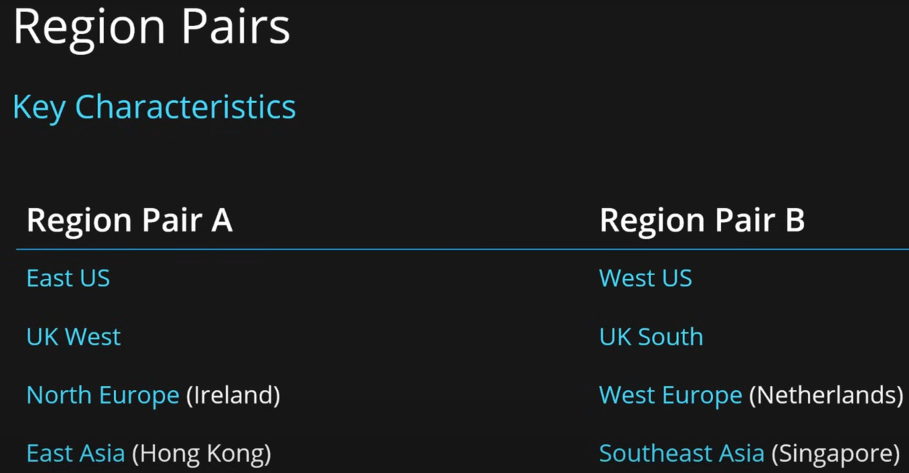
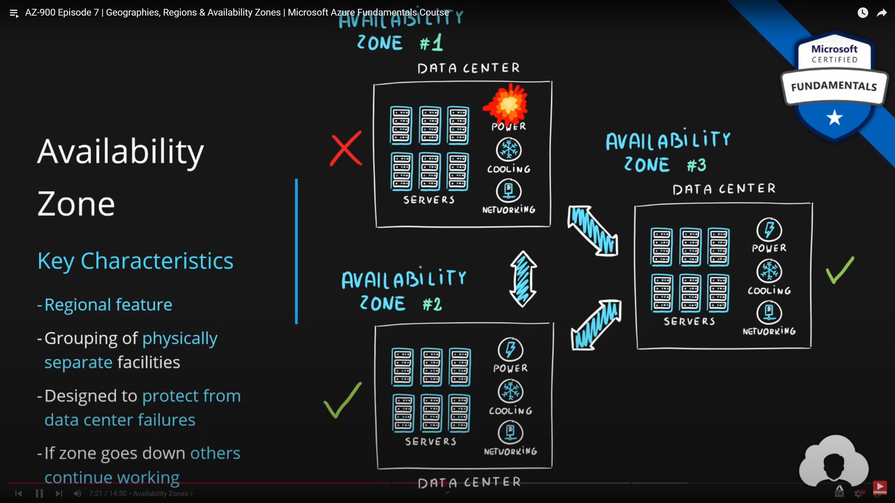

## ***1. Cloud Computing***

Service delivery model over the internet (cloud). This includes but is not limited to:

- **Compute Power**: Servers such as Windows, Linux, hosting environments, etc.
- **Storage**: Files and/or databases.
- **Networking**: In Azure but also outside when connecting to your company network.
- **Analytics Services**: For visualization and telemetry data.

## ***2. Azure Cloud Key Characteristics***

- **Scalability**: is the ability to scale, so scaling is a process of allocating(adding) and deallocating(removing) resources at any time.
- **Elasticity**: The ability to scale dynamically(Automatic Scaling).
- **Agility**: The ability to react fast (scale quickly).
- **Fault Tolerance**: is the ability to remain up and running during component and service failure.
- **Disaster Recovery**: is the ability to recover from an event that has taken down the service(disaster), should be able to recover from natural or human-induced disasters.
- **High Availability**: is the ability to keep services running for extended periods of time with very little downtime. It is a simple calculation of system uptime versus the whole lifetime of the system.
  - `availability = uptime / (uptime + downtime)`

## ***3. CapEx vs OpEx***

Great question! Understanding the difference between CapEx (Capital Expenditure) and OpEx (Operational Expenditure) is crucial when it comes to cloud computing, especially in Azure. Let's break it down:

### **Capital Expenditure (CapEx)**

- **Definition**: CapEx refers to the funds used by an organization to acquire, upgrade, or maintain physical assets such as property, industrial buildings, or equipment.
- **Usage in IT**: In traditional IT infrastructure, CapEx involves significant upfront investments in hardware, software licenses, data centers, and other physical infrastructure.
- **Benefits**:
  - Ownership of assets
  - Potential for depreciation tax benefits
- **Challenges**:
  - High initial costs
  - Long-term commitment
  - Difficulty in scaling quickly

### **Operational Expenditure (OpEx)**

- **Definition**: OpEx refers to the ongoing costs required for running day-to-day operations. These costs are incurred regularly and are often considered more flexible than CapEx.
- **Usage in IT**: In the context of cloud computing, OpEx involves the costs associated with the consumption of cloud services, such as pay-as-you-go pricing for compute, storage, and networking.
- **Benefits**:
  - Lower upfront costs
  - Greater flexibility and scalability
  - Easier to align with business needs
- **Challenges**:
  - Continuous expenses
  - Potential for higher long-term costs if not managed effectively

### **CapEx vs. OpEx in Azure**

| Feature                     | CapEx                                          | OpEx                                          |
|-----------------------------|-----------------------------------------------|-----------------------------------------------|
| **Initial Investment**      | High                                           | Low                                           |
| **Flexibility**             | Limited                                        | High                                          |
| **Scalability**             | Challenging and slow                           | Quick and easy                                |
| **Cost Management**         | Fixed over time                                | Variable based on usage                       |
| **Ownership of Assets**     | Yes                                            | No                                            |
| **Depreciation**            | Can claim tax benefits                         | Not applicable                                |
| **Use Case**                | Traditional on-premises IT infrastructure     | Cloud-based services and consumption models  |

In summary, **CapEx** involves substantial initial investments in physical assets and is more common in traditional IT setups. In contrast, **OpEx** allows for more flexibility and scalability, aligning with the dynamic nature of cloud computing, where costs are based on actual usage.

Moving to a cloud platform like Azure shifts many costs from CapEx to OpEx, which can provide significant financial and operational advantages for businesses.

## ***4. What is a Consumption-Based Model?***

The consumption-based model is a pricing model used in the cloud where customers are charged based on their resource usage.

This model is characterized by:

- **No Upfront Cost**: There are no associated upfront costs.
- **No Wasted Resources**: Charges are incurred only for used resources. For instance, blob storage that stores data is considered used as it consumes storage space. Virtual Machines that are running consume CPU, memory, and other resources even if there isn’t any traffic, hence they are considered used and will incur charges.
- **Pay for What You Need**: Customers pay only for the resources they need.
- **Stop Paying When You Don’t**: Charges stop when the resources are no longer needed.


Consumption is the virtual metric used to calculate how much each resource (service) in Azure was used. Each service has many smaller metrics that track its consumption to offer the best possible pricing model. These metrics are tracked at a very granular level.

## ***5. IaaS vs PaaS vs SaaS cloud service models***

Sure, let’s break down the three main cloud service models: Infrastructure as a Service (IaaS), Platform as a Service (PaaS), and Software as a Service (SaaS). Each offers different levels of control, flexibility, and management.

### Infrastructure as a Service (IaaS)
**Definition:** IaaS provides virtualized computing resources over the internet. It's essentially renting the infrastructure you need—like servers and storage—on-demand.


**Key Features:**
- **Scalability:** Easily scale resources up or down based on demand.
- **Flexibility:** Suitable for a wide range of use cases, from development and testing to disaster recovery.
- **Control:** Users have control over the operating systems, storage, and deployed applications.
- **Cost:** Pay-as-you-go pricing model, which can reduce costs associated with hardware and maintenance.

**Examples:** Amazon Web Services (AWS), Microsoft Azure, Google Cloud Platform (GCP)

### Platform as a Service (PaaS)
**Definition:** PaaS provides a platform allowing customers to develop, run, and manage applications without dealing with the infrastructure.


**Key Features:**
- **Development Tools:** Includes tools and libraries for application development, middleware, and database management.
- **Focus on Development:** Developers can focus on coding and managing applications rather than worrying about underlying hardware and software layers.
- **Efficiency:** Speeds up development cycles and reduces time to market.
- **Integration:** Often includes integrations with various services like databases and messaging systems.

**Examples:** Microsoft Azure App Services, Google App Engine, IBM Cloud Foundry

### Software as a Service (SaaS)
**Definition:** SaaS delivers software applications over the internet, on a subscription basis. Users access the software through a web browser, eliminating the need for internal servers and IT staff to manage installations.


**Key Features:**
- **Accessibility:** Access from any device with an internet connection.
- **Cost-Effective:** No upfront costs for software purchases; subscription-based pricing.
- **Automatic Updates:** Providers handle software updates and security patches.
- **Scalability:** Easily add or remove users as needed.

**Examples:** Microsoft Office 365, Google Workspace, Salesforce

### Comparison Table

| Feature            | IaaS                              | PaaS                           | SaaS                            |
|--------------------|-----------------------------------|--------------------------------|---------------------------------|
| Control            | Full control over the infrastructure | Control over applications but not the underlying infrastructure | Minimal control, focus on using the software |
| Use Cases          | Development, testing, disaster recovery | Application development and deployment | Business applications (CRM, email, collaboration tools) |
| Management         | High level of management required by users | Less management than IaaS, focus on application deployment | Minimal management, mostly handled by the provider |
| Cost Model         | Pay-as-you-go                      | Subscription-based, can vary by usage | Subscription-based per user |
| Examples           | AWS, Azure, GCP                   | Azure App Services, Google App Engine | Office 365, Google Workspace, Salesforce |


I hope this provides a clear understanding of the differences between IaaS, PaaS, and SaaS cloud service models. 

## ***6. Public, Private & Hybrid cloud deployment models***

Absolutely, let's dive into the three main cloud deployment models: Public, Private, and Hybrid Clouds.

### Public Cloud
**Definition:** A public cloud is a cloud infrastructure that is available to the general public or a large industry group and is owned by a cloud service provider.

**Key Features:**
- **Accessibility:** Services are available to anyone who wants to purchase them over the internet.
- **Cost-Effective:** Cost savings as users only pay for what they use, with no need to invest in hardware or infrastructure.
- **Scalability:** Highly scalable due to the vast resources of the service providers.
- **Maintenance:** Providers handle the maintenance, updates, and management of the infrastructure.


**Examples:** Amazon Web Services (AWS), Microsoft Azure, Google Cloud Platform (GCP)

**Use Cases:** Ideal for small to medium-sized businesses, startups, and projects with variable workloads.

### Private Cloud
**Definition:** A private cloud is a cloud infrastructure operated solely for a single organization. It can be managed internally or by a third party and can be hosted either on-premises or off-site.

**Key Features:**
- **Control:** Offers greater control over resources, security, and compliance.
- **Customization:** Highly customizable to meet specific business needs.
- **Security:** Enhanced security and privacy since resources are not shared with other organizations.
- **Cost:** Generally more expensive than public clouds due to the cost of managing and maintaining the infrastructure.


**Examples:** VMware, OpenStack, Microsoft Azure Stack

**Use Cases:** Suitable for large enterprises, government organizations, and businesses with stringent security and compliance needs.

### Hybrid Cloud
**Definition:** A hybrid cloud combines public and private cloud infrastructures, allowing data and applications to be shared between them.

**Key Features:**
- **Flexibility:** Offers the benefits of both public and private clouds, allowing for greater flexibility and optimization.
- **Scalability:** Use public cloud resources for high-demand workloads while keeping sensitive data in a private cloud.
- **Cost-Effectiveness:** Optimize costs by leveraging public cloud resources while maintaining critical applications and data in a private cloud.
- **Interoperability:** Requires strong interoperability between public and private clouds to ensure seamless integration and operation.


**Examples:** Microsoft Azure Hybrid, AWS Outposts, Google Anthos

**Use Cases:** Ideal for businesses with varying workloads, disaster recovery needs, and those seeking to optimize costs while maintaining control over sensitive data.

### Comparison Table

| Feature          | Public Cloud                     | Private Cloud                  | Hybrid Cloud                      |
|------------------|----------------------------------|--------------------------------|-----------------------------------|
| Accessibility    | Available to the general public  | Exclusive to a single organization | Combines public and private cloud resources |
| Control          | Limited control                  | Full control                   | Balanced control and flexibility  |
| Cost             | Pay-per-use, cost-effective      | Higher cost due to infrastructure management | Optimized costs                    |
| Scalability      | Highly scalable                  | Scalable but limited by internal resources | Scalable by leveraging both clouds |
| Security         | Standard security                | Enhanced security               | Enhanced security for sensitive data |
| Examples         | AWS, Azure, GCP                  | VMware, OpenStack, Azure Stack  | Azure Hybrid, AWS Outposts, Google Anthos   |

Each cloud deployment model has its own set of advantages and is suited for different business needs. If you have any specific scenarios in mind or further questions, feel free to ask!

## ***7. Geographies, Regions & Availability Zones***

Sure! Let's take a closer look at Microsoft Azure Geographies, Regions, and Availability Zones, including their purposes, characteristics, and benefits.

### **Azure Geographies**
- **Definition**: An Azure geography is a defined area of the world that contains at least one Azure Region. Geographies ensure that data residency, sovereignty, and compliance requirements are met. They are important for organizations needing to comply with laws and regulations that require data to be stored and processed within certain boundaries.
- **Purpose**: Provides a layer of data residency and compliance boundary to meet legal and regulatory requirements.
- **Examples**: 
  - United States
  - Europe
  - Asia Pacific
  - Canada
  - Middle East
  - Africa

### **Azure Regions**
- **Definition**: An Azure Region is a geographical area containing one or more datacenters, and it forms the basic building block of the Azure infrastructure. Each region is designed to be isolated from other regions to prevent potential failure.
- **Purpose**: Regions provide the physical infrastructure for running your applications and storing your data. They help ensure low-latency access to resources.
- **Characteristics**:
  - **Multiple Datacenters**: Each region typically has multiple datacenters for redundancy and availability.
  - **Region Pairs**: Azure pairs regions within the same geography to support disaster recovery. In the event of an outage, services can failover to the paired region.
- **Examples**: 
  - West US
  - East US
  - North Europe
  - Southeast Asia
  - Central India

### Products available by region

[Products available by region](https://azure.microsoft.com/en-us/explore/global-infrastructure/products-by-region)

### Azure Speed Test 2

[Azure Speed Test 2](https://azurespeedtest.azurewebsites.net/)


### **Azure Availability Zones**

- **Definition**: Availability Zones are unique physical locations within an Azure Region. Each zone is made up of one or more datacenters equipped with independent power, cooling, and networking.
- **Purpose**: Availability Zones are designed to provide high availability and fault tolerance for your applications and data by protecting against datacenter-level failures.
- **Characteristics**:
  - **Physical Separation**: Zones are separated by sufficient distance to ensure that a localized disaster cannot affect more than one zone, but they are close enough to provide low-latency connectivity.
  - **Independent Infrastructure**: Each zone has its own power, cooling, and network infrastructure, minimizing the risk of single points of failure.
  
- **Benefits**:
  - **High Availability**: Ensures your applications remain available even if one zone experiences an outage.
  - **Fault Tolerance**: Protects against datacenter-level failures, enhancing the resilience of your applications.
  - **Disaster Recovery**: Supports the ability to design and deploy applications that can quickly recover from catastrophic failures.

- Designed to protect from data center failures
- Not all regions are supports Availability Zones
- If zone goes down others continue working
- Supported region has three or more zones
- A zone is one or more data centers
- **Region Pair**:
  - Each region is paired with another region making it a region pair
  - Region pairs are static and cannot be chosen
  - Each pair resides within the same geography*
  - Physical isolation with at least 300 miles distance (when possible)
  - Some services have platform-provided replication
  - Planned updates across the pairs
  - Data residency maintained for disaster recovery
  


- **Two Service Categories**:
  - Zonal Services(Virtual Machines, Disks etc.)
  - Zone-Reduntant Services(SQL, Storage, etc.)
  


### **Benefits of Azure's Global Infrastructure**

- **High Availability**: By leveraging regions and availability zones, Azure ensures that your applications and data remain accessible even in the event of failures.
- **Scalability**: Azure's infrastructure allows you to scale your resources up or down based on demand, ensuring you can handle peak loads efficiently.
- **Compliance**: Geographies help meet data residency and compliance requirements, ensuring your data stays within legal boundaries.
- **Low Latency**: With regions spread across the globe, Azure provides low-latency access to resources, improving the performance of your applications.
- **Disaster Recovery**: Region pairs and availability zones enable robust disaster recovery solutions, ensuring business continuity.

### **Visual Representation**

Here's a visual representation of the relationship between geographies, regions, and availability zones:

```
Azure Geography
 └─ Azure Region
     ├─ Availability Zone 1
     ├─ Availability Zone 2
     └─ Availability Zone 3
```

### **Examples of Regions and Their Features**

| Region          | Location              | Availability Zones  | Paired Region    |
|-----------------|-----------------------|---------------------|------------------|
| East US         | Virginia, USA         | 3                   | West US          |
| West Europe     | Amsterdam, Netherlands| 3                   | North Europe     |
| Southeast Asia  | Singapore             | 3                   | East Asia        |
| Central India   | Pune, India           | 3                   | South India      |

This structure and organization ensure that Microsoft Azure can provide a highly available, scalable, and compliant cloud infrastructure to meet a wide range of business needs.

## ***8. Azure Data Center***

An **Azure Data Center** is a physical facility that houses the hardware and software infrastructure required to deliver cloud services to Azure customers. Here's a detailed explanation of its key components and functions:

### Key Components
1. **Physical Infrastructure**: This includes servers, storage systems, networking equipment, power supplies, cooling systems, and security systems.
2. **Networking**: Azure Data Centers are equipped with high-speed networking equipment to ensure fast and reliable communication between servers and with the outside world. This includes routers, switches, and fiber optic cables.
3. **Power Supply**: Reliable power sources and backup generators are essential to keep the data center running without interruptions.
4. **Cooling Systems**: Efficient cooling systems are crucial to prevent overheating of the equipment. This often involves advanced HVAC systems and liquid cooling technologies.
5. **Security**: Multiple layers of security are implemented, including physical security (e.g., access controls, surveillance cameras), network security (e.g., firewalls, intrusion detection systems), and data security (e.g., encryption, access controls).

### Functions
1. **Compute Resources**: Azure Data Centers host virtual machines, containers, and other compute resources that customers can use to run their applications.
2. **Storage**: They provide scalable storage solutions, including blob storage, file storage, and disk storage, to store data securely and efficiently.
3. **Networking**: Azure Data Centers offer networking services such as virtual networks, load balancers, and VPN gateways to connect resources and ensure high availability and performance.
4. **Management and Monitoring**: They include tools and services for managing and monitoring resources, such as Azure Monitor, Azure Automation, and Azure Security Center.
5. **Sustainability**: Microsoft is committed to sustainability, and Azure Data Centers are designed to be energy-efficient and environmentally friendly. This includes using renewable energy sources and implementing energy-saving technologies.

### Architecture
Azure Data Centers are organized into **geographies**, **regions**, and **availability zones**:
- **Geographies**: These are large areas that contain multiple regions, typically spanning entire countries or continents.
- **Regions**: Each geography contains multiple regions, which are separate locations with their own power, cooling, and networking infrastructure.
- **Availability Zones**: Within each region, there are multiple availability zones, which are physically separate locations designed to protect against datacenter failures.


### Example
Here's a simplified example of how an Azure Data Center might be structured:
1. **Region**: North America, Europe, Asia Pacific, South America, Africa, and the Middle East - Total 60 regions
2. **Availability Zones**: Zone 1, Zone 2, Zone 3
3. **Data Center**: Each availability zone contains a data center with servers, storage, and networking equipment.
4. **Networking**: High-speed fiber optic cables connect the data centers within the region and to other regions and the global internet.
5. **Power Supply**: Backup generators and renewable energy sources ensure continuous operation.
6. **Cooling**: Advanced cooling systems maintain optimal temperatures for the equipment.

By understanding the architecture and components of Azure Data Centers, you can better appreciate how Azure delivers reliable, scalable, and secure cloud services to its customers. 

## ***9. Resources, Resource Groups & Resource Manager***

Let's delve into Azure's core organizational components: **Azure Resources**, **Resource Groups**, and **Azure Resource Manager**.

### **Azure Resources**

- **Definition**: Azure Resources are the fundamental building blocks of Azure services. They include compute resources (like virtual machines), storage (like Azure Blob Storage), databases (like Azure SQL Database), and networking resources (like virtual networks).
- **Examples**:
  - Virtual Machines (VMs)
  - Storage Accounts
  - SQL Databases
  - Virtual Networks (VNets)
   


- **Characteristics**:
  - **Configurable**: Resources can be configured and managed independently or in groups.
  - **Scalable**: Resources can be scaled up or down based on requirements.
  - **Billing**: Resources incur costs based on usage, configuration, and service level.

### **Resource Groups**

- **Definition**: A Resource Group is a container that holds related Azure resources. All resources within a resource group share the same lifecycle, permissions, and policies.
- **Purpose**: Provides a logical way to organize and manage Azure resources.
- Each resource must be in one, and only one resource group
- Resource groups have their own location assigned
- Resources in the resource groups can reside in a different locations
- Resources can be moved between the resource groups
- Resource groups can’t be nested
- Organize based on your organization needs but consider
    - Billing
    - Security and access management
    - Application Lifecycle

- **Characteristics**:
  - **Lifecycle Management**: Resources in the same group can be managed, deployed, and deleted together.
  - **Access Control**: Resource groups allow for granular access control using role-based access control (RBAC).
  - **Tagging**: Resources and resource groups can be tagged for easy identification and management.


- **Examples**:
  - A resource group for a specific project containing a virtual machine, a storage account, and a database.
  - Resource groups for different environments (e.g., development, testing, production).

### **Azure Resource Manager (ARM)**

- **Definition**: Azure Resource Manager is the deployment and management service for Azure. It provides a consistent management layer that enables you to create, update, and delete resources in your Azure account.
- **Purpose**: Simplifies the management, deployment, and organization of Azure resources.
- **Characteristics**:
  - **Declarative Templates**: Allows you to use Azure Resource Manager templates (ARM templates) to define the infrastructure and configurations for your resources.
  - **Consistency**: Provides consistent management across all Azure services through a unified API.
  - **Role-Based Access Control (RBAC)**: Integrates with Azure Active Directory for fine-grained access control.
  - **Tagging and Policies**: Supports resource tagging and policy enforcement to ensure compliance and efficient resource management.
  - **Dependency Management**: Manages dependencies between resources during deployment.
  - 


### **Key Differences**

| Feature                        | Azure Resources                           | Resource Groups                            | Azure Resource Manager                     |
|--------------------------------|-------------------------------------------|--------------------------------------------|--------------------------------------------|
| **Definition**                 | Individual Azure services and components  | Logical container for related resources    | Deployment and management service for Azure|
| **Purpose**                    | Provides compute, storage, networking, etc.| Organizes and manages related resources     | Simplifies resource management and deployment|
| **Scope**                      | Individual resources                      | Group of related resources                  | All resources in a subscription             |
| **Access Control**             | Managed individually or through groups    | Granular control via RBAC                   | Integrated with Azure AD for RBAC          |
| **Lifecycle Management**       | Managed individually                      | Managed as a group                          | Managed through ARM templates and policies |
| **Tagging**                    | Resources can be tagged                   | Resource groups can be tagged               | ARM supports tagging and policy enforcement|
| **Deployment**                 | Individual or group deployment            | Group deployment                            | Declarative ARM templates                   |

### **Summary**
- **Azure Resources** are the fundamental components and services you use in Azure.
- **Resource Groups** provide a way to organize and manage these resources as a unit, sharing the same lifecycle and permissions.
- **Azure Resource Manager** (ARM) is the service that enables you to manage, deploy, and organize resources consistently using a unified API and declarative templates.

This framework ensures that you can efficiently manage, scale, and organize your Azure infrastructure to meet your business needs.

## ***10. Azure Compute Services***
Azure Compute Services offer a variety of cloud-based solutions to meet different computing needs. Here’s a detailed explanation of the main Azure Compute Services:

### **1. Virtual Machines (VMs)**
- **Definition**: Azure VMs are on-demand, scalable computing resources.
- **Key Features**:
  - **Customizable**: Choose your operating system, CPU, memory, and storage.
  - **Scalability**: Scale up or down based on demand.
  - **Deployment**: Easy deployment using Azure portal, ARM templates, or CLI.
- **Use Cases**: Running custom applications, extending on-premises servers to the cloud, and creating development and test environments.

### **2. Virtual Machines Scale Set(VMSS)**

Azure Virtual Machine Scale Sets (VMSS) are an Azure compute resource that allows you to deploy and manage a set of identical, auto-scaling virtual machines. VMSS provides high availability, automatic scaling, and ease of management, making it ideal for workloads that require dynamic scalability. Here's a detailed explanation:

### Key Features

1. **Auto-Scaling**: VMSS can automatically scale the number of VM instances based on demand, using various metrics such as CPU usage, memory usage, or custom metrics.
2. **Load Balancing**: VMSS integrates with Azure Load Balancer to distribute incoming traffic across the VM instances, ensuring high availability and reliability.
3. **High Availability**: VMSS distributes VM instances across multiple availability zones or availability sets, protecting against datacenter failures and ensuring business continuity.
4. **Easy Management**: You can manage all the VM instances in the scale set as a single resource, simplifying configuration, updates, and monitoring.
5. **Support for Custom Images**: VMSS allows you to use custom VM images or Azure Marketplace images, giving you flexibility in deploying different types of workloads.

### Use Cases

- **Web Applications**: VMSS is ideal for hosting web applications that experience varying levels of traffic, as it can automatically scale out during peak times and scale in during low traffic periods.
- **Big Data and Analytics**: VMSS can be used for big data processing and analytics workloads that require significant compute resources, which can scale dynamically based on the volume of data.
- **Containerized Workloads**: VMSS can be used to deploy and manage containerized applications, such as those running on Docker or Kubernetes.

### Example Architecture

Here's a high-level example of an architecture using Azure VMSS:

1. **Virtual Machine Scale Set**: Create a scale set with the required VM configuration (e.g., VM size, OS, networking).
2. **Load Balancer**: Configure an Azure Load Balancer to distribute incoming traffic across the VM instances in the scale set.
3. **Auto-Scaling Rules**: Define auto-scaling policies based on metrics such as CPU usage or custom metrics to handle demand fluctuations.
4. **High Availability**: Use Availability Zones to distribute VM instances across different zones within the region.


### Steps to Create a VMSS

Here's a step-by-step guide to creating a VMSS using the Azure portal:

1. **Create a VM Scale Set**:
   - In the Azure portal, navigate to "Create a resource" and select "Virtual Machine Scale Set."
   - Configure the basic settings such as the scale set name, region, and image (e.g., Windows Server or Ubuntu).

2. **Configure the Scale Set**:
   - Choose the VM size, instance count, and networking options.
   - Enable "Auto-scale" and configure auto-scaling rules based on metrics like CPU usage.

3. **Set Up Load Balancer**:
   - Select "Add Load Balancer" to distribute incoming traffic across the VM instances.
   - Configure the load balancer settings, such as front-end IP configuration and load balancing rules.

4. **Define High Availability**:
   - Select the availability options, such as Availability Zones or Availability Sets, to ensure high availability and redundancy.

5. **Review and Create**:
   - Review the configuration settings and click "Create" to deploy the VM scale set.

### **3. Azure Kubernetes Service (AKS)**

- **Definition**: AKS is a managed container orchestration service that simplifies deploying, managing, and scaling containerized applications using Kubernetes.
- **Key Features**:
  - **Managed Kubernetes**: Azure handles cluster management tasks.
  - **Scaling**: Automatically scales based on load.
  - **Security**: Integrates with Azure Active Directory for access control.
- **Use Cases**: Microservices architecture, DevOps pipelines, and scalable web applications.

### **4. Azure App Service**

- **Definition**: Azure App Service is a fully managed platform for building, deploying, and scaling web apps and APIs.
- **Key Features**:
  - **Multi-language support**: Supports .NET, Java, Python, PHP, Node.js, and more.
  - **Autoscaling**: Automatically adjusts the number of instances based on load.
  - **Integrated Development Tools**: Integrates with Visual Studio, GitHub, and DevOps tools.
- **Use Cases**: Hosting web applications, RESTful APIs, and mobile backends.

### **5. Azure Functions**

- **Definition**: Azure Functions is a serverless compute service that allows you to run event-driven code without managing infrastructure.
- **Key Features**:
  - **Event-driven**: Trigger functions based on events or schedules.
  - **Scalability**: Automatically scales based on demand.
  - **Cost-effective**: Pay only for the execution time of your code.
- **Use Cases**: Real-time file processing, IoT data processing, and background tasks.

### **6. Azure Virtual Desktop (formerly Windows Virtual Desktop)**

- **Definition**: Azure Virtual Desktop provides a scalable, multi-session Windows 10/11 experience in the cloud.
- **Key Features**:
  - **Remote Access**: Access Windows desktops and apps from anywhere.
  - **Multi-session**: Supports multiple concurrent users on a single VM.
  - **Integration**: Seamlessly integrates with Microsoft 365 and Azure Active Directory.
- **Use Cases**: Remote work scenarios, virtual training, and application virtualization.

### **7. Azure Batch**

- **Definition**: Azure Batch enables large-scale parallel and high-performance computing (HPC) jobs.
- **Key Features**:
  - **Job Scheduling**: Efficiently schedules jobs and tasks.
  - **Autoscaling**: Scales compute nodes based on job demands.
  - **Cost Optimization**: Optimize costs by using low-priority VMs.
- **Use Cases**: Scientific simulations, data analysis, and rendering workloads.

### **8. Azure Service Fabric**

- **Definition**: Service Fabric is a distributed systems platform that simplifies building and managing microservices and container-based applications.
- **Key Features**:
  - **Stateful and Stateless Services**: Supports both types of services.
  - **Reliability**: Built-in support for high availability and fault tolerance.
  - **Integration**: Integrates with various development tools and CI/CD pipelines.
- **Use Cases**: Mission-critical applications, microservices architecture, and stateful services.

### **9. Azure Container Instances (ACI)**
- **Definition**: ACI provides a quick and simple way to run containers without managing virtual machines.
- **Key Features**:
  - **Serverless Containers**: Run containers without provisioning infrastructure.
  - **Fast Deployment**: Deploy and start containers in seconds.
  - **Isolation**: Each container runs in isolation for security.
- **Use Cases**: Containerized workloads, development and testing, batch processing, Background Jobs and Scheduled scripts.

### **Comparison Summary**

| Service                       | Key Features                                    | Use Cases                                       |
|-------------------------------|-------------------------------------------------|-------------------------------------------------|
| **Virtual Machines**          | Customizable, scalable, easy deployment         | Custom apps, extending on-premises, testing     |
| **Azure Kubernetes Service**  | Managed Kubernetes, scaling, security           | Microservices, DevOps, scalable web apps        |
| **Azure App Service**         | Multi-language, autoscaling, development tools  | Hosting web apps, APIs, mobile backends         |
| **Azure Functions**           | Event-driven, scalability, cost-effective       | Real-time processing, IoT, background tasks     |
| **Azure Virtual Desktop**     | Remote access, multi-session, integration       | Remote work, virtual training, app virtualization|
| **Azure Batch**               | Job scheduling, autoscaling, cost optimization  | Scientific simulations, data analysis, rendering|
| **Azure Service Fabric**      | Stateful/stateless services, reliability        | Mission-critical apps, microservices, stateful services|
| **Azure Container Instances** | Serverless containers, fast deployment, isolation| Containerized workloads, dev/testing, batch processing|


These services together provide a robust, scalable, and flexible platform for building, deploying, and managing a wide range of applications and workloads in the cloud.

## ***11. Azure Networking Services***

Azure offers a comprehensive suite of networking services that enable you to build, manage, and secure your network infrastructure in the cloud. Here's a detailed explanation of the key Azure Networking Services:

### **1. Virtual Network (VNet)**
- **Definition**: A logically isolated network in Azure that allows you to securely connect Azure resources.
 


- **Key Features**:
  - **Isolation**: Provides network isolation and segmentation for your resources.
  - **Subnets**: Create subnets to segment your network for better security and management.
  - **Peering**: Connect VNets to each other for secure cross-network communication.
- **Use Cases**: Setting up a secure network environment for applications, extending on-premises networks to Azure.

### **2. Azure Load Balancer**
- **Definition**: A Layer 4 load balancer that distributes incoming traffic across multiple virtual machines.
- **Key Features**:
  - **High Availability**: Ensures high availability and reliability by distributing traffic.
  - **Internal and External Load Balancing**: Supports both internal and internet-facing load balancing.
  - **Health Probes**: Monitors the health of your services and routes traffic to healthy instances.
- **Use Cases**: Balancing traffic for web applications, improving availability and reliability of services.

### **3. Azure Application Gateway**

- **Definition**: A Layer 7 load balancer designed for web applications, providing application-level routing and features.
- **Key Features**:
  - **Web Application Firewall (WAF)**: Protects web applications from common threats and vulnerabilities.
  - **SSL Termination**: Offloads SSL decryption to improve performance.
  - **URL-based Routing**: Routes traffic based on URL paths for better traffic management.
- **Use Cases**: Enhancing security and performance for web applications, protecting against web vulnerabilities.

### **4. Azure VPN Gateway**

- **Definition**: A service that establishes secure, encrypted connections between on-premises networks and Azure VNets.


- **Key Features**:
  - **Site-to-Site VPN**: Connects on-premises networks to Azure VNets securely.
  - **Point-to-Site VPN**: Allows individual devices to connect to Azure VNets.
  - **ExpressRoute Integration**: Works with Azure ExpressRoute for private connections.
- **Use Cases**: Securely extending on-premises networks to Azure, enabling remote access to Azure resources.

### **5. Azure ExpressRoute**

- **Definition**: A service that provides a private, dedicated connection between on-premises networks and Azure.
- **Key Features**:
  - **Private Connectivity**: Bypasses the public internet for secure and reliable connections.
  - **High Bandwidth**: Supports high-bandwidth connectivity for data-intensive applications.
  - **Consistent Performance**: Provides predictable and consistent network performance.
- **Use Cases**: High-performance data transfer, hybrid cloud solutions, disaster recovery.

### **6. Azure Traffic Manager**

- **Definition**: A DNS-based traffic load balancer that distributes traffic across multiple endpoints globally.
- **Key Features**:
  - **Geographic Routing**: Routes traffic based on geographic location for improved performance.
  - **Priority Routing**: Routes traffic based on endpoint priority for failover scenarios.
  - **Weighted Routing**: Distributes traffic based on assigned weights for load balancing.
- **Use Cases**: Enhancing global performance, disaster recovery, and high availability for applications.

### **7. Azure Content Delivery Network (CDN)**

- **Definition**: A global CDN that delivers high-bandwidth content to users with low latency.
- **Key Features**:
  - **Caching**: Caches content at edge locations to reduce latency and improve load times.
  - **Content Acceleration**: Speeds up the delivery of static and dynamic content.
  - **Security**: Provides features like HTTPS, DDoS protection, and geo-filtering.
- **Use Cases**: Accelerating web applications, streaming media, and delivering large files.

### **8. Azure DDoS Protection**

- **Definition**: A service that protects Azure applications from Distributed Denial of Service (DDoS) attacks.
- **Key Features**:
  - **Always-On Monitoring**: Continuously monitors traffic for potential threats.
  - **Automatic Mitigation**: Automatically mitigates DDoS attacks without user intervention.
  - **Enhanced Reporting**: Provides detailed analytics and insights on DDoS events.
- **Use Cases**: Protecting web applications, APIs, and internet-facing services from DDoS attacks.

### **Comparison Summary**

| Service                        | Key Features                                    | Use Cases                                        |
|-------------------------------|-------------------------------------------------|-------------------------------------------------|
| **Virtual Network (VNet)**    | Isolation, subnets, peering                      | Secure network environment, extending on-premises |
| **Azure Load Balancer**       | High availability, internal/external balancing, health probes | Web application traffic balancing, improving service reliability |
| **Azure Application Gateway** | WAF, SSL termination, URL-based routing         | Enhancing web app security and performance, protecting against vulnerabilities |
| **Azure VPN Gateway**         | Site-to-Site, Point-to-Site, ExpressRoute integration | Extending on-premises networks securely, remote access |
| **Azure ExpressRoute**        | Private connectivity, high bandwidth, consistent performance | High-performance data transfer, hybrid cloud solutions |
| **Azure Traffic Manager**     | Geographic, priority, weighted routing          | Enhancing global performance, disaster recovery |
| **Azure CDN**                 | Caching, content acceleration, security         | Accelerating web apps, streaming media, large file delivery |
| **Azure DDoS Protection**     | Always-on monitoring, automatic mitigation, enhanced reporting | Protecting web applications and services from DDoS attacks |

These networking services work together to provide a robust, secure, and high-performance network infrastructure for your Azure-based applications and services.

## ***12. Azure Network Security Group (NSG)***

Azure Network Security Groups (NSGs) are essential for securing your Azure resources by controlling inbound and outbound network traffic to and from Azure resources. Here's a detailed explanation of NSGs:

### **Definition**

- **Network Security Group (NSG)**: An Azure resource that acts as a virtual firewall, allowing you to filter network traffic to and from Azure resources in an Azure Virtual Network (VNet).

### **Key Features**

1. **Rule-Based Filtering**: NSGs contain security rules that allow or deny inbound and outbound traffic based on various criteria like source and destination IP addresses, ports, and protocols.
2. **Stateful Rules**: NSG rules are stateful, meaning they automatically allow return traffic for an outbound connection that matches an inbound rule.
3. **Flexible Deployment**: NSGs can be applied to individual network interfaces, VMs, or subnets, providing flexible control over network traffic.
4. **Priority-Based Rules**: Each rule has a priority, and rules are evaluated in order of their priority, from lowest to highest.
5. **Logging and Monitoring**: NSGs support logging through Network Security Group Flow Logs, which allow you to monitor and analyze network traffic.

### **Key Components**
- **Inbound Security Rules**: Control incoming traffic to Azure resources. Each rule specifies the allowed or denied traffic.
- **Outbound Security Rules**: Control outgoing traffic from Azure resources. Each rule specifies the allowed or denied traffic.
- **Default Security Rules**: NSGs come with a set of default security rules that allow essential traffic (e.g., internal communication within the VNet) and deny others by default. These can be overridden with custom rules.

### **How NSGs Work**
1. **Association with Resources**: You can associate an NSG with a subnet or a network interface. If associated with both, the rules are applied cumulatively.
2. **Evaluation of Rules**: Traffic is evaluated against the security rules in order of priority. The first matching rule is applied, and no further rules are evaluated for that traffic.
3. **Stateful Processing**: Once a rule allows or denies traffic, the corresponding return traffic is automatically allowed.

### **Examples of NSG Rules**
| Priority | Source IP | Source Port | Destination IP | Destination Port | Protocol | Action |
|----------|-----------|-------------|----------------|------------------|----------|--------|
| 100      | Any       | Any         | Any            | 80               | TCP      | Allow  |
| 200      | Any       | Any         | Any            | 443              | TCP      | Allow  |
| 300      | VirtualNetwork | Any    | VirtualNetwork | Any              | Any      | Allow  |
| 400      | Any       | Any         | Any            | Any              | Any      | Deny   |

### **Use Cases**
- **Web Application Protection**: Restrict inbound traffic to web servers to specific IP addresses or ranges, allowing only HTTP (port 80) and HTTPS (port 443) traffic.
- **Database Security**: Control access to database servers by allowing only specific VMs or subnets to communicate with the database servers.
- **Microsegmentation**: Segment your network into smaller, isolated zones with specific security rules, improving overall network security.
 


### **Benefits**
- **Enhanced Security**: NSGs provide granular control over network traffic, enhancing the security of Azure resources.
- **Ease of Management**: NSGs can be managed through the Azure portal, Azure CLI, PowerShell, or ARM templates, making it easy to define and apply security policies.
- **Compliance**: NSGs help meet compliance requirements by enforcing network security policies and logging traffic flow for auditing purposes.

### **Summary**
Azure Network Security Groups (NSGs) are critical for controlling and securing network traffic to and from Azure resources. With features like rule-based filtering, stateful rules, and flexible deployment, NSGs provide robust security and management capabilities, ensuring that your Azure infrastructure is protected from unauthorized access and potential threats.

## ***13. CapEx vs OpEx***

## ***14. CapEx vs OpEx***

## ***15. CapEx vs OpEx***

## ***16. CapEx vs OpEx***

## ***17. CapEx vs OpEx***

## ***18. CapEx vs OpEx***