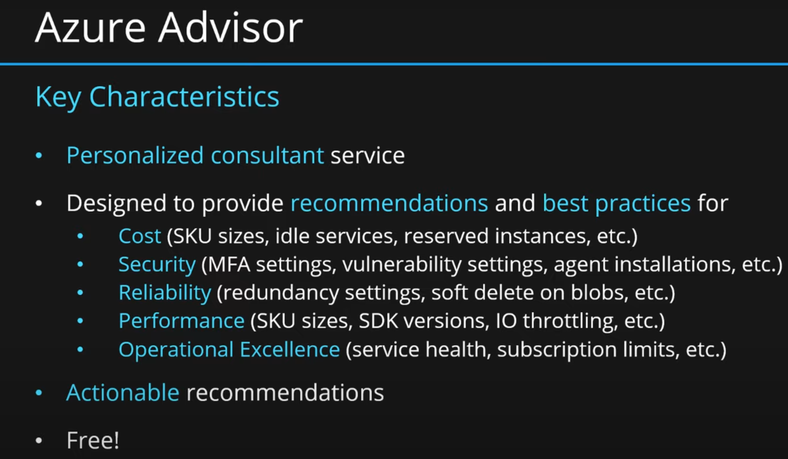
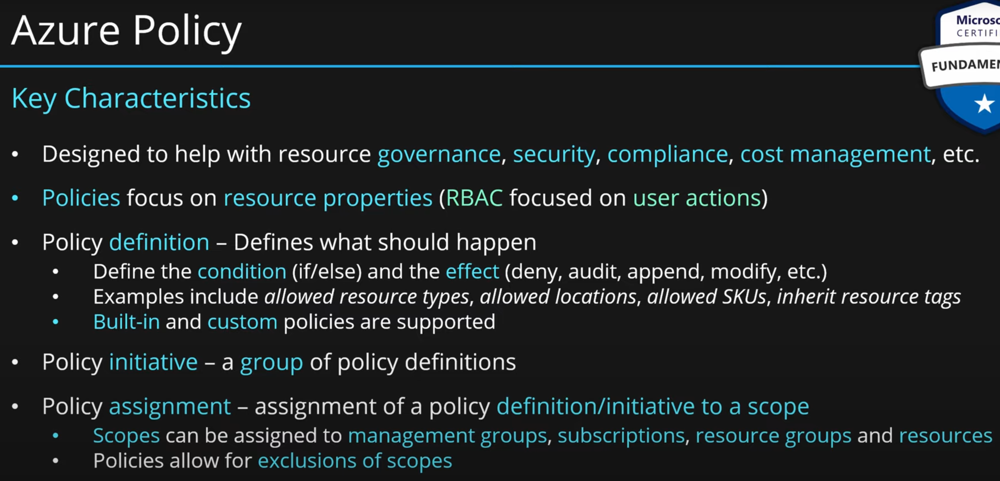

## ***1. Cloud Computing***

Service delivery model over the internet (cloud). This includes but is not limited to:

- **Compute Power**: Servers such as Windows, Linux, hosting environments, etc.
- **Storage**: Files and/or databases.
- **Networking**: In Azure but also outside when connecting to your company network.
- **Analytics Services**: For visualization and telemetry data.

## ***2. Azure Cloud Key Characteristics***

- **Scalability**: is the ability to scale, so scaling is a process of allocating(adding) and deallocating(removing) resources at any time.
- **Elasticity**: The ability to scale dynamically(Automatic Scaling).
- **Agility**: The ability to react fast (scale quickly).
- **Fault Tolerance**: is the ability to remain up and running during component and service failure.
- **Disaster Recovery**: is the ability to recover from an event that has taken down the service(disaster), should be able to recover from natural or human-induced disasters.
- **High Availability**: is the ability to keep services running for extended periods of time with very little downtime. It is a simple calculation of system uptime versus the whole lifetime of the system.
  - `availability = uptime / (uptime + downtime)`

## ***3. CapEx vs OpEx***

Great question! Understanding the difference between CapEx (Capital Expenditure) and OpEx (Operational Expenditure) is crucial when it comes to cloud computing, especially in Azure. Let's break it down:

### **Capital Expenditure (CapEx)**

- **Definition**: CapEx refers to the funds used by an organization to acquire, upgrade, or maintain physical assets such as property, industrial buildings, or equipment.
- **Usage in IT**: In traditional IT infrastructure, CapEx involves significant upfront investments in hardware, software licenses, data centers, and other physical infrastructure.
- **Benefits**:
  - Ownership of assets
  - Potential for depreciation tax benefits
- **Challenges**:
  - High initial costs
  - Long-term commitment
  - Difficulty in scaling quickly

### **Operational Expenditure (OpEx)**

- **Definition**: OpEx refers to the ongoing costs required for running day-to-day operations. These costs are incurred regularly and are often considered more flexible than CapEx.
- **Usage in IT**: In the context of cloud computing, OpEx involves the costs associated with the consumption of cloud services, such as pay-as-you-go pricing for compute, storage, and networking.
- **Benefits**:
  - Lower upfront costs
  - Greater flexibility and scalability
  - Easier to align with business needs
- **Challenges**:
  - Continuous expenses
  - Potential for higher long-term costs if not managed effectively

### **CapEx vs. OpEx in Azure**

| Feature                     | CapEx                                          | OpEx                                          |
|-----------------------------|-----------------------------------------------|-----------------------------------------------|
| **Initial Investment**      | High                                           | Low                                           |
| **Flexibility**             | Limited                                        | High                                          |
| **Scalability**             | Challenging and slow                           | Quick and easy                                |
| **Cost Management**         | Fixed over time                                | Variable based on usage                       |
| **Ownership of Assets**     | Yes                                            | No                                            |
| **Depreciation**            | Can claim tax benefits                         | Not applicable                                |
| **Use Case**                | Traditional on-premises IT infrastructure     | Cloud-based services and consumption models  |

In summary, **CapEx** involves substantial initial investments in physical assets and is more common in traditional IT setups. In contrast, **OpEx** allows for more flexibility and scalability, aligning with the dynamic nature of cloud computing, where costs are based on actual usage.

Moving to a cloud platform like Azure shifts many costs from CapEx to OpEx, which can provide significant financial and operational advantages for businesses.

## ***4. What is a Consumption-Based Model?***

The consumption-based model is a pricing model used in the cloud where customers are charged based on their resource usage.

This model is characterized by:

- **No Upfront Cost**: There are no associated upfront costs.
- **No Wasted Resources**: Charges are incurred only for used resources. For instance, blob storage that stores data is considered used as it consumes storage space. Virtual Machines that are running consume CPU, memory, and other resources even if there isn’t any traffic, hence they are considered used and will incur charges.
- **Pay for What You Need**: Customers pay only for the resources they need.
- **Stop Paying When You Don’t**: Charges stop when the resources are no longer needed.


Consumption is the virtual metric used to calculate how much each resource (service) in Azure was used. Each service has many smaller metrics that track its consumption to offer the best possible pricing model. These metrics are tracked at a very granular level.

## ***5. IaaS vs PaaS vs SaaS cloud service models***

Sure, let’s break down the three main cloud service models: Infrastructure as a Service (IaaS), Platform as a Service (PaaS), and Software as a Service (SaaS). Each offers different levels of control, flexibility, and management.

### Infrastructure as a Service (IaaS)
**Definition:** IaaS provides virtualized computing resources over the internet. It's essentially renting the infrastructure you need—like servers and storage—on-demand.


**Key Features:**
- **Scalability:** Easily scale resources up or down based on demand.
- **Flexibility:** Suitable for a wide range of use cases, from development and testing to disaster recovery.
- **Control:** Users have control over the operating systems, storage, and deployed applications.
- **Cost:** Pay-as-you-go pricing model, which can reduce costs associated with hardware and maintenance.

**Examples:** Amazon Web Services (AWS), Microsoft Azure, Google Cloud Platform (GCP)

### Platform as a Service (PaaS)
**Definition:** PaaS provides a platform allowing customers to develop, run, and manage applications without dealing with the infrastructure.


**Key Features:**
- **Development Tools:** Includes tools and libraries for application development, middleware, and database management.
- **Focus on Development:** Developers can focus on coding and managing applications rather than worrying about underlying hardware and software layers.
- **Efficiency:** Speeds up development cycles and reduces time to market.
- **Integration:** Often includes integrations with various services like databases and messaging systems.

**Examples:** Microsoft Azure App Services, Google App Engine, IBM Cloud Foundry

### Software as a Service (SaaS)
**Definition:** SaaS delivers software applications over the internet, on a subscription basis. Users access the software through a web browser, eliminating the need for internal servers and IT staff to manage installations.


**Key Features:**
- **Accessibility:** Access from any device with an internet connection.
- **Cost-Effective:** No upfront costs for software purchases; subscription-based pricing.
- **Automatic Updates:** Providers handle software updates and security patches.
- **Scalability:** Easily add or remove users as needed.

**Examples:** Microsoft Office 365, Google Workspace, Salesforce

### Comparison Table

| Feature            | IaaS                              | PaaS                           | SaaS                            |
|--------------------|-----------------------------------|--------------------------------|---------------------------------|
| Control            | Full control over the infrastructure | Control over applications but not the underlying infrastructure | Minimal control, focus on using the software |
| Use Cases          | Development, testing, disaster recovery | Application development and deployment | Business applications (CRM, email, collaboration tools) |
| Management         | High level of management required by users | Less management than IaaS, focus on application deployment | Minimal management, mostly handled by the provider |
| Cost Model         | Pay-as-you-go                      | Subscription-based, can vary by usage | Subscription-based per user |
| Examples           | AWS, Azure, GCP                   | Azure App Services, Google App Engine | Office 365, Google Workspace, Salesforce |


I hope this provides a clear understanding of the differences between IaaS, PaaS, and SaaS cloud service models. 

## ***6. Public, Private & Hybrid cloud deployment models***

Absolutely, let's dive into the three main cloud deployment models: Public, Private, and Hybrid Clouds.

### Public Cloud
**Definition:** A public cloud is a cloud infrastructure that is available to the general public or a large industry group and is owned by a cloud service provider.

**Key Features:**
- **Accessibility:** Services are available to anyone who wants to purchase them over the internet.
- **Cost-Effective:** Cost savings as users only pay for what they use, with no need to invest in hardware or infrastructure.
- **Scalability:** Highly scalable due to the vast resources of the service providers.
- **Maintenance:** Providers handle the maintenance, updates, and management of the infrastructure.


**Examples:** Amazon Web Services (AWS), Microsoft Azure, Google Cloud Platform (GCP)

**Use Cases:** Ideal for small to medium-sized businesses, startups, and projects with variable workloads.

### Private Cloud
**Definition:** A private cloud is a cloud infrastructure operated solely for a single organization. It can be managed internally or by a third party and can be hosted either on-premises or off-site.

**Key Features:**
- **Control:** Offers greater control over resources, security, and compliance.
- **Customization:** Highly customizable to meet specific business needs.
- **Security:** Enhanced security and privacy since resources are not shared with other organizations.
- **Cost:** Generally more expensive than public clouds due to the cost of managing and maintaining the infrastructure.


**Examples:** VMware, OpenStack, Microsoft Azure Stack

**Use Cases:** Suitable for large enterprises, government organizations, and businesses with stringent security and compliance needs.

### Hybrid Cloud
**Definition:** A hybrid cloud combines public and private cloud infrastructures, allowing data and applications to be shared between them.

**Key Features:**
- **Flexibility:** Offers the benefits of both public and private clouds, allowing for greater flexibility and optimization.
- **Scalability:** Use public cloud resources for high-demand workloads while keeping sensitive data in a private cloud.
- **Cost-Effectiveness:** Optimize costs by leveraging public cloud resources while maintaining critical applications and data in a private cloud.
- **Interoperability:** Requires strong interoperability between public and private clouds to ensure seamless integration and operation.


**Examples:** Microsoft Azure Hybrid, AWS Outposts, Google Anthos

**Use Cases:** Ideal for businesses with varying workloads, disaster recovery needs, and those seeking to optimize costs while maintaining control over sensitive data.

### Comparison Table

| Feature          | Public Cloud                     | Private Cloud                  | Hybrid Cloud                      |
|------------------|----------------------------------|--------------------------------|-----------------------------------|
| Accessibility    | Available to the general public  | Exclusive to a single organization | Combines public and private cloud resources |
| Control          | Limited control                  | Full control                   | Balanced control and flexibility  |
| Cost             | Pay-per-use, cost-effective      | Higher cost due to infrastructure management | Optimized costs                    |
| Scalability      | Highly scalable                  | Scalable but limited by internal resources | Scalable by leveraging both clouds |
| Security         | Standard security                | Enhanced security               | Enhanced security for sensitive data |
| Examples         | AWS, Azure, GCP                  | VMware, OpenStack, Azure Stack  | Azure Hybrid, AWS Outposts, Google Anthos   |

Each cloud deployment model has its own set of advantages and is suited for different business needs. If you have any specific scenarios in mind or further questions, feel free to ask!

## ***7. Geographies, Regions & Availability Zones***

Sure! Let's take a closer look at Microsoft Azure Geographies, Regions, and Availability Zones, including their purposes, characteristics, and benefits.

### **Azure Geographies**
- **Definition**: An Azure geography is a defined area of the world that contains at least one Azure Region. Geographies ensure that data residency, sovereignty, and compliance requirements are met. They are important for organizations needing to comply with laws and regulations that require data to be stored and processed within certain boundaries.
- **Purpose**: Provides a layer of data residency and compliance boundary to meet legal and regulatory requirements.
- **Examples**: 
  - United States
  - Europe
  - Asia Pacific
  - Canada
  - Middle East
  - Africa

### **Azure Regions**
- **Definition**: An Azure Region is a geographical area containing one or more datacenters, and it forms the basic building block of the Azure infrastructure. Each region is designed to be isolated from other regions to prevent potential failure.
- **Purpose**: Regions provide the physical infrastructure for running your applications and storing your data. They help ensure low-latency access to resources.
- **Characteristics**:
  - **Multiple Datacenters**: Each region typically has multiple datacenters for redundancy and availability.
  - **Region Pairs**: Azure pairs regions within the same geography to support disaster recovery. In the event of an outage, services can failover to the paired region.
- **Examples**: 
  - West US
  - East US
  - North Europe
  - Southeast Asia
  - Central India

### Products available by region

[Products available by region](https://azure.microsoft.com/en-us/explore/global-infrastructure/products-by-region)

### Azure Speed Test 2

[Azure Speed Test 2](https://azurespeedtest.azurewebsites.net/)


### **Azure Availability Zones**

- **Definition**: Availability Zones are unique physical locations within an Azure Region. Each zone is made up of one or more datacenters equipped with independent power, cooling, and networking.
- **Purpose**: Availability Zones are designed to provide high availability and fault tolerance for your applications and data by protecting against datacenter-level failures.
- **Characteristics**:
  - **Physical Separation**: Zones are separated by sufficient distance to ensure that a localized disaster cannot affect more than one zone, but they are close enough to provide low-latency connectivity.
  - **Independent Infrastructure**: Each zone has its own power, cooling, and network infrastructure, minimizing the risk of single points of failure.
  
- **Benefits**:
  - **High Availability**: Ensures your applications remain available even if one zone experiences an outage.
  - **Fault Tolerance**: Protects against datacenter-level failures, enhancing the resilience of your applications.
  - **Disaster Recovery**: Supports the ability to design and deploy applications that can quickly recover from catastrophic failures.

- Designed to protect from data center failures
- Not all regions are supports Availability Zones
- If zone goes down others continue working
- Supported region has three or more zones
- A zone is one or more data centers
- **Region Pair**:
  - Each region is paired with another region making it a region pair
  - Region pairs are static and cannot be chosen
  - Each pair resides within the same geography*
  - Physical isolation with at least 300 miles distance (when possible)
  - Some services have platform-provided replication
  - Planned updates across the pairs
  - Data residency maintained for disaster recovery
  


- **Two Service Categories**:
  - Zonal Services(Virtual Machines, Disks etc.)
  - Zone-Reduntant Services(SQL, Storage, etc.)
  


### **Benefits of Azure's Global Infrastructure**

- **High Availability**: By leveraging regions and availability zones, Azure ensures that your applications and data remain accessible even in the event of failures.
- **Scalability**: Azure's infrastructure allows you to scale your resources up or down based on demand, ensuring you can handle peak loads efficiently.
- **Compliance**: Geographies help meet data residency and compliance requirements, ensuring your data stays within legal boundaries.
- **Low Latency**: With regions spread across the globe, Azure provides low-latency access to resources, improving the performance of your applications.
- **Disaster Recovery**: Region pairs and availability zones enable robust disaster recovery solutions, ensuring business continuity.

### **Visual Representation**

Here's a visual representation of the relationship between geographies, regions, and availability zones:

```
Azure Geography
 └─ Azure Region
     ├─ Availability Zone 1
     ├─ Availability Zone 2
     └─ Availability Zone 3
```

### **Examples of Regions and Their Features**

| Region          | Location              | Availability Zones  | Paired Region    |
|-----------------|-----------------------|---------------------|------------------|
| East US         | Virginia, USA         | 3                   | West US          |
| West Europe     | Amsterdam, Netherlands| 3                   | North Europe     |
| Southeast Asia  | Singapore             | 3                   | East Asia        |
| Central India   | Pune, India           | 3                   | South India      |

This structure and organization ensure that Microsoft Azure can provide a highly available, scalable, and compliant cloud infrastructure to meet a wide range of business needs.

## ***8. Azure Data Center***

An **Azure Data Center** is a physical facility that houses the hardware and software infrastructure required to deliver cloud services to Azure customers. Here's a detailed explanation of its key components and functions:

### Key Components
1. **Physical Infrastructure**: This includes servers, storage systems, networking equipment, power supplies, cooling systems, and security systems.
2. **Networking**: Azure Data Centers are equipped with high-speed networking equipment to ensure fast and reliable communication between servers and with the outside world. This includes routers, switches, and fiber optic cables.
3. **Power Supply**: Reliable power sources and backup generators are essential to keep the data center running without interruptions.
4. **Cooling Systems**: Efficient cooling systems are crucial to prevent overheating of the equipment. This often involves advanced HVAC systems and liquid cooling technologies.
5. **Security**: Multiple layers of security are implemented, including physical security (e.g., access controls, surveillance cameras), network security (e.g., firewalls, intrusion detection systems), and data security (e.g., encryption, access controls).

### Functions
1. **Compute Resources**: Azure Data Centers host virtual machines, containers, and other compute resources that customers can use to run their applications.
2. **Storage**: They provide scalable storage solutions, including blob storage, file storage, and disk storage, to store data securely and efficiently.
3. **Networking**: Azure Data Centers offer networking services such as virtual networks, load balancers, and VPN gateways to connect resources and ensure high availability and performance.
4. **Management and Monitoring**: They include tools and services for managing and monitoring resources, such as Azure Monitor, Azure Automation, and Azure Security Center.
5. **Sustainability**: Microsoft is committed to sustainability, and Azure Data Centers are designed to be energy-efficient and environmentally friendly. This includes using renewable energy sources and implementing energy-saving technologies.

### Architecture
Azure Data Centers are organized into **geographies**, **regions**, and **availability zones**:
- **Geographies**: These are large areas that contain multiple regions, typically spanning entire countries or continents.
- **Regions**: Each geography contains multiple regions, which are separate locations with their own power, cooling, and networking infrastructure.
- **Availability Zones**: Within each region, there are multiple availability zones, which are physically separate locations designed to protect against datacenter failures.


### Example
Here's a simplified example of how an Azure Data Center might be structured:
1. **Region**: North America, Europe, Asia Pacific, South America, Africa, and the Middle East - Total 60 regions
2. **Availability Zones**: Zone 1, Zone 2, Zone 3
3. **Data Center**: Each availability zone contains a data center with servers, storage, and networking equipment.
4. **Networking**: High-speed fiber optic cables connect the data centers within the region and to other regions and the global internet.
5. **Power Supply**: Backup generators and renewable energy sources ensure continuous operation.
6. **Cooling**: Advanced cooling systems maintain optimal temperatures for the equipment.

By understanding the architecture and components of Azure Data Centers, you can better appreciate how Azure delivers reliable, scalable, and secure cloud services to its customers. 

## ***9. Resources, Resource Groups & Resource Manager***

Let's delve into Azure's core organizational components: **Azure Resources**, **Resource Groups**, and **Azure Resource Manager**.

### **Azure Resources**

- **Definition**: Azure Resources are the fundamental building blocks of Azure services. They include compute resources (like virtual machines), storage (like Azure Blob Storage), databases (like Azure SQL Database), and networking resources (like virtual networks).
- **Examples**:
  - Virtual Machines (VMs)
  - Storage Accounts
  - SQL Databases
  - Virtual Networks (VNets)
   


- **Characteristics**:
  - **Configurable**: Resources can be configured and managed independently or in groups.
  - **Scalable**: Resources can be scaled up or down based on requirements.
  - **Billing**: Resources incur costs based on usage, configuration, and service level.

### **Resource Groups**

- **Definition**: A Resource Group is a container that holds related Azure resources. All resources within a resource group share the same lifecycle, permissions, and policies.
- **Purpose**: Provides a logical way to organize and manage Azure resources.
- Each resource must be in one, and only one resource group
- Resource groups have their own location assigned
- Resources in the resource groups can reside in a different locations
- Resources can be moved between the resource groups
- Resource groups can’t be nested
- Organize based on your organization needs but consider
    - Billing
    - Security and access management
    - Application Lifecycle

- **Characteristics**:
  - **Lifecycle Management**: Resources in the same group can be managed, deployed, and deleted together.
  - **Access Control**: Resource groups allow for granular access control using role-based access control (RBAC).
  - **Tagging**: Resources and resource groups can be tagged for easy identification and management.


- **Examples**:
  - A resource group for a specific project containing a virtual machine, a storage account, and a database.
  - Resource groups for different environments (e.g., development, testing, production).

### **Azure Resource Manager (ARM)**

- **Definition**: Azure Resource Manager is the deployment and management service for Azure. It provides a consistent management layer that enables you to create, update, and delete resources in your Azure account.
- **Purpose**: Simplifies the management, deployment, and organization of Azure resources.
- **Characteristics**:
  - **Declarative Templates**: Allows you to use Azure Resource Manager templates (ARM templates) to define the infrastructure and configurations for your resources.
  - **Consistency**: Provides consistent management across all Azure services through a unified API.
  - **Role-Based Access Control (RBAC)**: Integrates with Azure Active Directory for fine-grained access control.
  - **Tagging and Policies**: Supports resource tagging and policy enforcement to ensure compliance and efficient resource management.
  - **Dependency Management**: Manages dependencies between resources during deployment.
  


### **Key Differences**

| Feature                        | Azure Resources                           | Resource Groups                            | Azure Resource Manager                     |
|--------------------------------|-------------------------------------------|--------------------------------------------|--------------------------------------------|
| **Definition**                 | Individual Azure services and components  | Logical container for related resources    | Deployment and management service for Azure|
| **Purpose**                    | Provides compute, storage, networking, etc.| Organizes and manages related resources     | Simplifies resource management and deployment|
| **Scope**                      | Individual resources                      | Group of related resources                  | All resources in a subscription             |
| **Access Control**             | Managed individually or through groups    | Granular control via RBAC                   | Integrated with Azure AD for RBAC          |
| **Lifecycle Management**       | Managed individually                      | Managed as a group                          | Managed through ARM templates and policies |
| **Tagging**                    | Resources can be tagged                   | Resource groups can be tagged               | ARM supports tagging and policy enforcement|
| **Deployment**                 | Individual or group deployment            | Group deployment                            | Declarative ARM templates                   |

### **Summary**
- **Azure Resources** are the fundamental components and services you use in Azure.
- **Resource Groups** provide a way to organize and manage these resources as a unit, sharing the same lifecycle and permissions.
- **Azure Resource Manager** (ARM) is the service that enables you to manage, deploy, and organize resources consistently using a unified API and declarative templates.

This framework ensures that you can efficiently manage, scale, and organize your Azure infrastructure to meet your business needs.

## ***10. Azure Compute Services***
Azure Compute Services offer a variety of cloud-based solutions to meet different computing needs. Here’s a detailed explanation of the main Azure Compute Services:

### **1. Virtual Machines (VMs)**
- **Definition**: Azure VMs are on-demand, scalable computing resources.
- **Key Features**:
  - **Customizable**: Choose your operating system, CPU, memory, and storage.
  - **Scalability**: Scale up or down based on demand.
  - **Deployment**: Easy deployment using Azure portal, ARM templates, or CLI.
- **Use Cases**: Running custom applications, extending on-premises servers to the cloud, and creating development and test environments.

### **2. Virtual Machines Scale Set(VMSS)**

Azure Virtual Machine Scale Sets (VMSS) are an Azure compute resource that allows you to deploy and manage a set of identical, auto-scaling virtual machines. VMSS provides high availability, automatic scaling, and ease of management, making it ideal for workloads that require dynamic scalability. Here's a detailed explanation:

### Key Features

1. **Auto-Scaling**: VMSS can automatically scale the number of VM instances based on demand, using various metrics such as CPU usage, memory usage, or custom metrics.
2. **Load Balancing**: VMSS integrates with Azure Load Balancer to distribute incoming traffic across the VM instances, ensuring high availability and reliability.
3. **High Availability**: VMSS distributes VM instances across multiple availability zones or availability sets, protecting against datacenter failures and ensuring business continuity.
4. **Easy Management**: You can manage all the VM instances in the scale set as a single resource, simplifying configuration, updates, and monitoring.
5. **Support for Custom Images**: VMSS allows you to use custom VM images or Azure Marketplace images, giving you flexibility in deploying different types of workloads.

### Use Cases

- **Web Applications**: VMSS is ideal for hosting web applications that experience varying levels of traffic, as it can automatically scale out during peak times and scale in during low traffic periods.
- **Big Data and Analytics**: VMSS can be used for big data processing and analytics workloads that require significant compute resources, which can scale dynamically based on the volume of data.
- **Containerized Workloads**: VMSS can be used to deploy and manage containerized applications, such as those running on Docker or Kubernetes.

### Example Architecture

Here's a high-level example of an architecture using Azure VMSS:

1. **Virtual Machine Scale Set**: Create a scale set with the required VM configuration (e.g., VM size, OS, networking).
2. **Load Balancer**: Configure an Azure Load Balancer to distribute incoming traffic across the VM instances in the scale set.
3. **Auto-Scaling Rules**: Define auto-scaling policies based on metrics such as CPU usage or custom metrics to handle demand fluctuations.
4. **High Availability**: Use Availability Zones to distribute VM instances across different zones within the region.


### Steps to Create a VMSS

Here's a step-by-step guide to creating a VMSS using the Azure portal:

1. **Create a VM Scale Set**:
   - In the Azure portal, navigate to "Create a resource" and select "Virtual Machine Scale Set."
   - Configure the basic settings such as the scale set name, region, and image (e.g., Windows Server or Ubuntu).

2. **Configure the Scale Set**:
   - Choose the VM size, instance count, and networking options.
   - Enable "Auto-scale" and configure auto-scaling rules based on metrics like CPU usage.

3. **Set Up Load Balancer**:
   - Select "Add Load Balancer" to distribute incoming traffic across the VM instances.
   - Configure the load balancer settings, such as front-end IP configuration and load balancing rules.

4. **Define High Availability**:
   - Select the availability options, such as Availability Zones or Availability Sets, to ensure high availability and redundancy.

5. **Review and Create**:
   - Review the configuration settings and click "Create" to deploy the VM scale set.

### **3. Azure Kubernetes Service (AKS)**

- **Definition**: AKS is a managed container orchestration service that simplifies deploying, managing, and scaling containerized applications using Kubernetes.
- **Key Features**:
  - **Managed Kubernetes**: Azure handles cluster management tasks.
  - **Scaling**: Automatically scales based on load.
  - **Security**: Integrates with Azure Active Directory for access control.
- **Use Cases**: Microservices architecture, DevOps pipelines, and scalable web applications.

### **4. Azure App Service**

- **Definition**: Azure App Service is a fully managed platform for building, deploying, and scaling web apps and APIs.
- **Key Features**:
  - **Multi-language support**: Supports .NET, Java, Python, PHP, Node.js, and more.
  - **Autoscaling**: Automatically adjusts the number of instances based on load.
  - **Integrated Development Tools**: Integrates with Visual Studio, GitHub, and DevOps tools.
- **Use Cases**: Hosting web applications, RESTful APIs, and mobile backends.

### **5. Azure Functions**

- **Definition**: Azure Functions is a serverless compute service that allows you to run event-driven code without managing infrastructure.
- **Key Features**:
  - **Event-driven**: Trigger functions based on events or schedules.
  - **Scalability**: Automatically scales based on demand.
  - **Cost-effective**: Pay only for the execution time of your code.
- **Use Cases**: Real-time file processing, IoT data processing, and background tasks.

### **6. Azure Virtual Desktop (formerly Windows Virtual Desktop)**

- **Definition**: Azure Virtual Desktop provides a scalable, multi-session Windows 10/11 experience in the cloud.
- **Key Features**:
  - **Remote Access**: Access Windows desktops and apps from anywhere.
  - **Multi-session**: Supports multiple concurrent users on a single VM.
  - **Integration**: Seamlessly integrates with Microsoft 365 and Azure Active Directory.
- **Use Cases**: Remote work scenarios, virtual training, and application virtualization.

### **7. Azure Batch**

- **Definition**: Azure Batch enables large-scale parallel and high-performance computing (HPC) jobs.
- **Key Features**:
  - **Job Scheduling**: Efficiently schedules jobs and tasks.
  - **Autoscaling**: Scales compute nodes based on job demands.
  - **Cost Optimization**: Optimize costs by using low-priority VMs.
- **Use Cases**: Scientific simulations, data analysis, and rendering workloads.

### **8. Azure Service Fabric**

- **Definition**: Service Fabric is a distributed systems platform that simplifies building and managing microservices and container-based applications.
- **Key Features**:
  - **Stateful and Stateless Services**: Supports both types of services.
  - **Reliability**: Built-in support for high availability and fault tolerance.
  - **Integration**: Integrates with various development tools and CI/CD pipelines.
- **Use Cases**: Mission-critical applications, microservices architecture, and stateful services.

### **9. Azure Container Instances (ACI)**
- **Definition**: ACI provides a quick and simple way to run containers without managing virtual machines.
- **Key Features**:
  - **Serverless Containers**: Run containers without provisioning infrastructure.
  - **Fast Deployment**: Deploy and start containers in seconds.
  - **Isolation**: Each container runs in isolation for security.
- **Use Cases**: Containerized workloads, development and testing, batch processing, Background Jobs and Scheduled scripts.

### **Comparison Summary**

| Service                       | Key Features                                    | Use Cases                                       |
|-------------------------------|-------------------------------------------------|-------------------------------------------------|
| **Virtual Machines**          | Customizable, scalable, easy deployment         | Custom apps, extending on-premises, testing     |
| **Azure Kubernetes Service**  | Managed Kubernetes, scaling, security           | Microservices, DevOps, scalable web apps        |
| **Azure App Service**         | Multi-language, autoscaling, development tools  | Hosting web apps, APIs, mobile backends         |
| **Azure Functions**           | Event-driven, scalability, cost-effective       | Real-time processing, IoT, background tasks     |
| **Azure Virtual Desktop**     | Remote access, multi-session, integration       | Remote work, virtual training, app virtualization|
| **Azure Batch**               | Job scheduling, autoscaling, cost optimization  | Scientific simulations, data analysis, rendering|
| **Azure Service Fabric**      | Stateful/stateless services, reliability        | Mission-critical apps, microservices, stateful services|
| **Azure Container Instances** | Serverless containers, fast deployment, isolation| Containerized workloads, dev/testing, batch processing|


These services together provide a robust, scalable, and flexible platform for building, deploying, and managing a wide range of applications and workloads in the cloud.

## ***11. Azure Networking Services***

Azure offers a comprehensive suite of networking services that enable you to build, manage, and secure your network infrastructure in the cloud. Here's a detailed explanation of the key Azure Networking Services:

### **1. Virtual Network (VNet)**
- **Definition**: A logically isolated network in Azure that allows you to securely connect Azure resources.
 


- **Key Features**:
  - **Isolation**: Provides network isolation and segmentation for your resources.
  - **Subnets**: Create subnets to segment your network for better security and management.
  - **Peering**: Connect VNets to each other for secure cross-network communication.
- **Use Cases**: Setting up a secure network environment for applications, extending on-premises networks to Azure.

### **2. Azure Load Balancer**

- **Definition**: A Layer 4 load balancer that distributes incoming traffic across multiple virtual machines.


- **Key Features**:
  - **High Availability**: Ensures high availability and reliability by distributing traffic.
  - **Internal and External Load Balancing**: Supports both internal and internet-facing load balancing.
  - **Health Probes**: Monitors the health of your services and routes traffic to healthy instances.
- **Use Cases**: Balancing traffic for web applications, improving availability and reliability of services.

### **3. Azure Application Gateway**

- **Definition**: A Layer 7 load balancer designed for web applications, providing application-level routing and features.


- **Key Features**:
  - **Web Application Firewall (WAF)**: Protects web applications from common threats and vulnerabilities.
  - **SSL Termination**: Offloads SSL decryption to improve performance.
  - **URL-based Routing**: Routes traffic based on URL paths for better traffic management.
  - **Session Affinity**
- **Use Cases**: Enhancing security and performance for web applications, protecting against web vulnerabilities.

### **4. Azure VPN Gateway**

- **Definition**: A service that establishes secure, encrypted connections between on-premises networks and Azure VNets.


- **Key Features**:
  - **Site-to-Site VPN**: Connects on-premises networks to Azure VNets securely.
  - **Point-to-Site VPN**: Allows individual devices to connect to Azure VNets.
  - **ExpressRoute Integration**: Works with Azure ExpressRoute for private connections.
  - Cross-regional communcation of azure virtual networks
    - VNet peering VS VPN gateway should be chosen based on the organization needs.
- **Use Cases**: Securely extending on-premises networks to Azure, enabling remote access to Azure resources.

### **5. Azure ExpressRoute**

- **Definition**: A service that provides a private, dedicated connection between on-premises networks and Azure.
- **Key Features**:
  - **Private Connectivity**: Bypasses the public internet for secure and reliable connections.
  - **High Bandwidth**: Supports high-bandwidth connectivity for data-intensive applications.
  - **Consistent Performance**: Provides predictable and consistent network performance.
- **Use Cases**: High-performance data transfer, hybrid cloud solutions, disaster recovery.

### **6. Azure Traffic Manager**

- **Definition**: A DNS-based traffic load balancer that distributes traffic across multiple endpoints globally.
- **Key Features**:
  - **Geographic Routing**: Routes traffic based on geographic location for improved performance.
  - **Priority Routing**: Routes traffic based on endpoint priority for failover scenarios.
  - **Weighted Routing**: Distributes traffic based on assigned weights for load balancing.
- **Use Cases**: Enhancing global performance, disaster recovery, and high availability for applications.

### **7. Azure Content Delivery Network (CDN)**

- **Definition**: A global CDN that delivers high-bandwidth content to users with low latency.
- **Key Features**:
  - **Caching**: Caches content at edge locations to reduce latency and improve load times.
  - **Content Acceleration**: Speeds up the delivery of static and dynamic content.
  - **Security**: Provides features like HTTPS, DDoS protection, and geo-filtering.
- **Use Cases**: Accelerating web applications, streaming media, and delivering large files.

### **8. Azure DDoS Protection**

- **Definition**: A service that protects Azure applications from Distributed Denial of Service (DDoS) attacks.
- **Key Features**:
  - **Always-On Monitoring**: Continuously monitors traffic for potential threats.
  - **Automatic Mitigation**: Automatically mitigates DDoS attacks without user intervention.
  - **Enhanced Reporting**: Provides detailed analytics and insights on DDoS events.
- **Use Cases**: Protecting web applications, APIs, and internet-facing services from DDoS attacks.

### **Comparison Summary**

| Service                        | Key Features                                    | Use Cases                                        |
|-------------------------------|-------------------------------------------------|-------------------------------------------------|
| **Virtual Network (VNet)**    | Isolation, subnets, peering                      | Secure network environment, extending on-premises |
| **Azure Load Balancer**       | High availability, internal/external balancing, health probes | Web application traffic balancing, improving service reliability |
| **Azure Application Gateway** | WAF, SSL termination, URL-based routing         | Enhancing web app security and performance, protecting against vulnerabilities |
| **Azure VPN Gateway**         | Site-to-Site, Point-to-Site, ExpressRoute integration | Extending on-premises networks securely, remote access |
| **Azure ExpressRoute**        | Private connectivity, high bandwidth, consistent performance | High-performance data transfer, hybrid cloud solutions |
| **Azure Traffic Manager**     | Geographic, priority, weighted routing          | Enhancing global performance, disaster recovery |
| **Azure CDN**                 | Caching, content acceleration, security         | Accelerating web apps, streaming media, large file delivery |
| **Azure DDoS Protection**     | Always-on monitoring, automatic mitigation, enhanced reporting | Protecting web applications and services from DDoS attacks |


These networking services work together to provide a robust, secure, and high-performance network infrastructure for your Azure-based applications and services.

## ***12. Azure Network Security Group (NSG) & Application Security Groups (ASG)***

Azure Network Security Groups (NSGs) are essential for securing your Azure resources by controlling inbound and outbound network traffic to and from Azure resources. Here's a detailed explanation of NSGs:

### **Definition**

- **Network Security Group (NSG)**: An Azure resource that acts as a virtual firewall, allowing you to filter network traffic to and from Azure resources in an Azure Virtual Network (VNet).

### **Key Features**

1. **Rule-Based Filtering**: NSGs contain security rules that allow or deny inbound and outbound traffic based on various criteria like source and destination IP addresses, ports, and protocols.
2. **Stateful Rules**: NSG rules are stateful, meaning they automatically allow return traffic for an outbound connection that matches an inbound rule.
3. **Flexible Deployment**: NSGs can be applied to individual network interfaces, VMs, or subnets, providing flexible control over network traffic.
4. **Priority-Based Rules**: Each rule has a priority, and rules are evaluated in order of their priority, from lowest to highest.
5. **Logging and Monitoring**: NSGs support logging through Network Security Group Flow Logs, which allow you to monitor and analyze network traffic.

### **Key Components**
- **Inbound Security Rules**: Control incoming traffic to Azure resources. Each rule specifies the allowed or denied traffic.
- **Outbound Security Rules**: Control outgoing traffic from Azure resources. Each rule specifies the allowed or denied traffic.
- **Default Security Rules**: NSGs come with a set of default security rules that allow essential traffic (e.g., internal communication within the VNet) and deny others by default. These can be overridden with custom rules.

### **How NSGs Work**
1. **Association with Resources**: You can associate an NSG with a subnet or a network interface. If associated with both, the rules are applied cumulatively.
2. **Evaluation of Rules**: Traffic is evaluated against the security rules in order of priority. The first matching rule is applied, and no further rules are evaluated for that traffic.
3. **Stateful Processing**: Once a rule allows or denies traffic, the corresponding return traffic is automatically allowed.

### **Examples of NSG Rules**
| Priority | Source IP | Source Port | Destination IP | Destination Port | Protocol | Action |
|----------|-----------|-------------|----------------|------------------|----------|--------|
| 100      | Any       | Any         | Any            | 80               | TCP      | Allow  |
| 200      | Any       | Any         | Any            | 443              | TCP      | Allow  |
| 300      | VirtualNetwork | Any    | VirtualNetwork | Any              | Any      | Allow  |
| 400      | Any       | Any         | Any            | Any              | Any      | Deny   |

### **Use Cases**
- **Web Application Protection**: Restrict inbound traffic to web servers to specific IP addresses or ranges, allowing only HTTP (port 80) and HTTPS (port 443) traffic.
- **Database Security**: Control access to database servers by allowing only specific VMs or subnets to communicate with the database servers.
- **Microsegmentation**: Segment your network into smaller, isolated zones with specific security rules, improving overall network security.
 


### **Benefits**
- **Enhanced Security**: NSGs provide granular control over network traffic, enhancing the security of Azure resources.
- **Ease of Management**: NSGs can be managed through the Azure portal, Azure CLI, PowerShell, or ARM templates, making it easy to define and apply security policies.
- **Compliance**: NSGs help meet compliance requirements by enforcing network security policies and logging traffic flow for auditing purposes.

### **Summary**
Azure Network Security Groups (NSGs) are critical for controlling and securing network traffic to and from Azure resources. With features like rule-based filtering, stateful rules, and flexible deployment, NSGs provide robust security and management capabilities, ensuring that your Azure infrastructure is protected from unauthorized access and potential threats.

### **Azure Application Security Groups (ASGs)**

**Definition**: An Azure Application Security Group (ASG) is a logical grouping of virtual machine (VM) network interfaces (NICs) that allows you to simplify the management of network security rules. ASGs enable you to create security rules based on application or workload identities rather than specific IP addresses.

### **Key Features**
1. **Logical Grouping**: ASGs provide a way to group VMs based on their application roles, such as web servers, database servers, or application servers.
2. **Simplified NSG Rules**: Instead of specifying individual IP addresses, you can apply Network Security Group (NSG) rules to ASGs, simplifying the management of security rules.
3. **Dynamic Membership**: VMs can be dynamically added to or removed from ASGs based on their network interfaces (NICs).
4. **Improved Management**: ASGs enable more manageable and scalable network security configurations, particularly in dynamic environments.

### **Components of ASGs**
- **Network Interface (NIC)**: The NICs of VMs are associated with ASGs. Each NIC can belong to multiple ASGs, allowing for flexible grouping.
- **NSG Rules**: Security rules are defined in NSGs and applied to ASGs. These rules control inbound and outbound traffic based on the ASGs.

### **How ASGs Work**
1. **Association**: You create ASGs and associate them with the NICs of your VMs. A NIC can belong to multiple ASGs.
2. **NSG Rules**: You define NSG rules that specify the source ASG, destination ASG, ports, and protocols. These rules are applied to control traffic between ASGs.
3. **Dynamic Grouping**: VMs can be added to or removed from ASGs dynamically, without needing to update NSG rules.

### **Example ASG Rules**
| Priority | Source ASG    | Destination ASG | Destination Port | Protocol | Action |
|----------|---------------|-----------------|------------------|----------|--------|
| 100      | WebServers    | DatabaseServers | 1433             | TCP      | Allow  |
| 200      | Any           | WebServers      | 80               | TCP      | Allow  |
| 300      | Any           | WebServers      | 443              | TCP      | Allow  |
| 400      | ManagementServers | AllServers   | 22               | TCP      | Allow  |

### **Use Cases for ASGs**
1. **Application Isolation**: Group VMs by their application roles (e.g., web servers, database servers) and apply security rules based on these roles. This ensures that only specific applications can communicate with each other.
2. **Dynamic Environments**: Simplify network security management in environments where VMs are frequently added or removed. ASGs eliminate the need to update NSG rules whenever VMs are added or removed.
3. **Scalable Security Management**: Manage network security at scale by applying NSG rules to logical groups of VMs instead of individual IP addresses.

### **Benefits**
- **Simplified Management**: ASGs simplify the management of NSG rules by allowing you to group VMs based on their application roles.
- **Dynamic Grouping**: VMs can be dynamically added to or removed from ASGs without needing to update NSG rules.
- **Improved Scalability**: ASGs enable scalable network security configurations, particularly in dynamic environments.
- **Enhanced Security**: By applying security rules to application groups, ASGs help ensure that only authorized traffic is allowed between applications.


### **Summary**
Azure Application Security Groups (ASGs) provide a flexible and efficient way to manage network security rules by grouping VMs based on their application roles. ASGs simplify the creation and management of NSG rules, allowing for dynamic and scalable security configurations. This is particularly beneficial in dynamic environments where VMs are frequently added or removed.

### **Comparison Summary**

| Feature                          | Network Security Groups (NSGs)            | Application Security Groups (ASGs)           |
|----------------------------------|-------------------------------------------|---------------------------------------------|
| **Definition**                   | Virtual firewall with rule-based filtering| Logical grouping of VM NICs for simplified NSG rules |
| **Rule Scope**                   | Source/Destination IPs, ports, protocols  | Source/Destination ASGs, ports, protocols   |
| **Stateful Rules**               | Yes                                       | Yes                                         |
| **Association**                  | Subnets, network interfaces, VMs          | VM NICs                                     |
| **Dynamic Membership**           | No                                        | Yes                                         |
| **Use Cases**                    | Web app protection, database security     | Application isolation, dynamic environments |
| **Management Complexity**        | Higher for large numbers of VMs           | Lower, as rules are applied to groups       |

## ***13. Azure Storage Services***

Azure Storage Services provide a robust, scalable, and secure storage solution for a wide range of data and applications. Let's take a closer look at the key Azure Storage Services:

### **1. Azure Blob Storage**

- **Definition**: A massively scalable object storage service for unstructured data, such as text or binary data.


- **Key Features**:
  - **Blob Types**: Supports three types of blobs - Block Blobs, Append Blobs, and Page Blobs.
  - **Access Tiers**: Offers Hot, Cool, and Archive tiers for cost-effective data storage.
  - **Integration**: Seamlessly integrates with Azure Data Lake Storage for big data analytics.
  - **Security**: Supports encryption, access policies, and shared access signatures (SAS).
- **Use Cases**: Storing and serving images, videos, documents, and backups.

### **2. Azure File Storage**

- **Definition**: A fully managed file share service that provides file shares in the cloud accessible via the Server Message Block (SMB) and Network File System (NFS) protocols.


- **Key Features**:
  - **SMB and NFS Support**: Enables cross-platform access from Windows, Linux, and macOS.
  - **Azure File Sync**: Synchronizes on-premises file servers with Azure Files or implement lift-and-shift scenarios.
  - **Snapshots**: Provides file share snapshots for data protection and recovery.
  - **Integration**: Integrates with Azure Kubernetes Service (AKS) and Azure Virtual Machines (VMs).
- **Use Cases**: File sharing, home directories, and enterprise file storage.

### **3. Azure Queue Storage**

- **Definition**: A service that provides messaging for communication between application components, enabling asynchronous message queuing.
- **Key Features**:
  - **Scalability**: Handles millions of messages, ensuring high throughput.
  - **Decoupling**: Decouples components for better scalability and reliability.
  - **Message TTL**: Supports time-to-live (TTL) for messages to control message lifecycle.
  - **Integration**: Works seamlessly with Azure Functions and Azure Logic Apps.
- **Use Cases**: Task scheduling, asynchronous background processing, and workflow management.

### **4. Azure Table Storage**

- **Definition**: It is semi-structured database. A NoSQL key-value store that stores large amounts of structured data.
- **Key Features**:
  - **Schema-less Design**: Provides a flexible schema for storing structured data.
  - **High Availability**: Ensures high availability and durability of data.
  - **Partitioning**: Uses partitioning for scalable data storage and access.
  - **Integration**: Integrates with Azure Cosmos DB for advanced NoSQL capabilities.
- **Use Cases**: Storing user data, application logs, and sensor data.

### **5. Azure Disk Storage**

- **Definition**: Provides persistent, highly durable disk storage for Azure VMs.
- **Key Features**:
  - **Disk Types**: Offers Standard HDD, Standard SSD, and Premium SSD disks.
  - **Performance Tiers**: Provides performance tiers for different workload requirements.
  - **Snapshots**: Supports point-in-time snapshots for data backup and recovery.
  - **Encryption**: Ensures data security with server-side encryption.
- **Use Cases**: VM storage, database storage, and application data storage.

### **Comparison Summary**

| Service                   | Key Features                                     | Use Cases                                        |
|---------------------------|--------------------------------------------------|--------------------------------------------------|
| **Azure Blob Storage**    | Scalable, Access Tiers, Integration, Security    | Storing images, videos, documents, backups       |
| **Azure Files**           | SMB/NFS support, Azure File Sync, Snapshots      | File sharing, home directories, enterprise storage|
| **Azure Queue Storage**   | Scalability, Decoupling, Message TTL, Integration| Task scheduling, asynchronous processing, workflows|
| **Azure Table Storage**   | Schema-less design, High availability, Partitioning | User data, application logs, sensor data        |
| **Azure Disk Storage**    | Disk types, Performance tiers, Snapshots, Encryption | VM storage, database storage, application data storage|


### **Benefits of Azure Storage Services**

- **Scalability**: Azure Storage Services are designed to scale as your data grows, ensuring you have the capacity and performance needed.
- **Security**: Offers robust security features, including encryption, access control, and network security, to protect your data.
- **Cost-Effectiveness**: Provides various pricing tiers and storage options to optimize costs based on your data access patterns and needs.
- **Integration**: Seamlessly integrates with other Azure services and tools, enabling efficient data workflows and analytics.
- **Reliability**: Ensures high availability and durability of your data with built-in redundancy and disaster recovery options.

These Azure Storage Services provide a comprehensive and flexible solution for a wide range of data storage needs, from unstructured data to file shares and NoSQL storage.

## ***14. Azure Database Services***


## ***15. Azure Advisor***

Azure Advisor is a personalized cloud consultant that helps you optimize your Azure resources by following best practices. It analyzes your resource configuration and usage telemetry and provides actionable recommendations to improve cost effectiveness, performance, reliability, and security.

### **Key Features**
1. **Proactive Recommendations**: Azure Advisor offers proactive, actionable, and personalized best practices recommendations.
2. **Comprehensive Coverage**: It covers five main categories: Reliability, Security, Performance, Cost, and Operational Excellence.
3. **Actionable Insights**: Recommendations come with proposed actions inline, making it easy to implement them.
4. **Dashboard Access**: You can access Azure Advisor through the Azure portal, where it displays personalized recommendations for all your subscriptions.
5. **Customization**: You can apply filters to display recommendations for specific subscriptions and resource types.

### **Categories of Recommendations**
- **Reliability**: Ensures and improves the continuity of your business-critical applications.
- **Security**: Detects threats and vulnerabilities that might lead to security breaches.
- **Performance**: Improves the speed of your applications.
- **Cost**: Optimizes and reduces your overall Azure spending.
- **Operational Excellence**: Helps achieve process and workflow efficiency, resource manageability, and deployment best practices.

### **How to Use Azure Advisor**
1. **Sign In**: Access the Azure portal and locate Azure Advisor on the navigation pane or search for it in the All services menu.
2. **View Recommendations**: The Advisor dashboard displays personalized recommendations for all your subscriptions.
3. **Implement Actions**: Select a recommendation to learn more about it and implement the recommended action.
4. **Postpone or Dismiss**: If you don't intend to take immediate action, you can postpone or dismiss the recommendation.




### **Benefits**
- **Optimized Resources**: Helps you follow best practices to optimize your Azure deployments.
- **Improved Security**: Enhances the security of your resources by detecting threats and vulnerabilities.
- **Cost Savings**: Identifies opportunities to reduce your overall Azure spend.
- **Enhanced Performance**: Provides recommendations to improve the performance of your applications.
- **Operational Efficiency**: Assists in achieving process and workflow efficiency.

Azure Advisor is a valuable tool for ensuring that your Azure resources are running efficiently, securely, and cost-effectively. 

## ***16. Azure User-defined Routes with Route Tables***

Azure User-defined Routes with Route Tables allow you to control the routing of network traffic within your Azure Virtual Network (VNet). Here's a detailed explanation:

### **What are User-defined Routes (UDRs)?**
User-defined routes are custom routes that you can create to override the default system routes provided by Azure. These routes allow you to specify how traffic should be routed within your VNet or between VNets.

### **What are Route Tables?**
A route table is a collection of routes that define how network traffic is routed within a VNet. Each subnet in a VNet can be associated with a route table, and the routes in the table determine how traffic is directed.

### **Key Components**
1. **Routes**: Each route consists of an address prefix (destination) and a next hop (where the traffic should be sent). The next hop can be a virtual network, a virtual appliance, or the internet.
2. **Subnets**: Subnets are segments of your VNet that can be associated with a route table. Each subnet can have its own route table or share a route table with other subnets.
3. **Next Hop Types**: The next hop specifies where the traffic should be sent. Common next hop types include:
   - **Virtual Network**: Routes traffic within the same VNet.
   - **Internet**: Routes traffic to the internet.
   - **Virtual Appliance**: Routes traffic to a virtual appliance, such as a firewall or load balancer.

### **How to Create and Use UDRs and Route Tables**
1. **Create a Route Table**: In the Azure portal, navigate to "Create a resource" and select "Route table." Configure the route table with a name, subscription, resource group, and location.
2. **Add Routes**: Add custom routes to the route table. Specify the address prefix and the next hop type.
3. **Associate the Route Table with a Subnet**: Associate the route table with one or more subnets in your VNet. This allows the routes in the table to control the traffic for those subnets.


### **Configure Subnets inside Route Table**


### **Example Scenario**
Suppose you have a VNet with two subnets: Subnet A and Subnet B. You want to route traffic from Subnet A to a virtual appliance in Subnet B before it reaches the internet.

1. **Create a Route Table**: Create a route table and add a route with the address prefix `0.0.0.0/0` and the next hop type set to the virtual appliance in Subnet B.
2. **Associate the Route Table**: Associate the route table with Subnet A. Now, traffic from Subnet A will be routed through the virtual appliance in Subnet B before reaching the internet.

### **Benefits**
- **Custom Routing**: UDRs provide flexibility to customize how traffic is routed within your VNet.
- **Security**: You can route traffic through security appliances to enhance network security.
- **Optimization**: Efficient routing can improve network performance and reduce latency.

By using Azure User-defined Routes with Route Tables, you can have greater control over your network traffic, ensuring it follows the paths you define for optimal performance and security.

## ***17. Azure Security Center***
Azure Security Center is a comprehensive security management tool that helps you protect your Azure resources. It provides a unified view of your security posture across your Azure and hybrid cloud environments. Here’s a detailed explanation of its key features and functionalities:

### Key Features of Azure Security Center

1. **Security Posture Management**:
   - Azure Security Center continuously assesses the security posture of your Azure resources.
   - It provides recommendations to harden your resources and improve your security score.
   - The recommendations cover various areas such as network security, identity and access management, data protection, and more.

2. **Threat Protection**:
   - Azure Security Center offers threat detection and response capabilities.
   - It uses advanced analytics and threat intelligence to detect and respond to security threats in real-time.
   - It integrates with other Azure security solutions like Azure Defender and Azure Sentinel to provide comprehensive threat protection.

3. **Integrated Security Management**:
   - It provides a centralized view of your security status across your Azure and hybrid cloud environments.
   - You can manage security policies, monitor security alerts, and implement security controls from a single pane of glass.

4. **Automated Security Policies**:
   - Azure Security Center uses built-in Azure Policy initiatives to enforce security policies across your resources.
   - It automatically applies security policies to your resources based on best practices and regulatory requirements.

5. **Network Security**:
   - It includes a network map that provides an interactive graphical view of your network topology and traffic routes.
   - It offers recommendations to secure your network resources and improve your network security posture.

6. **Compliance Management**:
   - Azure Security Center helps you meet regulatory and compliance requirements by providing compliance assessments and recommendations.
   - It ensures that your resources comply with industry standards and best practices.


### How to Enable Azure Security Center

1. **Access Azure Security Center**:
   - Go to the Azure portal and navigate to the Azure Security Center.
   - You can enable it for your Azure subscriptions by visiting the Security Center section in the portal.

2. **Onboard Resources**:
   - Azure Security Center automatically discovers and onboards your Azure resources.
   - You can also onboard non-Azure resources using the Log Analytics agent and Azure Arc.

3. **Configure Security Policies**:
   - Define and configure security policies based on your organization’s requirements.
   - Implement the recommended security policies to improve your security posture.

### Conclusion

Azure Security Center is a powerful tool that helps you manage and improve the security of your Azure resources. By providing comprehensive security posture management, threat protection, and compliance management, it ensures that your cloud environment is secure and compliant with industry standards.

## ***18. Azure Key Vault***
Azure Key Vault is a cloud service provided by Microsoft Azure that allows you to securely store and manage sensitive information such as secrets, keys, and certificates. It is designed to help you safeguard cryptographic keys and other secrets used by your cloud applications and services. Here's a detailed explanation of Azure Key Vault and its key features:

### Key Features of Azure Key Vault

1. **Secret Management:**
   - **Purpose:** Securely stores and manages sensitive information such as API keys, passwords, and connection strings.
   - **Usage:** Access secrets from your applications and services without hardcoding them into your code.
   - **Security:** Secrets are encrypted at rest using keys stored in the Key Vault, and access is controlled through Azure Active Directory (AAD).

2. **Key Management:**
   - **Purpose:** Stores and manages cryptographic keys for encryption, decryption, signing, and verifying data.
   - **Usage:** Use keys for operations such as data encryption, digital signing, and secure communication.
   - **Security:** Keys are protected by hardware security modules (HSMs) for enhanced security. You can also bring your own keys (BYOK).

3. **Certificate Management:**
   - **Purpose:** Stores and manages SSL/TLS certificates and other types of certificates.
   - **Usage:** Simplifies the process of obtaining, renewing, and managing certificates for your applications.
   - **Security:** Certificates are securely stored, and automated certificate renewal helps maintain service continuity.

4. **Access Control:**
   - **Role-Based Access Control (RBAC):** Azure Key Vault uses RBAC to control access to the vault and its contents.
   - **Managed Identities:** Use managed identities for Azure resources to access Key Vault without needing credentials in your code.

5. **Monitoring and Logging:**
   - **Integration with Azure Monitor:** Azure Key Vault integrates with Azure Monitor to provide logging and monitoring capabilities.
   - **Audit Logs:** Track access and usage of the vault and its contents for auditing and compliance purposes.

6. **Integration with Azure Services:**
   - **Azure App Service, Azure Functions, and Azure VMs:** Easily integrate Key Vault with these services to securely manage secrets and certificates.
   - **Azure DevOps:** Integrate Key Vault with Azure DevOps pipelines to securely manage secrets and keys during the CI/CD process.

### How to Use Azure Key Vault

1. **Create an Azure Key Vault:**
   - Go to the Azure portal and navigate to "Create a resource."
   - Search for "Key Vault" and select it.
   - Fill in the required details (e.g., name, subscription, resource group, location) and create the Key Vault.

2. **Add Secrets, Keys, and Certificates:**
   - After creating the Key Vault, go to the "Secrets," "Keys," or "Certificates" sections to add new items.
   - For secrets, you can manually add key-value pairs or import them from a file.
   - For keys, you can generate new keys or import existing ones.
   - For certificates, you can create new certificates or import existing ones.

3. **Access Key Vault from Your Application:**
   - Use Azure SDKs or REST APIs to access Key Vault from your application.
   - Example of accessing a secret using .NET SDK:
     ```csharp
     using Azure.Identity;
     using Azure.Security.KeyVault.Secrets;

     var client = new SecretClient(new Uri("https://<Your-Key-Vault-Name>.vault.azure.net/"), new DefaultAzureCredential());
     KeyVaultSecret secret = client.GetSecret("<Your-Secret-Name>");
     string secretValue = secret.Value;
     ```

### Security Considerations

- **Encryption:** All secrets, keys, and certificates are encrypted at rest using industry-standard algorithms.
- **Access Policies:** Configure access policies to control who can access the Key Vault and its contents.
- **Network Security:** Use virtual network service endpoints and private links to restrict access to Key Vault from specific network environments.


### Summary

Azure Key Vault is a powerful tool for securely managing sensitive information in the cloud. By providing secret management, key management, and certificate management capabilities, it helps you enhance the security and compliance of your applications and services. With features like role-based access control, integration with Azure services, and detailed logging, Azure Key Vault is an essential component of your cloud security strategy.

## ***19. When to use Azure Key Vault key over Azure Key Vault Secrects***
Great question! Both Azure Key Vault keys and secrets are used to securely store sensitive information, but they serve different purposes and are used in different scenarios. Here’s a detailed explanation:

### **Azure Key Vault Keys**
- **Purpose**: Keys are cryptographic keys used for cryptographic operations such as encryption, decryption, signing, and verification.
- **Use Cases**:
  - **Data Encryption**: When you need to encrypt sensitive data (e.g., user data, payment information) before storing it in a database, you would use keys in Azure Key Vault.
  - **Digital Signatures**: If you need to sign documents or messages to ensure their integrity and authenticity, keys are used for this purpose.
  - **Secure Communication**: Keys can be used to establish secure communication channels between services or applications.
- **Security**: Keys are represented as JSON Web Key (JWK) objects and are protected by hardware security modules (HSMs) in Azure Key Vault. They never leave the Key Vault boundary, ensuring they are always protected.

### **Azure Key Vault Secrets**
- **Purpose**: Secrets are used to store sensitive information such as passwords, API keys, database connection strings, and certificates.
- **Use Cases**:
  - **API Authentication**: When your application needs to authenticate with an external API using an API key, you would store this API key as a secret in Azure Key Vault.
  - **Database Connections**: Database connection strings can be stored as secrets to ensure they are securely managed and accessed.
  - **Certificates**: SSL/TLS certificates can be stored as secrets for use in secure communication.
- **Security**: Secrets are stored encrypted at rest and are only accessible to authorized applications and users. They can be retrieved and used as needed, but unlike keys, they can be exposed outside the Key Vault boundary when used.

### **When to Use Each**
- **Use Keys**: When you need to perform cryptographic operations like encryption, decryption, signing, or verification.
- **Use Secrets**: When you need to store sensitive information that needs to be accessed and used by applications, such as passwords, API keys, or connection strings.

In summary, use **keys** for cryptographic operations and **secrets** for storing sensitive information that needs to be accessed by applications. Both are essential for maintaining the security of your applications and data.

## ***20. Azure Firewall***
**Azure Firewall** is a cloud-native, fully stateful firewall as a service that provides network security for your Azure Virtual Network (VNet) resources. It offers built-in high availability and unrestricted cloud scalability. Here's a detailed explanation:

### **Key Features**
1. **High Availability**: Azure Firewall is designed with built-in high availability, ensuring that your network security is always up and running.
2. **Threat Intelligence**: Azure Firewall Standard includes threat intelligence-based filtering, which alerts and denies traffic from/to known malicious IP addresses and domains.
3. **Application and Network Traffic Filtering**: You can create rules to filter both inbound and outbound traffic based on application-level and network-level criteria.
4. **Centralized Management**: Azure Firewall can be centrally managed using Azure Firewall Manager, allowing you to apply consistent policies across multiple subscriptions.
5. **Integration with Azure Services**: Azure Firewall integrates with other Azure services like Azure Monitor for logging and monitoring, and Azure Security Center for threat detection.

### **Azure Firewall SKUs**
Azure Firewall is available in three SKUs:
- **Azure Firewall Basic**: Designed for small and medium-sized businesses, providing essential protection at an affordable price.
- **Azure Firewall Standard**: Offers Layer 3-7 filtering and threat intelligence feeds from Microsoft Cyber Security.
- **Azure Firewall Premium**: Provides advanced capabilities, including signature-based intrusion detection and prevention (IDPS) to detect and block attacks.

### **How It Works**
1. **Deployment**: You deploy Azure Firewall as a resource within your Azure VNet.
2. **Rule Configuration**: You configure rules to allow or deny traffic based on your security policies.
3. **Traffic Inspection**: Azure Firewall inspects both north-south traffic (inbound and outbound) and east-west traffic (between resources within the VNet).
4. **Threat Detection**: The firewall uses threat intelligence to detect and block malicious traffic.
5. **Logging and Monitoring**: Azure Firewall logs traffic and provides metrics for monitoring and analysis.

### **Example Scenario**
Suppose you have an application running in Azure that needs to be protected from external threats:
1. **Deploy Azure Firewall**: Deploy Azure Firewall in your VNet.
2. **Configure Rules**: Create rules to allow traffic from trusted IP addresses and deny traffic from known malicious IP addresses.
3. **Monitor Traffic**: Use Azure Monitor to track traffic and detect any suspicious activity.

### **Benefits**
- **Scalability**: Azure Firewall scales automatically with your workload, ensuring consistent performance.
- **Security**: Provides comprehensive threat protection with built-in threat intelligence and advanced IDPS capabilities.
- **Cost-Effective**: Offers different pricing tiers to suit various business needs, from small businesses to large enterprises.

Azure Firewall is a powerful tool for securing your Azure resources, providing robust network security with ease of management and integration with other Azure services.

## ***21. Azure Role-based Access Control***

Azure Role-Based Access Control (RBAC) is a system that provides fine-grained access management for Azure resources. It helps you control who has access to Azure resources, what they can do with those resources, and what areas they have access to?](https://learn.microsoft.com/en-us/azure/role-based-access-control/overview). Here’s a detailed explanation of how Azure RBAC works and its key components:

### Key Components of Azure RBAC

1. **Security Principal:**
   - A security principal is an object that represents a user, group, service principal, or managed identity that requests access to Azure resources?](https://learn.microsoft.com/en-us/azure/role-based-access-control/overview).
   - Examples include individual users, Azure Active Directory (AAD) groups, and applications with service principals.

2. **Role Definition:**
   - A role definition is a collection of permissions that define what actions can be performed on resources?](https://learn.microsoft.com/en-us/azure/role-based-access-control/overview).
   - Roles can be high-level (e.g., Owner, Contributor) or specific (e.g., Virtual Machine Contributor, Reader)?](https://learn.microsoft.com/en-us/azure/role-based-access-control/overview).
   - Azure provides several built-in roles, and you can also create custom roles to meet specific needs?](https://learn.microsoft.com/en-us/azure/role-based-access-control/overview).

3. **Scope:**
   - Scope defines the set of resources that the access applies to?](https://learn.microsoft.com/en-us/azure/role-based-access-control/overview).
   - You can specify the scope at different levels: management group, subscription, resource group, or individual resource?](https://learn.microsoft.com/en-us/azure/role-based-access-control/overview).
   - This allows you to limit access to specific resources or groups of resources?](https://learn.microsoft.com/en-us/azure/role-based-access-control/overview).

### How Azure RBAC Works

1. **Role Assignment:**
   - A role assignment is the process of granting a security principal access to resources by assigning a role definition within a specific scope?](https://learn.microsoft.com/en-us/azure/role-based-access-control/overview).
   - Each role assignment consists of three elements: security principal, role definition, and scope?](https://learn.microsoft.com/en-us/azure/role-based-access-control/overview).

2. **Built-in Roles:**
   - Azure provides several built-in roles that cover common access scenarios.
   - Examples include Owner, Contributor, Reader, and specific roles like Virtual Machine Contributor and SQL DB Contributor.
   - Built-in roles are predefined and cannot be modified, but you can create custom roles if the built-in roles do not meet your needs.

3. **Custom Roles:**
   - If the built-in roles do not meet your specific requirements, you can create custom roles.
   - Custom roles allow you to define a set of permissions tailored to your organization’s needs.

### Example Use Cases

- **Managing Virtual Machines:**
  - You can assign the Virtual Machine Contributor role to a user to allow them to create and manage virtual machines within a specific resource group.
- **Database Management:**
  - You can assign the SQL DB Contributor role to a database administrator group to manage SQL databases in a subscription?](https://learn.microsoft.com/en-us/azure/role-based-access-control/overview).
- **Application Access:**
  - You can assign the Reader role to a user to allow them to view all resources in a resource group but not make any changes?](https://learn.microsoft.com/en-us/azure/role-based-access-control/overview).

### Benefits of Using Azure RBAC

- **Fine-Grained Access Control:** Azure RBAC allows you to grant precise access to resources based on the principle of least privilege.
- **Centralized Management:** You can manage access to resources from a single interface, making it easier to monitor and control permissions.
- **Compliance and Auditing:** Azure RBAC helps you meet regulatory and compliance requirements by providing detailed audit logs of access and actions taken on resources.

### What is a Role?

- Role (role definition) is a collection of actions that the assigned identity will be able to perform.
- Role definition is an answer to a question “What can be done?”

### What is a Security Principal?

- Security Principal is an Azure object (identity) that can be assigned to a role (ex. users, groups or applications).
- Security Principal assignment is an answer to a question “Who can do it?”

### What is a Scope?

- Scope is one or more Azure resources that the access applies to.
- Scope assignment is an answer to a question “Where can it be done?”

### What is a Role Assignment?

- Role assignment is a combination of the role definition, security principal and scope.


### Azure Role-based Access Control (RBAC)

- Authorization system built on Azure Resource Manager (ARM)
- Designed for fine-grained access management of Azure Resources
- Role assignment is combination of
  - Role definition – list of permissions like create VM, delete SQL, assign permissions, etc.
  - Security Principal – user, group, service principal and managed identity and
  - Scope – resource, resource groups, subscription, management group
- Hierarchical
    -Management Groups > Subscriptions > Resource Groups > Resources
- Built-in and Custom roles are supported


### Role at Resource Group Level


### Summary

Azure Role-Based Access Control (RBAC) is a powerful tool for managing access to Azure resources. By using security principals, role definitions, and scopes, you can ensure that users have the appropriate level of access to perform their tasks while maintaining security and compliance.

## ***22. Azure Resource Locks***
Azure Resource Locks are a feature in Azure that helps you prevent accidental deletion or modification of critical resources. They provide an extra layer of protection by restricting certain operations on resources, regardless of the user's permissions. Here’s a detailed explanation of Azure Resource Locks:

### Key Features of Azure Resource Locks

1. **Types of Locks:**
   - **CanNotDelete:** This lock allows authorized users to read and modify a resource but prevents them from deleting it.
   - **ReadOnly:** This lock allows authorized users to read a resource but prevents them from deleting or modifying it.

2. **Scope of Locks:**
   - Locks can be applied at different levels: subscription, resource group, or individual resource.
   - When a lock is applied at a parent scope (e.g., a resource group), all resources within that scope inherit the same lock.

3. **Lock Inheritance:**
   - Locks are inherited by child resources. For example, if you apply a lock to a resource group, all resources within that group will inherit the lock.
   - The most restrictive lock in the inheritance chain takes precedence.

4. **Management Locks vs. RBAC:**
   - Management locks apply restrictions across all users and roles, whereas RBAC (Role-Based Access Control) controls access based on user roles.
   - Locks override any user permissions, providing an additional layer of protection.


### How to Apply Azure Resource Locks

1. **Azure Portal:**
   - Navigate to the resource you want to lock.
   - Under the "Settings" section, select "Locks".
   - Click "Add" and provide a name for the lock, select the type of lock (CanNotDelete or ReadOnly), and add a note if desired.

2. **PowerShell:**
   - Use the `New-AzResourceLock` command to create a lock.
   - Example:
     ```powershell
     New-AzResourceLock -LockName "MyResourceLock" -LockLevel CanNotDelete -ResourceGroupName "MyResourceGroup" -ResourceName "MyResource" -Note "Prevent deletion of this resource"
     ```

3. **Azure CLI:**
   - Use the `az lock create` command to create a lock.
   - Example:
     ```bash
     az lock create --name "MyResourceLock" --resource-group "MyResourceGroup" --resource "MyResource" --lock-type "CanNotDelete" --notes "Prevent deletion of this resource"
     ```

### Benefits of Using Azure Resource Locks

- **Prevent Accidental Deletion:** Locks help prevent accidental deletion or modification of critical resources.
- **Compliance:** Locks can help you meet regulatory and compliance requirements by ensuring that critical resources are protected.
- **Centralized Management:** You can manage locks from a single interface, making it easier to monitor and control access to resources.


### Summary

Azure Resource Locks provide a powerful way to protect your critical resources from accidental deletion or modification. By applying locks at different levels and inheriting them to child resources, you can ensure that your resources remain secure and compliant with your organization's policies.

## ***23. Azure Resource Tags***
Azure Resource Tags are a feature in Azure that allows you to organize and manage your resources more effectively by assigning metadata to them. Tags consist of key-value pairs that provide additional information about resources, making it easier to categorize, search, and filter them. Here's a detailed explanation of Azure Resource Tags and their key benefits:

### Key Features of Azure Resource Tags

1. **Organize Resources:**
   - Tags help you categorize and organize your resources based on various attributes such as environment (e.g., production, development), department, cost center, project, and owner.

2. **Metadata Management:**
   - Tags provide a way to associate custom metadata with resources. Each tag consists of a key and a value, allowing you to store relevant information about the resource.

3. **Search and Filter:**
   - You can use tags to search and filter resources in the Azure portal, making it easier to find specific resources based on their tags.

4. **Billing and Cost Management:**
   - Tags can be used to track and manage costs by categorizing resources based on projects, departments, or environments. This helps in analyzing and optimizing resource usage and expenditures.

5. **Governance and Compliance:**
   - Tags enable better governance and compliance by allowing you to enforce tagging policies and ensure that resources are tagged consistently across your organization.

### How to Apply Azure Resource Tags

1. **Using the Azure Portal:**
   - Navigate to the resource you want to tag.
   - Under the "Settings" section, select "Tags."
   - Add key-value pairs for the tags and save the changes.

2. **Using Azure PowerShell:**
   - Use the `Set-AzTag` cmdlet to add or update tags for a resource.
   - Example:
     ```powershell
     Set-AzTag -ResourceId "/subscriptions/{subscription-id}/resourceGroups/{resource-group-name}/providers/Microsoft.Compute/virtualMachines/{vm-name}" -Tag @{"Environment"="Production"; "Department"="Finance"}
     ```

3. **Using Azure CLI:**
   - Use the `az tag` command to add or update tags for a resource.
   - Example:
     ```bash
     az tag create --resource-id "/subscriptions/{subscription-id}/resourceGroups/{resource-group-name}/providers/Microsoft.Compute/virtualMachines/{vm-name}" --tags Environment=Production Department=Finance
     ```

4. **Using ARM Templates:**
   - You can specify tags in an Azure Resource Manager (ARM) template to ensure that resources are tagged during deployment.
   - Example:
     ```json
     {
       "$schema": "https://schema.management.azure.com/schemas/2019-04-01/deploymentTemplate.json#",
       "contentVersion": "1.0.0.0",
       "resources": [
         {
           "type": "Microsoft.Compute/virtualMachines",
           "apiVersion": "2020-06-01",
           "name": "myVM",
           "location": "eastus",
           "tags": {
             "Environment": "Production",
             "Department": "Finance"
           },
           "properties": {
             // VM properties
           }
         }
       ]
     }
     ```

### Best Practices for Using Tags

1. **Consistent Tagging:**
   - Establish a standardized tagging strategy across your organization to ensure consistency. Use predefined tag keys and values to maintain uniformity.

2. **Automate Tagging:**
   - Use automation tools such as Azure Policy and Azure Resource Manager (ARM) templates to enforce tagging rules and automatically apply tags during resource creation.

3. **Limit the Number of Tags:**
   - Although Azure allows up to 50 tags per resource, it's a good practice to limit the number of tags to what is necessary for effective management.

4. **Regularly Review Tags:**
   - Regularly review and update tags to ensure they remain relevant and accurate. Remove obsolete tags to keep the tagging system clean and manageable.


### Benefits of Using Azure Resource Tags

- **Enhanced Resource Management:** Tags help you better organize, search, and filter resources, making it easier to manage large-scale environments.
- **Improved Cost Tracking:** By categorizing resources with tags, you can analyze and optimize costs based on projects, departments, or environments.
- **Simplified Governance:** Tags enable better governance and compliance by enforcing tagging policies and ensuring consistent tagging across your organization.


### Summary

Azure Resource Tags provide a flexible and powerful way to manage and organize your resources by adding custom metadata. By applying tags, you can improve resource management, cost tracking, and governance within your Azure environment. Whether you're using the Azure portal, PowerShell, CLI, or ARM templates, tags offer a versatile solution for enhancing resource visibility and control.

## ***24. Azure Policy***
Azure Policy is a service in Microsoft Azure that helps you enforce organizational standards and assess compliance at scale. By defining and implementing policies, you can ensure your Azure resources comply with your organization's governance requirements. Here's a detailed explanation of Azure Policy, its key features, and how to use it effectively:

### Key Features of Azure Policy

1. **Policy Definition:**
   - **Purpose:** A policy definition is a rule that defines what conditions must be met for a resource to be compliant.
   - **Types:** Azure provides built-in policy definitions, and you can also create custom policies to meet specific needs.
   - **Structure:** A policy definition includes properties like policy rule (if-then logic), parameters, display name, and description.

2. **Initiatives:**
   - **Purpose:** An initiative is a collection of policy definitions grouped together to achieve a specific goal.
   - **Use Case:** Use initiatives to manage and apply multiple policy definitions as a single unit, simplifying management and compliance tracking.
   - **Structure:** An initiative definition includes properties like initiative rule, parameters, display name, and description.

3. **Policy Assignment:**
   - **Purpose:** A policy assignment applies a policy definition or initiative to a specific scope, such as a subscription, resource group, or individual resource.
   - **Inheritance:** Policies assigned at higher scopes (e.g., subscription) are inherited by all resources within that scope.
   - **Effect:** The effect defines the action to take when a policy condition is met, such as audit, deny, append, or deployIfNotExists.

4. **Compliance and Remediation:**
   - **Compliance Dashboard:** Azure Policy provides a compliance dashboard that shows the overall compliance status of your resources.
   - **Remediation Tasks:** Remediation tasks help you bring non-compliant resources into compliance by taking corrective actions based on policy definitions.

### How to Use Azure Policy

1. **Creating a Policy Definition:**
   - Go to the Azure portal and navigate to "Policy."
   - Select "Definitions" and click "Policy definition."
   - Choose a built-in policy or create a custom policy by providing the necessary details (name, description, policy rule, etc.).

2. **Creating an Initiative Definition:**
   - In the Azure portal, navigate to "Policy."
   - Select "Initiatives" and click "Initiative definition."
   - Add policy definitions to the initiative and configure the required properties (name, description, parameters, etc.).

3. **Assigning a Policy or Initiative:**
   - Go to the Azure portal and navigate to "Policy."
   - Select "Assignments" and click "Assign policy."
   - Choose the scope (subscription, resource group, resource) and select the policy definition or initiative to assign.
   - Configure the assignment properties (parameters, non-compliance message, etc.) and create the assignment.

4. **Monitoring Compliance:**
   - In the Azure portal, navigate to "Policy" and select "Compliance."
   - View the compliance state of your resources and identify non-compliant resources.
   - Use the compliance dashboard to track compliance status and generate reports.


### Example of a Custom Policy Definition

Here's an example of a custom policy definition that ensures all virtual machines have a specific tag:

```json
{
  "properties": {
    "displayName": "Require tag on virtual machines",
    "description": "Ensures that all virtual machines have a specific tag.",
    "policyRule": {
      "if": {
        "allOf": [
          {
            "field": "type",
            "equals": "Microsoft.Compute/virtualMachines"
          },
          {
            "field": "[concat('tags[', parameters('tagName'), ']')]",
            "exists": "false"
          }
        ]
      },
      "then": {
        "effect": "deny"
      }
    },
    "parameters": {
      "tagName": {
        "type": "String",
        "metadata": {
          "description": "The name of the tag to ensure exists.",
          "displayName": "Tag Name"
        }
      }
    }
  }
}
```

### Summary



Azure Policy is a powerful tool for enforcing organizational standards and ensuring compliance with governance requirements in your Azure environment. By defining policies and initiatives, assigning them to specific scopes, and monitoring compliance, you can maintain control over your resources and ensure they meet your organization's standards.

## ***25. Azure Blueprints***

Azure Blueprints is a service in Microsoft Azure that helps you define and deploy a repeatable set of Azure resources that adhere to your organization's standards, patterns, and requirements. It provides a structured way to implement governance and set up complex environments efficiently. Here’s a detailed explanation of Azure Blueprints and their key features:

### Key Features of Azure Blueprints

1. **Blueprint Definition:**
   - **Purpose:** A blueprint definition is a package that includes all the artifacts (e.g., resource groups, role assignments, policies, ARM templates) needed to deploy a specific environment.
   - **Components:** Blueprint definitions can include resource groups, role assignments, policy assignments, ARM templates, and resource groups.

2. **Blueprint Assignment:**
   - **Purpose:** A blueprint assignment is the process of applying a blueprint definition to a specific scope, such as a subscription, resource group, or individual resource.
   - **Scope:** You can assign blueprints at different levels, and the assigned blueprint will be applied to all resources within that scope.

3. **Blueprint Artifacts:**
   - **Purpose:** Blueprint artifacts are the individual components that make up a blueprint definition.
   - **Types:** Artifacts can include resource groups, role assignments, policy assignments, ARM templates, and resource groups.

4. **Blueprint Lifecycle:**
   - **Definition:** In this phase, you define the artifacts that make up the blueprint.
   - **Assignment:** Once defined, blueprints are assigned to a management group, subscription, or resource group.
   - **Review and Audit:** After the assignment, you can review and audit the blueprint's compliance with your organization's requirements.
   - **Update and Versioning:** As your organization evolves, you can update and version your blueprints to maintain alignment with changing needs.


### How to Use Azure Blueprints

1. **Creating a Blueprint Definition:**
   - Go to the Azure portal and navigate to "Blueprints."
   - Select "Blueprint definition" and click "Create."
   - Add the necessary artifacts (e.g., resource groups, role assignments, policies, ARM templates) to the blueprint definition.

2. **Assigning a Blueprint:**
   - In the Azure portal, navigate to "Blueprints."
   - Select "Blueprint assignments" and click "Assign blueprint."
   - Choose the scope (subscription, resource group, resource) and select the blueprint definition to assign.
   - Configure the assignment properties and create the assignment.

3. **Monitoring Compliance:**
   - Use the compliance dashboard in the Azure portal to monitor the compliance status of your resources.
   - Review and audit the blueprint's compliance with your organization's requirements.

### Benefits of Using Azure Blueprints

- **Consistency:** Azure Blueprints ensure that deployments are consistent and adhere to organizational standards and requirements.
- **Governance:** Blueprints help enforce governance and compliance by design, making it easier to manage complex environments.
- **Efficiency:** Blueprints streamline the deployment process, allowing for rapid and repeatable deployments of Azure resources.

### Summary

Azure Blueprints is a powerful tool for managing and deploying Azure resources in a consistent and compliant manner. By defining blueprints and assigning them to specific scopes, you can ensure that your deployments adhere to organizational standards and requirements. With features like blueprint definitions, assignments, artifacts, and lifecycle management, Azure Blueprints provide a structured approach to cloud governance and resource management.


## ***26. Cloud Adoption Framework for Azure***
The **Microsoft Cloud Adoption Framework for Azure** is a comprehensive guide that provides best practices, documentation, and tools to help organizations adopt cloud technologies and achieve their business goals. It covers the entire lifecycle of cloud adoption, from strategy and planning to migration, innovation, security, and governance. Here’s a detailed explanation of the framework and its key components:

### Key Components of the Cloud Adoption Framework

1. **Strategy:**
   - **Purpose:** Define the business justification and expected outcomes of cloud adoption.
   - **Activities:** Determine motivations, define mission and objectives, and inform your strategy.

2. **Plan:**
   - **Purpose:** Align actionable adoption plans with business outcomes.
   - **Activities:** Rationalize your digital estate, align organizational structures, and develop skills readiness plans.

3. **Ready:**
   - **Purpose:** Prepare your cloud environment for planned changes.
   - **Activities:** Design your Azure landing zone, align your operating model, and ensure organizational alignment.

4. **Migrate:**
   - **Purpose:** Migrate and modernize existing workloads.
   - **Activities:** Plan and execute migrations, innovate with new solutions, and secure your cloud environment.

5. **Innovate:**
   - **Purpose:** Develop new cloud-native or hybrid solutions.
   - **Activities:** Build MVPs (Minimum Viable Products), measure customer impact, and expand digital innovations.

6. **Secure:**
   - **Purpose:** Improve security over time.
   - **Activities:** Integrate security into your cloud adoption strategy, prepare your secure cloud estate, and manage business commitments.

7. **Manage:**
   - **Purpose:** Manage operations for cloud and hybrid solutions.
   - **Activities:** Advance operations and design principles, and ensure ongoing management.

8. **Govern:**
   - **Purpose:** Govern your environment and workloads.
   - **Activities:** Assess governance approaches, plan your cloud journey, and implement governance practices.


### How to Use the Cloud Adoption Framework

1. **Assess Your Current State:**
   - Use assessments like the Cloud Adoption Strategy Evaluator and the Strategic Migration Assessment and Readiness Tool (SMART) to understand your current state and cloud adoption readiness.

2. **Define Your Strategy:**
   - Develop a clear business case for cloud adoption, define your mission and objectives, and align your strategy with business goals.

3. **Plan Your Adoption:**
   - Create a detailed plan that includes rationalizing your digital estate, aligning organizational structures, and developing skills readiness plans.

4. **Prepare Your Environment:**
   - Design your Azure landing zone, align your operating model, and ensure organizational alignment.

5. **Migrate and Modernize:**
   - Plan and execute migrations, innovate with new solutions, and secure your cloud environment.

6. **Innovate and Expand:**
   - Build MVPs, measure customer impact, and expand digital innovations.

7. **Secure and Manage:**
   - Integrate security into your cloud adoption strategy, prepare your secure cloud estate, and manage ongoing operations.

8. **Govern and Optimize:**
   - Assess governance approaches, plan your cloud journey, and implement governance practices.

### Benefits of Using the Cloud Adoption Framework

- **Consistency:** Ensures that cloud adoption efforts are consistent and aligned with organizational standards and requirements.
- **Governance:** Helps enforce governance and compliance by design, making it easier to manage complex environments.
- **Efficiency:** Streamlines the deployment process, allowing for rapid and repeatable deployments of Azure resources.

### Summary

The Microsoft Cloud Adoption Framework for Azure provides a structured approach to cloud adoption, helping organizations achieve their business goals through best practices, documentation, and tools. By following the framework, you can ensure that your cloud adoption efforts are consistent, compliant, and efficient.


## ***27. Azure Cost Affecting Factors***

Azure costs can be influenced by several factors, and understanding these can help you manage and optimize your cloud spending effectively. Here are some key factors that affect Azure costs:

### Key Factors Affecting Azure Costs

1. **Resource Utilization:**
   - **Virtual Machines (VMs):** Running VMs when they are not needed can lead to unnecessary charges. Overprovisioning resources such as CPUs, memory, or storage can also contribute to cost spikes.
   - **Storage:** Data storage costs can increase as businesses generate and accumulate vast amounts of data. Efficient data management practices, such as deleting unused data and using appropriate storage options, are crucial.

2. **Data Storage:**
   - **Storage Options:** Azure offers various storage options, including blob storage, file storage, and disk storage, each with its associated costs. Choosing the right storage option based on your needs can help manage costs.

3. **Network and Data Transfer:**
   - **Data Transfer:** Costs can arise from data transfer between Azure services and between Azure and external networks. Monitoring and optimizing data transfer can help reduce costs.

4. **Virtual Machine Sizes:**
   - **VM Sizes:** The size and type of VMs you choose can significantly impact costs. Selecting the appropriate VM size based on your workload requirements can help optimize costs.

5. **Lack of Cost Monitoring and Budgeting:**
   - **Monitoring:** Regularly monitoring and analyzing your Azure usage can help identify cost-saving opportunities. Using tools like Azure Cost Management can provide insights into your spending patterns.

6. **Unoptimized Licensing:**
   - **Licensing:** Ensuring that you are using the most cost-effective licensing options, such as Azure Hybrid Benefit, can help reduce costs.

7. **Third-Party Service Integration:**
   - **Third-Party Services:** Integrating third-party services and products can add to your overall costs. Evaluating the necessity and cost-effectiveness of these integrations is important.

8. **Policies:**
   - **Governance:** Implementing governance policies and practices can help enforce cost management and ensure compliance with organizational standards.

### Strategies to Optimize Azure Costs

1. **Right-Size Resources:** Regularly review and adjust your resource allocation to ensure you are not overprovisioning or underutilizing resources.
2. **Use Cost Management Tools:** Utilize Azure Cost Management tools to monitor, analyze, and optimize your spending.
3. **Implement Tagging:** Use tags to categorize resources and track costs by project, department, or environment.
4. **Optimize Storage:** Implement data lifecycle management policies to delete or archive old data and choose the most cost-effective storage options.
5. **Leverage Reserved Instances:** Commit to Azure resources for a longer period to benefit from discounts offered by Azure Reserved Instances.
6. **Monitor Data Transfer:** Keep an eye on data transfer costs and optimize your network usage to minimize expenses.

By understanding these factors and implementing effective cost management strategies, you can optimize your Azure spending and ensure that your cloud environment remains cost-effective.

## ***28. CapEx vs OpEx***

## ***29. CapEx vs OpEx***
## ***30. CapEx vs OpEx***
## ***31. CapEx vs OpEx***
## ***32. CapEx vs OpEx***
## ***33. CapEx vs OpEx***