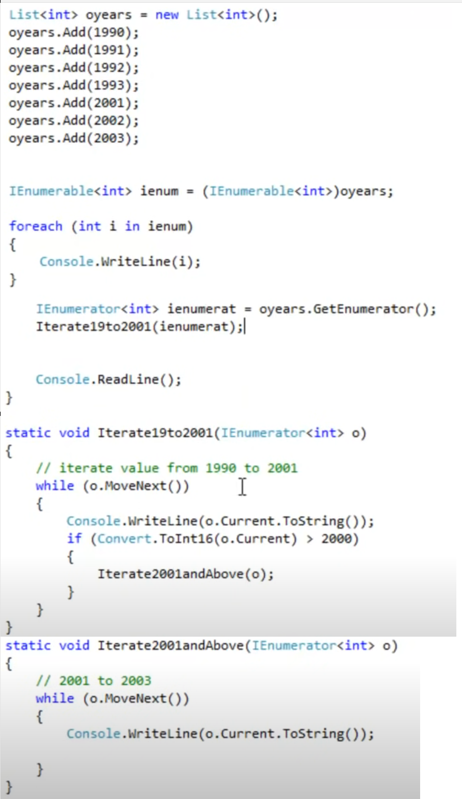
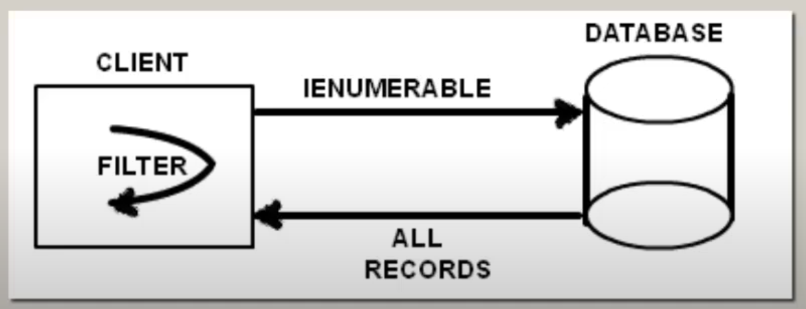
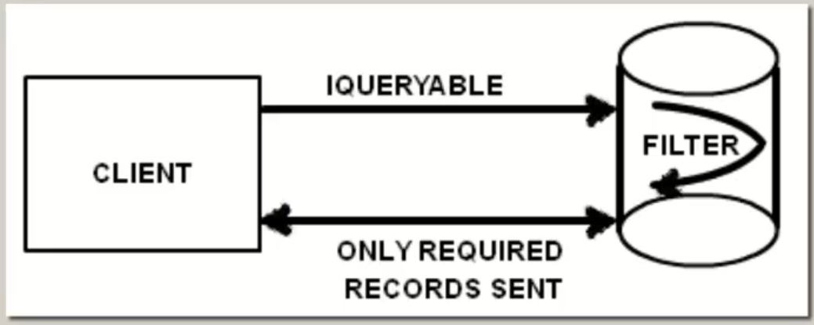

## ***1. What is the use of private constructor***

##### 1. A class with a private constructor can not be inherited

##### 2. We can not create a object of the class which has private constructor

##### 3. Many times we do not want to create instances of certain classes like utility, common routine classes

In C#, a private constructor is used to restrict the instantiation of a class from outside the class itself. Here are some common uses of private constructors:

### **1. Singleton Pattern**

A private constructor is often used in the Singleton design pattern to ensure that only one instance of the class can be created. This is useful when you need a single, shared instance of a class throughout the application.

**Example**:

```csharp
public class Singleton
{
    private static Singleton _instance;
    
    // Private constructor
    private Singleton() { }
    
    public static Singleton Instance
    {
        get
        {
            if (_instance == null)
            {
                _instance = new Singleton();
            }
            return _instance;
        }
    }
}
```

### **2. Static Classes**

A private constructor can be used to prevent the instantiation of a static class. Static classes cannot be instantiated, and by declaring a private constructor, you ensure that no instances of the class are created accidentally.

**Example**:

```csharp
public static class Utility
{
    // Private constructor
    private Utility() { }

    public static void DoSomething()
    {
        // Implementation
    }
}
```

### **3. Factory Methods**

Private constructors can be used in combination with factory methods to control the creation of instances. Factory methods allow you to create instances of a class in a controlled manner, often with additional logic.

**Example**:

```csharp
public class Product
{
    public string Name { get; private set; }

    // Private constructor
    private Product(string name)
    {
        Name = name;
    }

    // Factory method
    public static Product CreateProduct(string name)
    {
        // Additional logic before creating an instance
        return new Product(name);
    }
}
```

### **4. Preventing Inheritance**

By declaring a private constructor, you can prevent a class from being inherited. This can be useful when you want to ensure that a class remains sealed and cannot be extended.

**Example**:

```csharp
public class NonInheritable
{
    // Private constructor
    private NonInheritable() { }

    public static void DoSomething()
    {
        // Implementation
    }
}
```

In summary, private constructors are a powerful tool in C# that provide fine-grained control over how and when instances of a class can be created. They are commonly used in design patterns, static classes, factory methods, and to prevent inheritance.

## ***2. IEnumerable and IEnumerator***

In C#, both `IEnumerable` and `IEnumerator` are interfaces used for iterating over collections. Here's a detailed look at each, including their uses and differences:

- IEnumerable does not remembers cursor state where as IEnumerator does.
- If your requirement is to just loop sequentially through collection one by one and you are not intersted in where the cursor is currently then IEnumerable is best fit. Syntax is much smaller.
- When you pass the IEnumerator from one function another function and remember the current cursor position then IEnumerator is best fit.
- IEnumerable uses IEnumerator internally.

### **IEnumerable**

- **Imp**: IEnumerable helps to iterate over a collection without knowing the actual type.It acts like an abstraction.
- **Namespace**: `System.Collections` or `System.Collections.Generic` (for generics).
- **Purpose**: Represents a collection that can be enumerated.
- **Key Method**: `GetEnumerator()`, which returns an `IEnumerator` object.
- **Usage**: Used with `foreach` loops for easy iteration over collections.


**Example**:

```csharp
public class MyCollection : IEnumerable<int>
{
    private int[] _numbers = { 1, 2, 3, 4, 5 };

    public IEnumerator<int> GetEnumerator()
    {
        return ((IEnumerable<int>)_numbers).GetEnumerator();
    }

    IEnumerator IEnumerable.GetEnumerator()
    {
        return GetEnumerator();
    }
}

public class Program
{
    public static void Main()
    {
        MyCollection collection = new MyCollection();
        foreach (int number in collection)
        {
            Console.WriteLine(number);
        }
    }
}
```

### **IEnumerator**

- **Namespace**: `System.Collections` or `System.Collections.Generic` (for generics).
- **Purpose**: Provides the mechanism for iterating over a collection.
- **Key Methods**: `MoveNext()`, `Reset()`, and the `Current` property.
- **Usage**: Typically used internally by `IEnumerable` implementations.



**Example**:

```csharp
public class MyCollectionEnumerator : IEnumerator<int>
{
    private int[] _numbers;
    private int _position = -1;

    public MyCollectionEnumerator(int[] numbers)
    {
        _numbers = numbers;
    }

    public bool MoveNext()
    {
        _position++;
        return (_position < _numbers.Length);
    }

    public void Reset()
    {
        _position = -1;
    }

    public int Current
    {
        get
        {
            if (_position < 0 || _position >= _numbers.Length)
                throw new InvalidOperationException();
            return _numbers[_position];
        }
    }

    object IEnumerator.Current => Current;

    public void Dispose()
    {
        // Dispose resources if needed
    }
}
```

### **Using IEnumerable and IEnumerator Together**

- **Implementation**: Typically, `IEnumerable` is implemented by a collection class to provide an enumerator (`IEnumerator`), allowing the collection to be iterated.
- **Example Implementation**:

```csharp
public class MyCollection : IEnumerable<int>
{
    private int[] _numbers = { 1, 2, 3, 4, 5 };

    public IEnumerator<int> GetEnumerator()
    {
        return new MyCollectionEnumerator(_numbers);
    }

    IEnumerator IEnumerable.GetEnumerator()
    {
        return GetEnumerator();
    }
}
```

### **Key Differences**

| Feature                  | IEnumerable                                   | IEnumerator                                     |
|--------------------------|-----------------------------------------------|-------------------------------------------------|
| **Purpose**              | Represents a collection that can be iterated | Provides the mechanism for iterating a collection |
| **Key Method/Property**  | `GetEnumerator()`                             | `MoveNext()`, `Reset()`, `Current`              |
| **Usage**                | Used with `foreach` loops                     | Used internally by `IEnumerable` implementations |
| **Namespace**            | `System.Collections`, `System.Collections.Generic` | `System.Collections`, `System.Collections.Generic` |

### **When to Use Each**

- **IEnumerable**: Use when you need to represent a collection that can be iterated over. It is commonly used for collections and enables `foreach` loop syntax.
- **IEnumerator**: Use when you need to implement the actual iteration mechanism for a collection. It is typically used internally within classes that implement `IEnumerable`.

Understanding `IEnumerable` and `IEnumerator` helps you create custom collections and iterators, allowing you to control how collections are traversed and interacted with.

## ***3. IEnumerable versus IQueryable***

In C#, both `IEnumerable` and `IQueryable` are used to represent collections of objects, but they have different use cases, performance characteristics, and behaviors. Here’s a detailed comparison to help you understand their differences and when to use each one:

### **IEnumerable**

- **Namespace**: `System.Collections`
- **Use Case**: Suitable for in-memory collections like arrays, lists, and other collections that are enumerated sequentially.
- **Execution**: Executes queries against the in-memory data. All operations are performed in-memory, which means the entire collection is loaded into memory.
- **Deferred Execution**: Supports deferred execution, meaning the query is not executed until the data is enumerated (e.g., using `foreach` loop).
- **Extension Methods**: LINQ extension methods for `IEnumerable` are defined in `System.Linq.Enumerable`.



**Example**:

```csharp
List<int> numbers = new List<int> { 1, 2, 3, 4, 5 };
IEnumerable<int> query = numbers.Where(n => n > 3);

foreach (int number in query)
{
    Console.WriteLine(number); // Output: 4, 5
}
```

### **IQueryable**

- **Namespace**: `System.Linq`
- **Use Case**: Suitable for querying data from remote data sources like databases. It enables efficient querying by translating queries to the underlying data source.
- **Execution**: Executes queries against a remote data source. The query is translated to the appropriate query language (e.g., SQL for databases) and executed on the data source.
- **Deferred Execution**: Supports deferred execution, similar to `IEnumerable`.
- **Extension Methods**: LINQ extension methods for `IQueryable` are defined in `System.Linq.Queryable`.



**Example**:

```csharp
using (var context = new MyDbContext())
{
    IQueryable<int> query = context.Numbers.Where(n => n > 3);

    foreach (int number in query)
    {
        Console.WriteLine(number); // Output: 4, 5 (fetched from the database)
    }
}
```

### **Key Differences**

| Feature                | IEnumerable                                         | IQueryable                                         |
|------------------------|-----------------------------------------------------|---------------------------------------------------|
| **Namespace**          | `System.Collections`                                | `System.Linq`                                     |
| **Use Case**           | In-memory collections                               | Remote data sources (e.g., databases)             |
| **Execution**          | In-memory                                           | Remote data source                                |
| **Query Translation**  | Not translated                                      | Translated to the underlying data source query    |
| **Deferred Execution** | Yes                                                 | Yes                                               |
| **Extension Methods**  | `System.Linq.Enumerable`                            | `System.Linq.Queryable`                           |

### **When to Use Each**

- **Use `IEnumerable`** when working with in-memory collections where the entire collection is already loaded into memory and you want to perform operations on it.
- **Use `IQueryable`** when working with remote data sources like databases where you want to leverage the querying capabilities of the data source to fetch and filter data efficiently.

By understanding these differences, you can make informed decisions on which interface to use based on your specific needs and the characteristics of your data source.

## ***4. Yield keyword***

The `yield` keyword in C# is used to simplify the creation of iterators, which are used to traverse collections or streams of data. It enables the implementation of a stateful iterator method without the need to explicitly maintain the state and manage the enumeration logic.


Here are some real-time usage examples:

### **1. Simplifying Iterators**

The `yield` keyword is used to produce elements one at a time, as they are needed. This approach can simplify the code and improve readability.

**Example**:

```csharp
public IEnumerable<int> GetEvenNumbers(int max)
{
    for (int i = 0; i <= max; i += 2)
    {
        yield return i;
    }
}

public static void Main()
{
    var evenNumbers = GetEvenNumbers(10);
    foreach (var num in evenNumbers)
    {
        Console.WriteLine(num); // Output: 0, 2, 4, 6, 8, 10
    }
}
```

### **2. Infinite Sequences**

The `yield` keyword can be used to generate infinite sequences in a memory-efficient way.

**Example**:

```csharp
public IEnumerable<int> GetFibonacciSequence()
{
    int a = 0;
    int b = 1;
    while (true)
    {
        yield return a;
        int temp = a;
        a = b;
        b = temp + b;
    }
}

public static void Main()
{
    var fibonacci = GetFibonacciSequence().Take(10);
    foreach (var num in fibonacci)
    {
        Console.WriteLine(num); // Output: 0, 1, 1, 2, 3, 5, 8, 13, 21, 34
    }
}
```

### **3. Filtering Data Streams**

The `yield` keyword can be used to filter data streams efficiently.

**Example**:

```csharp
public IEnumerable<int> FilterData(IEnumerable<int> data, Func<int, bool> predicate)
{
    foreach (var item in data)
    {
        if (predicate(item))
        {
            yield return item;
        }
    }
}

public static void Main()
{
    var numbers = new List<int> { 1, 2, 3, 4, 5, 6, 7, 8, 9, 10 };
    var filteredNumbers = FilterData(numbers, n => n > 5);

    foreach (var num in filteredNumbers)
    {
        Console.WriteLine(num); // Output: 6, 7, 8, 9, 10
    }
}
```

### **4. State Machines**

The `yield` keyword can be used to implement state machines, making it easier to manage state transitions.

**Example**:

```csharp
public IEnumerable<string> StateMachine()
{
    yield return "State 1";
    yield return "State 2";
    yield return "State 3";
}

public static void Main()
{
    var states = StateMachine();
    foreach (var state in states)
    {
        Console.WriteLine(state); // Output: State 1, State 2, State 3
    }
}
```

### **How It Works**

- **`yield return`**: Returns each element one at a time and maintains the current state of the method.
- **State Management**: The compiler generates a state machine behind the scenes, allowing the method to pause and resume execution, making it easier to handle complex iterations.

### **Benefits**

- **Simplicity**: Simplifies the code by removing the need to manually manage state and iterators.
- **Efficiency**: Produces elements as needed, which can improve memory usage and performance.
- **Readability**: Makes the code more readable and maintainable by abstracting the complexity of iterators.

Using the `yield` keyword can greatly simplify the process of creating iterators and handling sequences, making your code more efficient and easier to understand.
