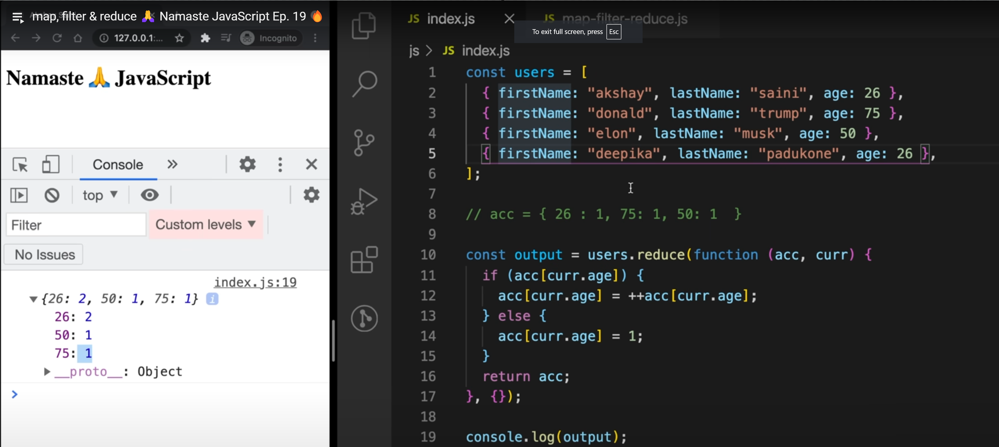
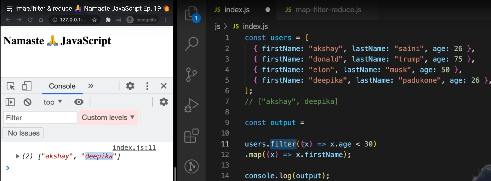
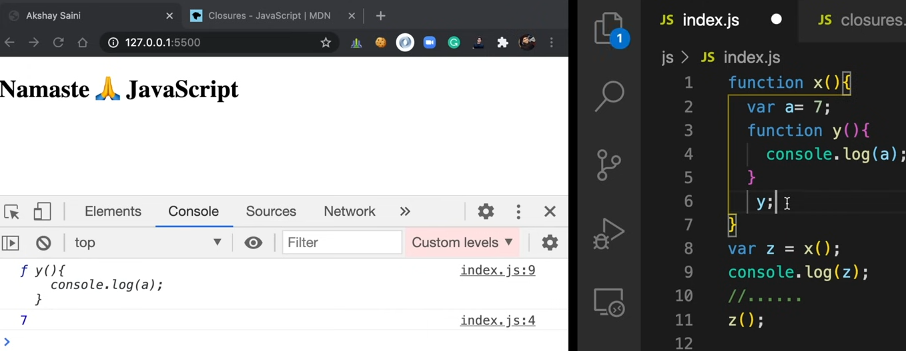
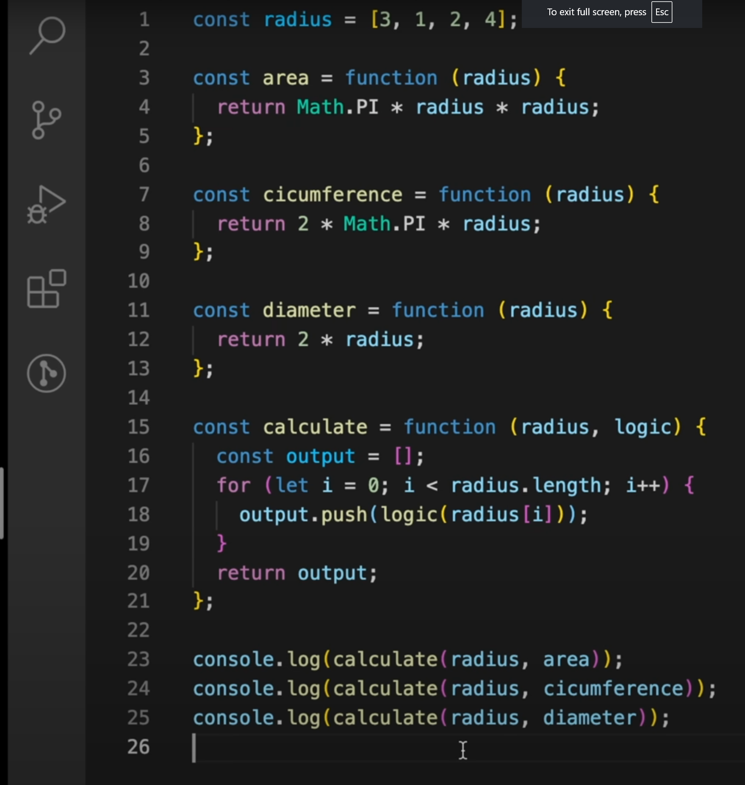
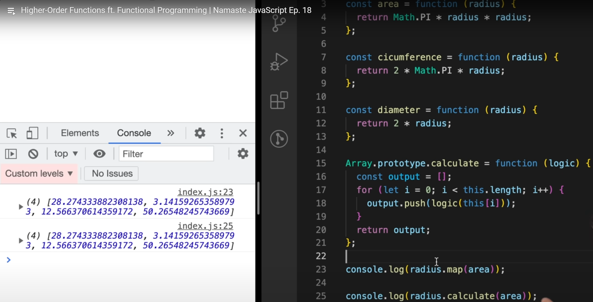
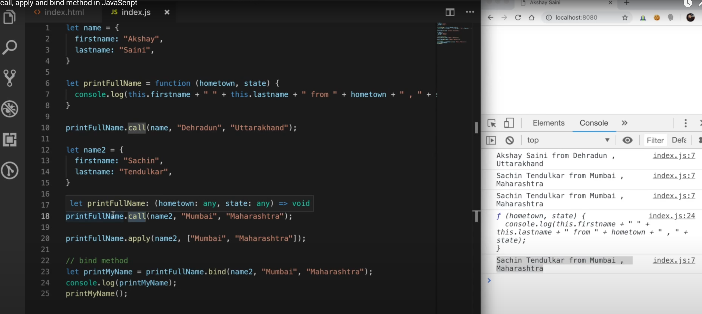
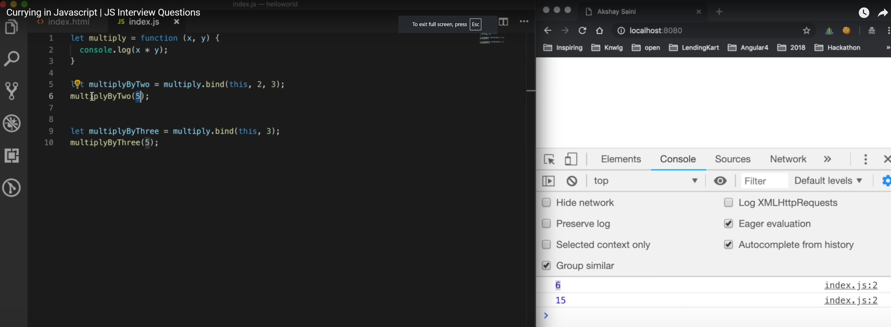
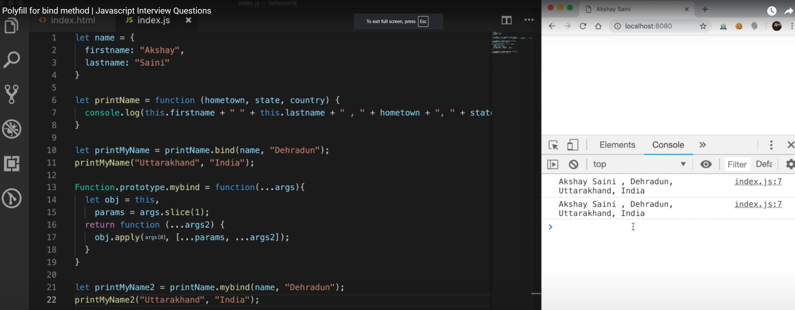

## ***1. Javascript ES6 Features***

JavaScript ES6 (ECMAScript 2015) introduced several powerful features that enhance the language's capabilities and developer experience. Here are some of the key features:

### 1. **Arrow Functions**

Arrow functions provide a more concise syntax for writing functions and lexically bind the `this` value.

```javascript
const add = (a, b) => a + b;
```

### 2. **Let and Const**

`let` and `const` are block-scoped variable declarations.

```javascript
let mutableVar = 10;
const immutableVar = 20;
```

### 3. **Template Literals**

Template literals allow for easier string interpolation and multi-line strings.

```javascript
const name = 'John';
const greeting = `Hello, ${name}!`;
```

### 4. **Default Parameters**

Functions can now have default parameter values.

```javascript
function greet(name = 'Guest') {
  return `Hello, ${name}!`;
}
```

### 5. **Destructuring Assignment**

Destructuring allows for unpacking values from arrays or properties from objects into distinct variables.

```javascript
const person = { name: 'Alice', age: 30 };
const { name, age } = person;
```

### 6. **Rest and Spread Operators**

The rest operator (`...`) collects all remaining elements into an array, while the spread operator (`...`) expands an array into individual elements.

```javascript
const nums = [1, 2, 3, 4];
const [first, ...rest] = nums; // Rest
const newNums = [...nums, 5, 6]; // Spread
```

### 7. **Classes**

ES6 introduces a syntax for defining classes and inheritance.

```javascript
class Person {
  constructor(name, age) {
    this.name = name;
    this.age = age;
  }

  greet() {
    return `Hello, my name is ${this.name}.`;
  }
}
```

### 8. **Modules**

ES6 introduces a module system for better code organization.

```javascript
// person.js
export const name = 'Alice';
export function greet() {
  return `Hello, ${name}`;
}

// main.js
import { name, greet } from './person.js';
```

### 9. **Promises**

Promises provide a cleaner way to handle asynchronous operations.

```javascript
const fetchData = () => {
  return new Promise((resolve, reject) => {
    // Simulate async operation
    setTimeout(() => resolve('Data fetched'), 1000);
  });
};

fetchData().then((data) => console.log(data));
```

### 10. **Enhanced Object Literals**

Enhanced object literals provide shorthand syntax for defining properties and methods.

```javascript
const name = 'Alice';
const person = {
  name,
  greet() {
    return `Hello, my name is ${this.name}.`;
  }
};
```

### 11. **Iterators and Generators**

Iterators and generators provide a way to define custom iteration behavior.

```javascript
function* generator() {
  yield 1;
  yield 2;
  yield 3;
}

const iter = generator();
for (const value of iter) {
  console.log(value); // Output: 1 2 3
}
```

These features significantly improve the readability, maintainability, and expressiveness of JavaScript code.

## ***2. Module and Class in js***

In JavaScript, both modules and classes are essential features that help organize and structure your code, especially as it grows in complexity. Let's explore each concept in detail:

### **Modules in JavaScript**

Modules allow you to encapsulate code in separate files and control what is exposed to the rest of the application. This promotes better code organization and reuse. JavaScript modules can be created using either CommonJS (used in Node.js) or ES6 (ECMAScript 2015) module syntax.

#### **ES6 Module Syntax**

- **Exporting**: Use `export` to expose functions, objects, or values from a module.
- **Importing**: Use `import` to bring in exported values from another module.

**Example**:

**math.js (Module)**:

```javascript
// Exporting functions
export function add(a, b) {
    return a + b;
}

export function subtract(a, b) {
    return a - b;
}

// Exporting a constant
export const PI = 3.14159;
```

**app.js**:

```javascript
// Importing functions and constants
import { add, subtract, PI } from './math.js';

console.log(add(2, 3));        // Output: 5
console.log(subtract(5, 2));   // Output: 3
console.log(PI);               // Output: 3.14159
```

### **Classes in JavaScript**

Classes in JavaScript provide a way to create objects using a blueprint, supporting object-oriented programming (OOP). They encapsulate data and functions (methods) related to that data.

#### **Class Syntax**

- **Class Definition**: Use the `class` keyword to define a class.
- **Constructor**: A special method called `constructor` is used for initializing new objects.
- **Methods**: Functions defined within a class.
- **Inheritance**: Use the `extends` keyword to create a subclass that inherits from a parent class.

**Example**:

```javascript
// Define a class
class Person {
    constructor(name, age) {
        this.name = name;
        this.age = age;
    }

    // Method
    greet() {
        return `Hello, my name is ${this.name} and I am ${this.age} years old.`;
    }
}

// Create an instance of the class
const alice = new Person('Alice', 30);
console.log(alice.greet()); // Output: Hello, my name is Alice and I am 30 years old.

// Inheritance
class Student extends Person {
    constructor(name, age, grade) {
        super(name, age); // Call the constructor of the parent class
        this.grade = grade;
    }

    // Method
    study() {
        return `${this.name} is studying in grade ${this.grade}.`;
    }
}

// Create an instance of the subclass
const bob = new Student('Bob', 20, '12th');
console.log(bob.greet()); // Output: Hello, my name is Bob and I am 20 years old.
console.log(bob.study()); // Output: Bob is studying in grade 12th.
```

### **Key Differences and Uses**

| Feature    | Modules                                 | Classes                                     |
|------------|-----------------------------------------|---------------------------------------------|
| **Purpose**| Encapsulate and organize code           | Define blueprints for creating objects      |
| **Syntax** | `import` and `export` keywords          | `class`, `constructor`, `extends` keywords  |
| **Usage**  | Manage dependencies and reuse code      | Implement object-oriented programming (OOP) |
| **Scope**  | File-based (each module in its own file)| Define properties and methods on instances  |

Understanding both modules and classes can greatly enhance your ability to write clean, maintainable, and scalable JavaScript code.

## ***3. Difference between let and var***

In JavaScript, `let` and `var` are both used to declare variables, but they have some key differences. Here's a comparison to help you understand when and how to use each:

### **1. Scope**

- **`var`**:
  - Function-scoped. This means a variable declared with `var` is available throughout the function it was declared in.
  - If declared outside a function, it becomes globally scoped.

- **`let`**:
  - Block-scoped. This means a variable declared with `let` is only available within the block (enclosed by `{}`) it was declared in.

**Example**:

```javascript
function example() {
    if (true) {
        var varVariable = "I'm a var";
        let letVariable = "I'm a let";
    }
    console.log(varVariable); // Output: "I'm a var"
    console.log(letVariable); // ReferenceError: letVariable is not defined
}
example();
```

### **2. Hoisting**

- **`var`**:
  - Variables declared with `var` are hoisted to the top of their function or global scope. They are initialized with `undefined`.
  - This means you can use the variable before it is declared without throwing an error, but it will be `undefined`.

- **`let`**:
  - Variables declared with `let` are also hoisted to the top of their block scope. However, they are not initialized.
  - Accessing them before the declaration will result in a `ReferenceError`.

**Example**:

```javascript
console.log(varVariable); // Output: undefined
var varVariable = "I'm a var";

console.log(letVariable); // ReferenceError: Cannot access 'letVariable' before initialization
let letVariable = "I'm a let";
```

### **3. Re-declaration**

- **`var`**:
  - Allows re-declaration within the same scope, which can lead to unexpected behavior and bugs.

- **`let`**:
  - Does not allow re-declaration within the same scope, making the code less error-prone.

**Example**:

```javascript
var varVariable = "First declaration";
var varVariable = "Second declaration"; // No error

let letVariable = "First declaration";
let letVariable = "Second declaration"; // SyntaxError: Identifier 'letVariable' has already been declared
```

### **4. Temporal Dead Zone**

- **`var`**:
  - Variables declared with `var` do not have a temporal dead zone (TDZ). They are available from the beginning of their enclosing scope.

- **`let`**:
  - Variables declared with `let` have a temporal dead zone from the start of their block until the declaration is encountered. Accessing the variable in the TDZ results in a `ReferenceError`.

**Example**:

```javascript
{
    console.log(letVariable); // ReferenceError: Cannot access 'letVariable' before initialization
    let letVariable = "I'm a let";
}
```

### **Summary**

- Use `let` when you need block scope and want to avoid issues with variable re-declaration.
- Use `var` when you need function scope, although it's generally recommended to use `let` (or `const`) for better scoping rules and to avoid potential bugs.

## ***4. What is hoisting in JavaScript?***

**Hoisting** is a JavaScript behavior where variable and function declarations are moved to the top of their containing scope during the compilation phase. This means that you can use variables and functions before they are declared in the code.

### **How It Works:**

1. **Variable Declarations**:
   - Variables declared with `var` are hoisted to the top of their function scope but are initialized with `undefined`.
   - Variables declared with `let` and `const` are also hoisted to the top of their block scope, but they are not initialized. Accessing them before the declaration results in a `ReferenceError`.

2. **Function Declarations**:
   - Function declarations are hoisted to the top of their scope, so the function can be called before it is defined in the code.

### **Examples**

**Example 1: Variable Hoisting with `var`**:

```javascript
console.log(myVar); // Output: undefined
var myVar = 10;
console.log(myVar); // Output: 10
```

In this example, the declaration of `myVar` is hoisted to the top, but its initialization (`myVar = 10`) is not. Therefore, `myVar` is `undefined` when first logged.

**Example 2: Variable Hoisting with `let` and `const`**:

```javascript
console.log(myLet); // ReferenceError: Cannot access 'myLet' before initialization
let myLet = 20;
console.log(myLet); // Output: 20
```

In this example, `myLet` is hoisted to the top of its block scope but not initialized, resulting in a `ReferenceError` when accessed before its declaration.

**Example 3: Function Declaration Hoisting**:

```javascript
myFunction(); // Output: Hello, world!

function myFunction() {
  console.log('Hello, world!');
}
```

In this example, the function declaration `myFunction` is hoisted to the top, so it can be called before it is defined in the code.

### **Key Points**

- **Hoisting applies only to declarations, not initializations**. Variables declared with `var` are initialized with `undefined`, while `let` and `const` remain uninitialized until their declaration.
- **Function expressions and arrow functions** are not hoisted. Only the variable declarations are hoisted, not the assignments.

Understanding hoisting helps avoid unexpected behavior in JavaScript code and ensures that you declare and initialize variables and functions in the correct order.

## ***5. Rest operator in es6 JavaScript?***

The rest operator in ES6 (ECMAScript 2015) is represented by three dots (`...`) and allows you to collect the remaining elements or properties into an array or object. It is often used in function parameters and destructuring assignments. Here are a few common use cases:

### **1. Function Parameters**

The rest operator can be used to represent an indefinite number of arguments as an array.

**Example**:

```javascript
function sum(...numbers) {
    return numbers.reduce((acc, curr) => acc + curr, 0);
}

console.log(sum(1, 2, 3, 4)); // Output: 10
```

In this example, `...numbers` collects all the arguments passed to the `sum` function into an array.

### **2. Destructuring Arrays**

The rest operator can be used to collect the remaining elements of an array after destructuring.

**Example**:

```javascript
const [first, second, ...rest] = [1, 2, 3, 4, 5];
console.log(first);  // Output: 1
console.log(second); // Output: 2
console.log(rest);   // Output: [3, 4, 5]
```

Here, `first` and `second` capture the first two elements, and `...rest` captures the remaining elements of the array.

### **3. Destructuring Objects**

The rest operator can also be used to collect the remaining properties of an object after destructuring.

**Example**:

```javascript
const person = { name: 'Alice', age: 25, city: 'New York' };
const { name, ...details } = person;
console.log(name);    // Output: Alice
console.log(details); // Output: { age: 25, city: 'New York' }
```

In this example, `name` captures the `name` property, and `...details` collects the rest of the properties into a new object.

### **Key Points**

- **Function Parameters**: Collects remaining function arguments into an array.
- **Array Destructuring**: Collects remaining elements of an array into a new array.
- **Object Destructuring**: Collects remaining properties of an object into a new object.

The rest operator enhances the flexibility and readability of your code by simplifying the handling of variable numbers of parameters or properties.

## ***6. Shallow copy versus deep copy in JavaScript?***

In JavaScript, copying objects and arrays can be done using shallow copy or deep copy techniques. Understanding the difference between them is crucial for managing and manipulating data correctly.

### **Shallow Copy**

A shallow copy creates a new object or array, but only one level deep. For nested objects or arrays, it copies references to the original elements, not the actual nested objects themselves.

**Example**:

```javascript
const originalArray = [1, 2, { a: 3, b: 4 }];
const shallowCopy = [...originalArray];

// Modify the nested object in the shallow copy
shallowCopy[2].a = 99;

console.log(originalArray); // Output: [1, 2, { a: 99, b: 4 }]
console.log(shallowCopy);   // Output: [1, 2, { a: 99, b: 4 }]
```

In this example, changing the nested object in `shallowCopy` also affects `originalArray`, since both arrays share the same reference to the nested object.

### **Deep Copy**

A deep copy creates a new object or array, including all nested objects or arrays. This ensures that changes to the copied structure do not affect the original.

**Example**:

```javascript
const originalArray = [1, 2, { a: 3, b: 4 }];
const deepCopy = JSON.parse(JSON.stringify(originalArray));

// Modify the nested object in the deep copy
deepCopy[2].a = 99;

console.log(originalArray); // Output: [1, 2, { a: 3, b: 4 }]
console.log(deepCopy);      // Output: [1, 2, { a: 99, b: 4 }]
```

In this example, changing the nested object in `deepCopy` does not affect `originalArray`, since the nested objects are copied by value rather than by reference.

### **Key Differences**

| Feature         | Shallow Copy                             | Deep Copy                                |
|-----------------|------------------------------------------|------------------------------------------|
| **Depth**       | One level deep                           | Full depth                               |
| **References**  | Copies references for nested objects     | Copies actual values of nested objects   |
| **Impact**      | Changes in copy affect the original      | Changes in copy do not affect the original |

### **Methods to Create Copies**

1. **Shallow Copy Methods**:
   - Using the spread operator (`...`): `const shallowCopy = [...originalArray];`
   - Using `Object.assign()`: `const shallowCopy = Object.assign({}, originalObject);`

2. **Deep Copy Methods**:
   - Using `JSON.parse` and `JSON.stringify`: `const deepCopy = JSON.parse(JSON.stringify(originalObject));`
   - Using libraries like Lodash: `const deepCopy = _.cloneDeep(originalObject);`

Understanding when to use shallow or deep copy techniques is important for managing data integrity and preventing unintended side effects in your applications.

## ***7. Map versus reduce function in JavaScrip?***

The `map` and `reduce` functions are powerful array methods in JavaScript, each serving distinct purposes. Let's explore their differences, use cases, and examples:

### **1. `map` Function**

- **Purpose**: Creates a new array by applying a function to each element of an existing array.
- **Returns**: A new array of the same length with transformed elements.
- **Use Case**: When you need to transform or perform a consistent operation on each element of an array.

**Example**:

```javascript
const numbers = [1, 2, 3, 4, 5];
const squaredNumbers = numbers.map(num => num * num);
console.log(squaredNumbers); // Output: [1, 4, 9, 16, 25]
```

In this example, `map` is used to square each number in the array.

### **2. `reduce` Function**

- **Purpose**: Reduces an array to a single value by applying a function that accumulates a result.
- **Returns**: A single value, typically the accumulated result.
- **Use Case**: When you need to aggregate array elements into a single value, such as summing numbers, concatenating strings, or merging objects.

**Example**:

```javascript
const numbers = [1, 2, 3, 4, 5];
const sum = numbers.reduce((accumulator, currentValue) => accumulator + currentValue, 0);
console.log(sum); // Output: 15
```

In this example, `reduce` is used to calculate the sum of the numbers in the array.

### **Key Differences**

| Feature                | `map`                                        | `reduce`                                     |
|------------------------|----------------------------------------------|----------------------------------------------|
| **Purpose**            | Transforms each element in an array          | Aggregates all elements to a single value    |
| **Returns**            | New array                                    | Single value                                 |
| **Use Case**           | Transformation                               | Aggregation                                  |
| **Mutation**           | Non-mutating (creates a new array)           | Non-mutating (does not change the original array) |

### **When to Use Each**

- **Use `map`**: When you need to apply a consistent transformation to each element in an array and obtain a new array of the same length.
- **Use `reduce`**: When you need to combine all elements of an array into a single value, such as summing numbers, calculating averages, or merging objects.





By understanding the distinctions between `map` and `reduce`, you can choose the appropriate method for your specific use case, leading to more readable and efficient code.

## ***8. Promise versus callback in JavaScript?***

In JavaScript, both promises and callbacks are used to handle asynchronous operations. Here’s a comparison to help you understand their differences, advantages, and use cases:

### **Callbacks**

- **Definition**: A callback is a function that is passed as an argument to another function and is executed after the completion of a specific task.
- **Syntax**: Simple and straightforward, but can lead to complex and hard-to-maintain code, often referred to as "callback hell" or "pyramid of doom."

**Example**:

```javascript
function fetchData(callback) {
    setTimeout(() => {
        const data = 'Sample Data';
        callback(data);
    }, 1000);
}

fetchData((result) => {
    console.log(result); // Output: Sample Data
});
```

**Advantages**:

- Simple to use for straightforward asynchronous tasks.
- Supported in all JavaScript environments.

**Disadvantages**:

- Can lead to deeply nested code when dealing with multiple asynchronous operations.
- Error handling is more cumbersome, as each callback needs to explicitly handle errors.

### **Promises**

- **Definition**: A promise is an object representing the eventual completion (or failure) of an asynchronous operation and its resulting value.
- **Syntax**: More structured than callbacks, making it easier to handle asynchronous operations, avoid nesting, and manage errors.

**Example**:

```javascript
function fetchData() {
    return new Promise((resolve, reject) => {
        setTimeout(() => {
            const data = 'Sample Data';
            resolve(data);
        }, 1000);
    });
}

fetchData()
    .then((result) => {
        console.log(result); // Output: Sample Data
    })
    .catch((error) => {
        console.error(error);
    });
```

**Advantages**:

- Cleaner and more readable code, especially for multiple asynchronous operations.
- Built-in error handling through `.catch()`.
- Chainable, allowing for sequential execution of asynchronous tasks.

**Disadvantages**:

- Slightly more complex syntax compared to simple callbacks.
- Not supported in very old browsers without polyfills.

### **When to Use Each**

- **Callbacks**: Suitable for simple, single asynchronous operations where nested structures are not an issue.
- **Promises**: Ideal for more complex asynchronous workflows, where you need to handle multiple operations sequentially or in parallel, with better error management.

### **Summary**

| Feature                | Callbacks                               | Promises                                       |
|------------------------|-----------------------------------------|------------------------------------------------|
| **Definition**         | Function passed as an argument          | Object representing asynchronous completion    |
| **Syntax**             | Simple but can become nested            | More structured and chainable                  |
| **Error Handling**     | Cumbersome, handled in each callback    | Built-in with `.catch()`                       |
| **Readability**        | Can become hard to read (callback hell) | Cleaner and more readable                      |
| **Use Case**           | Simple asynchronous tasks               | Complex asynchronous workflows                 |

By understanding the differences between callbacks and promises, you can choose the right approach for handling asynchronous operations in your JavaScript code.

## ***9. What is the use of closure?***

Closure :Function bundled with its lexical environment is known as a closure. Whenever function is returned, even if its vanished in execution context but still it remembers the reference it was pointing to. Its not just that function alone it returns but the entire closure and that's where it becomes interesting !



Closures are a fundamental and powerful feature in JavaScript that allow a function to access variables from its outer scope even after the outer function has finished executing. Essentially, closures enable functions to "remember" the environment in which they were created.

Here are some key uses of closures:

1. **Data Encapsulation:**
   Closures can be used to create private variables and functions. This helps in encapsulating data and protecting it from being accessed or modified directly from outside the function.

   ```javascript
   function createCounter() {
       let count = 0;
       return {
           increment: function() {
               count++;
               return count;
           },
           decrement: function() {
               count--;
               return count;
           }
       };
   }

   const counter = createCounter();
   console.log(counter.increment()); // Output: 1
   console.log(counter.increment()); // Output: 2
   console.log(counter.decrement()); // Output: 1
   ```

2. **Function Factories:**
   Closures can be used to create functions with customized behavior.

   ```javascript
   function createMultiplier(multiplier) {
       return function(number) {
           return number * multiplier;
       };
   }

   const double = createMultiplier(2);
   const triple = createMultiplier(3);

   console.log(double(5)); // Output: 10
   console.log(triple(5)); // Output: 15
   ```

3. **Callbacks and Event Handlers:**
   Closures are often used in asynchronous programming, such as with callbacks and event handlers, to maintain access to variables from the outer scope.

   ```javascript
   function fetchData(url) {
       const xhr = new XMLHttpRequest();
       xhr.open("GET", url);
       xhr.onload = function() {
           if (xhr.status === 200) {
               console.log(`Response from ${url}: ${xhr.responseText}`);
           }
       };
       xhr.send();
   }

   fetchData("https://api.example.com/data");
   ```

4. **Partial Application and Currying:**
   Closures can be used to partially apply arguments to a function or create curried functions.

   ```javascript
   function greet(greeting) {
       return function(name) {
           console.log(`${greeting}, ${name}!`);
       };
   }

   const sayHello = greet("Hello");
   sayHello("Alice"); // Output: Hello, Alice!
   sayHello("Bob"); // Output: Hello, Bob!
   ```

Closures allow for more modular, maintainable, and reusable code by enabling the creation of private variables, customized functions, and efficient callback handling. They are an essential tool in the JavaScript developer's toolkit.
## ***10 Disadvantages of closures in javascript?***
Closures are a powerful feature in JavaScript, but they come with some disadvantages and potential pitfalls:

1. **Memory Leak Potential**: Closures can lead to memory leaks if not managed properly. Since closures keep references to outer scope variables, these variables are not garbage collected as long as the closure exists. This can result in increased memory usage, especially if the closure is not released correctly.
   ```javascript
   function createClosure() {
     let largeArray = new Array(1000000).fill('data');
     return function() {
       console.log(largeArray);
     };
   }
   ```

2. **Debugging Complexity**: Because closures capture variables from their containing scopes, it can sometimes be difficult to trace the source of a variable when debugging. The value of a variable might change unexpectedly if not carefully managed.

3. **Overhead in Memory and Performance**: Creating a large number of closures, especially in performance-critical applications, can result in increased memory consumption and potential performance degradation. Each closure creates a new function object and a new lexical environment, which can add up in terms of overhead.

4. **Scope Chain Length**: Closures create a chain of scopes, which the JavaScript engine needs to traverse to resolve variables. If the chain becomes too long, it can potentially impact performance.

5. **Accidental Global Variable Creation**: Misuse of closures can lead to unintentional creation of global variables, particularly if you forget to use the `var`, `let`, or `const` keywords. This can cause unexpected behavior in your code.
   ```javascript
   function createClosure() {
     closureVar = 42; // Forgot to use 'var', 'let', or 'const'
     return function() {
       console.log(closureVar);
     };
   }
   createClosure()();
   console.log(closureVar); // Accessible globally, which can be problematic
   ```

While these disadvantages are worth noting, closures remain an essential and beneficial concept in JavaScript. By understanding and managing their limitations, you can use closures effectively in your code.


## ***11. How does this keyword works in javascript??***
In JavaScript, the `this` keyword behaves differently depending on the context in which it's used. It's a bit of a chameleon, adapting to various environments, so it can be tricky at first. Here's a breakdown:

1. **Global Context**: When used in the global context, `this` refers to the global object. In a browser, this would be the `window` object.
   ```javascript
   console.log(this); // window in a browser
   ```

2. **Function Context**: When used inside a function, `this` depends on how the function is called.
   - Regular function call: In non-strict mode, `this` refers to the global object. In strict mode, `this` is `undefined`.
     ```javascript
     function myFunction() {
       console.log(this);
     }
     myFunction(); // window (or undefined in strict mode)
     ```

   - Method call: When a function is called as a property of an object, `this` refers to the object the method is called on.
     ```javascript
     const myObject = {
       myMethod: function() {
         console.log(this);
       }
     };
     myObject.myMethod(); // myObject
     ```

   - `new` keyword: When a function is used as a constructor with the `new` keyword, `this` refers to the new instance of the object created.
     ```javascript
     function MyConstructor() {
       this.value = 42;
     }
     const instance = new MyConstructor();
     console.log(instance.value); // 42
     ```

   - Arrow functions: In arrow functions, `this` is lexically bound, meaning it uses `this` from the surrounding code at the time the function is defined.
     ```javascript
     const myArrowFunction = () => {
       console.log(this);
     };
     myArrowFunction(); // this refers to the surrounding context
     ```

3. **Event Handlers**: When used in an event handler, `this` refers to the element that received the event.
   ```javascript
   const button = document.querySelector('button');
   button.addEventListener('click', function() {
     console.log(this); // button element
   });
   ```

Overall, understanding how `this` works in JavaScript involves knowing the context in which it's used. 

## ***12. What is the purpose of Bind Method in javascript???***
The `bind` method in JavaScript is used to create a new function that, when called, has its `this` keyword set to the provided value. It can also allow you to set the initial arguments for that function. Here's a breakdown of its purposes:

1. **Explicitly Setting `this`**: `bind` is commonly used to set the `this` value explicitly when calling a function. This is especially useful when passing a method as a callback, ensuring it retains the correct context.
   ```javascript
   const obj = {
     value: 42,
     getValue: function() {
       return this.value;
     }
   };

   const getValue = obj.getValue;
   console.log(getValue()); // undefined (or error in strict mode)

   const boundGetValue = obj.getValue.bind(obj);
   console.log(boundGetValue()); // 42
   ```

2. **Partial Application**: `bind` can also be used for partial application, where some of the arguments are pre-set when creating the new function.
   ```javascript
   function add(a, b) {
     return a + b;
   }

   const addFive = add.bind(null, 5);
   console.log(addFive(10)); // 15
   ```

3. **Function Borrowing**: `bind` allows borrowing methods from other objects by creating a new function with the `this` value set to the desired object.
   ```javascript
   const person = {
     firstName: 'John',
     lastName: 'Doe',
     fullName: function() {
       return this.firstName + ' ' + this.lastName;
     }
   };

   const member = {
     firstName: 'Jane',
     lastName: 'Smith'
   };

   const getMemberFullName = person.fullName.bind(member);
   console.log(getMemberFullName()); // Jane Smith
   ```

In summary, `bind` is a powerful tool for controlling the `this` context and for partially applying functions. It can make your code more predictable and easier to read, especially in scenarios where the context is crucial.


## ***13. How does javascript handles code with async and await?***
In JavaScript, `async` and `await` are used to handle asynchronous code in a more readable and synchronous-like manner. They are built on top of Promises and provide a cleaner syntax for working with asynchronous operations. Here's how they work:

1. **Async Function**: The `async` keyword is used to define an asynchronous function. When a function is declared with `async`, it automatically returns a Promise. This means you can use `await` inside the function to pause execution until the Promise is resolved.
   ```javascript
   async function fetchData() {
     // This function will return a Promise
     return "Data fetched";
   }
   ```

2. **Await Keyword**: The `await` keyword can only be used inside an `async` function. It is used to pause the execution of the function until the Promise is resolved. The resolved value of the Promise is then returned.
   ```javascript
   async function fetchData() {
     const response = await fetch('https://api.example.com/data');
     const data = await response.json();
     return data;
   }

   fetchData().then(data => {
     console.log(data);
   });
   ```

3. **Error Handling**: You can use `try...catch` blocks to handle errors in async functions. This allows you to handle errors in a synchronous-like manner.
   ```javascript
   async function fetchData() {
     try {
       const response = await fetch('https://api.example.com/data');
       const data = await response.json();
       return data;
     } catch (error) {
       console.error('Error fetching data:', error);
     }
   }

   fetchData();
   ```

4. **Sequential and Parallel Execution**: `async` and `await` make it easy to control the order of asynchronous operations.
   - **Sequential Execution**: Operations are performed one after the other, waiting for each one to complete.
     ```javascript
     async function fetchSequential() {
       const response1 = await fetch('https://api.example.com/data1');
       const data1 = await response1.json();

       const response2 = await fetch('https://api.example.com/data2');
       const data2 = await response2.json();

       return [data1, data2];
     }

     fetchSequential().then(data => {
       console.log(data);
     });
     ```

   - **Parallel Execution**: Multiple asynchronous operations can be performed in parallel using `Promise.all()`.
     ```javascript
     async function fetchParallel() {
       const [response1, response2] = await Promise.all([
         fetch('https://api.example.com/data1'),
         fetch('https://api.example.com/data2')
       ]);

       const data1 = await response1.json();
       const data2 = await response2.json();

       return [data1, data2];
     }

     fetchParallel().then(data => {
       console.log(data);
     });
     ```

Overall, `async` and `await` make working with asynchronous code in JavaScript more straightforward and manageable by providing a cleaner syntax and better error-handling capabilities. 

## ***14. How garbage collection works in javascript?***
JavaScript has an automatic garbage collection mechanism that handles memory management for you. This means the JavaScript engine automatically allocates memory when objects are created and frees it when they are no longer needed. The main technique used for garbage collection in JavaScript is called **mark-and-sweep**. Here's how it works:

1. **Marking**: 
   - The garbage collector starts from the root, which is typically the global object (`window` in browsers) and other reachable objects.
   - It "marks" all reachable objects. An object is reachable if it can be accessed or referenced from any root.
   - During this process, the garbage collector traverses the graph of objects, marking all objects that are accessible from the root.

2. **Sweeping**:
   - After the marking phase, the garbage collector moves to the sweeping phase.
   - It goes through the entire memory heap and "sweeps" away the unmarked objects, reclaiming the memory they occupy.
   - These unmarked objects are those that are no longer reachable and, therefore, can be considered as garbage.

3. **Reference Counting**: 
   - JavaScript engines may also use reference counting as a supplementary garbage collection technique. Each object has a reference count, indicating the number of references to it. When the reference count drops to zero, the object can be safely collected.
   - However, reference counting is prone to problems like circular references, where two objects reference each other, preventing their reference counts from ever reaching zero. This can result in memory leaks.

4. **Generational Garbage Collection**:
   - Modern JavaScript engines, like V8 (used in Chrome and Node.js), use generational garbage collection. This approach divides the heap into two or more regions (generations) based on object age.
   - Objects are initially allocated in the "young" generation, which is collected more frequently.
   - Long-lived objects are promoted to the "old" generation, which is collected less frequently.
   - This method is efficient because most objects in JavaScript programs are short-lived, and collecting them more frequently improves performance.

Here’s a simple example demonstrating how unreachable objects are garbage collected:

```javascript
function createObject() {
  let obj = { name: 'example' };
  return obj;
}

let myObj = createObject();
myObj = null; // Now the object created is unreachable and can be garbage collected
```

In this example, the object created inside the `createObject` function becomes unreachable after `myObj` is set to `null`. The garbage collector will eventually reclaim the memory occupied by this object.

Overall, automatic garbage collection helps developers by managing memory allocation and deallocation, allowing you to focus on writing your application without worrying about manual memory management.

## ***15. How are closures and garbage collector are related to each other in javascript?***
Closures and garbage collection in JavaScript are related through the way they handle memory management. Let's break down the relationship:

1. **Closures Retain References**:
   - Closures capture and retain references to variables from their containing (outer) scope. This means that the closure has access to these variables even after the outer function has finished executing.
   - Because closures retain references to these variables, the garbage collector cannot reclaim the memory used by these variables until the closure itself becomes unreachable.

2. **Memory Management with Closures**:
   - When a closure is created, the JavaScript engine allocates memory for the variables it captures. This memory remains allocated as long as the closure exists and the variables are accessible.
   - If closures are not managed properly, especially in long-running applications or with frequently created closures, they can lead to increased memory usage and potential memory leaks.

3. **Garbage Collection and Closures**:
   - The garbage collector will only reclaim memory used by closures when they are no longer reachable. This means that if there are no references to the closure itself, the variables captured by the closure can be garbage collected.
   - Consider the following example:

   ```javascript
   function createClosure() {
     let data = new Array(1000000).fill('example data');
     return function() {
       console.log(data);
     };
   }

   let myClosure = createClosure();
   // `myClosure` still holds a reference to `data`
   // The memory used by `data` cannot be reclaimed by the garbage collector

   myClosure = null; // Now the closure and the captured variables can be garbage collected
   ```

   In this example, the memory used by the `data` variable cannot be reclaimed by the garbage collector as long as the `myClosure` function is still referenced. Once `myClosure` is set to `null`, the closure becomes unreachable, and the memory can be reclaimed.

4. **Optimizing Memory Usage with Closures**:
   - To optimize memory usage and avoid potential memory leaks, it's important to manage closures carefully. This involves:
     - Releasing references to closures when they are no longer needed.
     - Avoiding capturing unnecessary variables in closures, especially large data structures.
     - Being mindful of the scope in which closures are created and used.

By understanding how closures and garbage collection work together, you can write more efficient and memory-conscious JavaScript code.

## ***16. Difference between parameters and arguments in javascript?***
In JavaScript, "parameters" and "arguments" are terms often used interchangeably, but they have distinct meanings based on the context in which they are used:

1. **Parameters**:
   - **Definition**: Parameters are the names listed in a function's definition. They act as placeholders for the values that the function will receive when it's called.
   - **Purpose**: They define the inputs that a function expects.
   - **Example**:
     ```javascript
     function greet(name, age) {
       console.log(`Hello, my name is ${name} and I am ${age} years old.`);
     }
     // 'name' and 'age' are parameters in this function definition
     ```

2. **Arguments**:
   - **Definition**: Arguments are the actual values that are passed to the function when it's called.
   - **Purpose**: They provide the real data that the function will work with.
   - **Example**:
     ```javascript
     greet('Alice', 25);
     // 'Alice' and '25' are arguments passed to the function during the call
     ```

To summarize:
- Parameters are defined in the function declaration, acting as placeholders.
- Arguments are the real values supplied to the function when it's invoked.

Here's an example that illustrates both terms:

```javascript
function calculateSum(a, b) { // 'a' and 'b' are parameters
  return a + b;
}

let result = calculateSum(5, 10); // '5' and '10' are arguments
console.log(result); // Outputs: 15
```

## ***17. What is function statement , function expression and function declaration with example in javascript?***
In JavaScript, functions can be defined in various ways, each with its own nuances. Let's break down the differences between function statements, function expressions, and function declarations:

1. **Function statement/Function Declaration**:
   - A function declaration defines a named function using the `function` keyword.
   - Function statement/Function Declaration both are same
   - It is hoisted, meaning it can be called before its definition in the code.
   - Example:
     ```javascript
     // Function Declaration
     function sayHello() {
       console.log('Hello!');
     }

     sayHello(); // Outputs: Hello!
     ```

2. **Function Expression**:
   - A function expression defines a function as part of a larger expression, typically by assigning it to a variable.
   - It is not hoisted, meaning it cannot be called before its definition in the code.
   - Example:
     ```javascript
     // Function Expression
     const sayHello = function() {
       console.log('Hello!');
     };

     sayHello(); // Outputs: Hello!
     ```

3. **Named Function Expression**:
   - A variation of the function expression where the function has a name.
   - The name is only accessible within the function itself, not in the outer scope.
   - Example:
     ```javascript
     // Named Function Expression
     const sayHello = function greet() {
       console.log('Hello!');
       // greet() can be called here
     };

     sayHello(); // Outputs: Hello!
     // greet() cannot be called here
     ```

In summary:
- **Function Declarations** are hoisted and can be called before they appear in the code.
- **Function Expressions** are not hoisted and are only available after their definition.
- **Named Function Expressions** are like regular function expressions but with a name that is only accessible within the function.

## ***18. What are First class functions in javascript?***
First-class functions in JavaScript are those that can be treated like any other variable. They can be assigned to variables, passed as arguments to other functions, and returned from other functions. This concept is one of the cornerstones of JavaScript's functional programming capabilities.

Here's an example to illustrate this:

### Example: Assigning a function to a variable
```javascript
// Define a function
function sayHello() {
  return "Hello!";
}

// Assign the function to a variable
let greeting = sayHello;

// Invoke the function using the variable
console.log(greeting()); // Outputs: Hello!
```

### Example: Passing a function as an argument
```javascript
// Define a function that accepts another function as an argument
function greet(callback) {
  console.log(callback());
}

// Define a function to be passed
function sayGoodbye() {
  return "Goodbye!";
}

// Pass the function as an argument
greet(sayGoodbye); // Outputs: Goodbye!
```

### Example: Returning a function from another function
```javascript
// Define a function that returns another function
function createGreeting(greeting) {
  return function(name) {
    return `${greeting}, ${name}!`;
  };
}

// Use the returned function
let sayHi = createGreeting("Hi");
console.log(sayHi("John")); // Outputs: Hi, John!
```

In these examples, functions are being treated as first-class citizens, demonstrating the flexibility and power of JavaScript's functional programming paradigm. Feel free to experiment with these examples to get a better grasp of the concept! 😊

## ***19. Difference between Regular functions and Arrow functions?***
Certainly! Regular functions and arrow functions in JavaScript have some important differences in terms of syntax and behavior. Let me explain these differences with examples:

### 1. Syntax

#### Regular Function:
```javascript
function add(a, b) {
  return a + b;
}
```

#### Arrow Function:
```javascript
const add = (a, b) => a + b;
```

### 2. `this` Keyword

#### Regular Function:
In a regular function, the value of `this` is determined by how the function is called.
```javascript
const person = {
  name: 'John',
  greet: function() {
    console.log(this.name);
  }
};

person.greet(); // Outputs: John
```

#### Arrow Function:
In an arrow function, `this` is lexically bound, meaning it takes `this` from the surrounding code context where it is defined.
```javascript
const person = {
  name: 'John',
  greet: () => {
    console.log(this.name);
  }
};

person.greet(); // Outputs: undefined
```

### 3. Arguments Object

#### Regular Function:
Regular functions have access to the `arguments` object, which contains all the arguments passed to the function.
```javascript
function showArgs() {
  console.log(arguments);
}

showArgs(1, 2, 3); // Outputs: [1, 2, 3]
```

#### Arrow Function:
Arrow functions do not have their own `arguments` object. They use the `arguments` object from their closest non-arrow parent function.
```javascript
const showArgs = () => {
  console.log(arguments);
};

showArgs(1, 2, 3); // Outputs: ReferenceError: arguments is not defined
```

### 4. Constructor

#### Regular Function:
Regular functions can be used as constructors with the `new` keyword.
```javascript
function Person(name) {
  this.name = name;
}

const john = new Person('John');
console.log(john.name); // Outputs: John
```

#### Arrow Function:
Arrow functions cannot be used as constructors and will throw an error if used with the `new` keyword.
```javascript
const Person = (name) => {
  this.name = name;
};

const john = new Person('John'); // Outputs: TypeError: Person is not a constructor
```

These are some of the key differences between regular functions and arrow functions in JavaScript. Both have their own uses, and understanding these distinctions can help you choose the right type of function for your needs. 

## ***20. What is callback function in javascript?***
A callback function in JavaScript is a function that is passed as an argument to another function and is executed after some event or condition occurs within that function. Callback functions are commonly used for asynchronous operations, such as fetching data from an API, reading files, or waiting for user input.

Here's a simple example to illustrate the concept of a callback function:

### Example: Callback Function
```javascript
// Define a function that accepts a callback function as an argument
function fetchData(callback) {
  // Simulate an asynchronous operation using setTimeout
  setTimeout(() => {
    const data = "Hello, world!";
    // Call the callback function with the data
    callback(data);
  }, 1000); // 1-second delay
}

// Define a callback function
function displayData(data) {
  console.log(data);
}

// Call fetchData and pass displayData as the callback function
fetchData(displayData); // Outputs: Hello, world! (after 1 second)
```

In this example, the `fetchData` function simulates an asynchronous operation using `setTimeout` to delay execution for 1 second. The `displayData` function is passed as a callback to `fetchData`. After 1 second, `fetchData` calls the `displayData` function with the data, and "Hello, world!" is logged to the console.

### Example: Callback in Array Methods
Callback functions are also commonly used in array methods like `map`, `filter`, and `forEach`.

#### `map` Method Example:
```javascript
const numbers = [1, 2, 3, 4, 5];

// Use the map method with a callback function to double each number
const doubled = numbers.map((num) => num * 2);

console.log(doubled); // Outputs: [2, 4, 6, 8, 10]
```

In this example, the `map` method takes a callback function that doubles each number in the array.

Callback functions are a powerful feature in JavaScript, enabling you to write more modular, maintainable, and asynchronous code.

## ***21. What is event loop in javascript?***

The event loop is a fundamental concept in JavaScript that handles asynchronous operations. JavaScript is single-threaded, meaning it can only execute one operation at a time. However, it uses the event loop to manage multiple tasks by organizing them into a queue and executing them one by one.

Here's how it works:
1. **Call Stack**: This is where your code gets executed, one frame at a time. When a function is called, it's pushed onto the stack, and when it returns, it's popped off.
2. **Web APIs**: These are provided by the browser and handle tasks like AJAX requests, setTimeout, and DOM events. When one of these tasks is called, the browser takes over until it's ready to be processed.
3. **Callback Queue**: Once the browser has completed a task, the callback function is moved to the callback queue.
4. **Event Loop**: The event loop continuously checks if the call stack is empty. If it is, it moves the first task from the callback queue to the call stack to be executed.

This process allows JavaScript to perform non-blocking operations, handling tasks like user interactions, API calls, and timers efficiently. In a nutshell, the event loop ensures that tasks are executed in the order they were added, but only when the call stack is empty.


Sure! Let's walk through an example of the event loop in JavaScript.

Consider this piece of code:

```javascript
console.log('Start');

setTimeout(() => {
  console.log('Timeout callback');
}, 2000);

console.log('End');
```

Let's see what happens when we run this code:

1. **Call Stack**: The engine starts executing the script.
   - It encounters `console.log('Start')` and prints "Start".
   - Next, it encounters `setTimeout` and delegates it to the Web API with a callback function to be executed after 2000 milliseconds (2 seconds). The timer starts but the callback function is not immediately added to the call stack.
   - Then it encounters `console.log('End')` and prints "End".
  
2. **Web API**: The `setTimeout` function is handled by the Web API.
   - After 2000 milliseconds, the callback function (`() => { console.log('Timeout callback'); }`) is moved to the callback queue.

3. **Event Loop**: The event loop checks the call stack.
   - It sees that the call stack is empty.
   - It then takes the callback function from the callback queue and pushes it onto the call stack.

4. **Call Stack**: The engine executes the callback function from the call stack.
   - It encounters `console.log('Timeout callback')` and prints "Timeout callback".

Output:
```
Start
End
Timeout callback
```

The "Start" and "End" messages are printed immediately because they are synchronous operations. The "Timeout callback" message is printed after 2000 milliseconds because it's an asynchronous operation handled by the event loop.

The event loop ensures that the callback function is executed only after the call stack is empty and the timer has completed, allowing JavaScript to handle asynchronous tasks efficiently.

## ***22. What are Higher-Order Functions in Javascript?***

Higher-order functions in JavaScript are functions that can take other functions as arguments, return functions as their result, or both. They are a key feature in functional programming and allow for powerful and flexible code.

Here are some key aspects of higher-order functions:

1. **Taking Functions as Arguments**: Higher-order functions can accept other functions as input. This allows for creating reusable and modular code.
   ```javascript
   function repeat(operation, num) {
     for (let i = 0; i < num; i++) {
       operation();
     }
   }

   function sayHello() {
     console.log('Hello!');
   }

   // Usage
   repeat(sayHello, 3); // Prints 'Hello!' three times
   ```

2. **Returning Functions**: Higher-order functions can also return other functions. This enables creating functions dynamically based on specific conditions.
   ```javascript
   function createMultiplier(multiplier) {
     return function (num) {
       return num * multiplier;
     };
   }

   const double = createMultiplier(2);
   console.log(double(5)); // Outputs 10
   ```

3. **Combining Both**: Higher-order functions can both take functions as arguments and return functions. This can lead to very powerful abstractions.
   ```javascript
   function compose(f, g) {
     return function (x) {
       return f(g(x));
     };
   }

   function add5(num) {
     return num + 5;
   }

   function multiplyBy2(num) {
     return num * 2;
   }

   const add5ThenMultiplyBy2 = compose(multiplyBy2, add5);
   console.log(add5ThenMultiplyBy2(5)); // Outputs 20
   ```

Higher-order functions provide a way to abstract behaviors and create more expressive and readable code. They are widely used in JavaScript libraries and frameworks, such as `map`, `filter`, and `reduce` in arrays.

**Another Example**




## ***23. What are call, apply and bind method in JavaScript?***
The `call`, `apply`, and `bind` methods in JavaScript are used to control the `this` context within functions. They allow you to invoke functions with a specific `this` value and arguments, providing flexibility in how functions are executed. Here’s a breakdown of each method:

1. **call()**:
   The `call` method calls a function with a given `this` value and arguments provided individually. It immediately invokes the function.
   ```javascript
   function greet(greeting, punctuation) {
     console.log(greeting + ', ' + this.name + punctuation);
   }

   const person = { name: 'Alice' };

   greet.call(person, 'Hello', '!'); // Outputs: 'Hello, Alice!'
   ```

2. **apply()**:
   The `apply` method is similar to `call`, but it accepts arguments as an array (or an array-like object) instead of individual parameters.
   ```javascript
   function greet(greeting, punctuation) {
     console.log(greeting + ', ' + this.name + punctuation);
   }

   const person = { name: 'Alice' };

   greet.apply(person, ['Hello', '!']); // Outputs: 'Hello, Alice!'
   ```

3. **bind()**:
   The `bind` method creates a new function that, when called, has its `this` value set to a provided value, with a given sequence of arguments preceding any provided when the new function is called. It does not invoke the function immediately; instead, it returns a new function.
   ```javascript
   function greet(greeting, punctuation) {
     console.log(greeting + ', ' + this.name + punctuation);
   }

   const person = { name: 'Alice' };

   const greetAlice = greet.bind(person, 'Hello');
   greetAlice('!'); // Outputs: 'Hello, Alice!'
   ```

### Summary:

- **call()**: Invokes the function immediately, passing `this` and individual arguments.
- **apply()**: Invokes the function immediately, passing `this` and arguments as an array.
- **bind()**: Returns a new function, permanently setting `this` and optional initial arguments.



These methods are particularly useful when dealing with object-oriented programming and managing the `this` context within callbacks and event handlers.

## ***24. What is Currying in Javascript?***
Currying is a technique in functional programming where a function, instead of taking all arguments at once, takes the first argument and returns a new function that takes the next argument, and so on, until all arguments have been provided. This allows for the creation of more reusable and modular code.

In JavaScript, currying can be implemented by creating functions that return other functions. Here’s an example to illustrate this concept:

### Example of Currying

Let's say we have a simple function that adds three numbers together:

```javascript
function add(a, b, c) {
  return a + b + c;
}

console.log(add(1, 2, 3)); // Outputs: 6
```

We can transform this function into a curried version:

```javascript
function curriedAdd(a) {
  return function (b) {
    return function (c) {
      return a + b + c;
    };
  };
}

const add1 = curriedAdd(1);
const add1And2 = add1(2);
const result = add1And2(3);

console.log(result); // Outputs: 6
```

In this example, the `curriedAdd` function takes one argument `a` and returns a new function that takes the next argument `b`. This second function then returns another function that takes the final argument `c` and performs the addition.

### Practical Use Case

Currying is useful when you have a function that you call multiple times with some of the same arguments. For example, consider a function that calculates the volume of a box:

```javascript
function calculateVolume(length) {
  return function (width) {
    return function (height) {
      return length * width * height;
    };
  };
}

const calculateVolumeWithLength5 = calculateVolume(5);
const calculateVolumeWithLength5AndWidth3 = calculateVolumeWithLength5(3);

const volume = calculateVolumeWithLength5AndWidth3(4);
console.log(volume); // Outputs: 60
```

In this case, currying allows you to fix the length and width of the box and only change the height when needed, making the code more modular and easier to work with.



Currying can be especially powerful when combined with functions like `map`, `filter`, and `reduce`, allowing for greater code flexibility and reusability.

## ***25. Polyfill for bind method in Javascript?***

Certainly! A polyfill is a piece of code that provides functionality for older browsers that do not natively support that feature. Below is a polyfill for the `bind` method in JavaScript:

```javascript
if (!Function.prototype.bind) {
  Function.prototype.bind = function (context) {
    var func = this;
    var args = Array.prototype.slice.call(arguments, 1);

    return function () {
      var newArgs = Array.prototype.slice.call(arguments);
      return func.apply(context, args.concat(newArgs));
    };
  };
}
```

### Explanation:

1. **Checking if `bind` already exists**:
   ```javascript
   if (!Function.prototype.bind) {
   ```

2. **Defining the `bind` method**:
   ```javascript
   Function.prototype.bind = function (context) {
   ```

3. **Storing the reference to the original function (`this`)**:
   ```javascript
   var func = this;
   ```

4. **Collecting any arguments provided to `bind` (excluding the first `context` argument)**:
   ```javascript
   var args = Array.prototype.slice.call(arguments, 1);
   ```

5. **Returning a new function that will call the original function (`func`) with the correct `context` and combined arguments**:
   ```javascript
   return function () {
     var newArgs = Array.prototype.slice.call(arguments);
     return func.apply(context, args.concat(newArgs));
   };
   ```



This polyfill mimics the behavior of the native `bind` method, allowing you to use it in environments that do not support it natively. 
