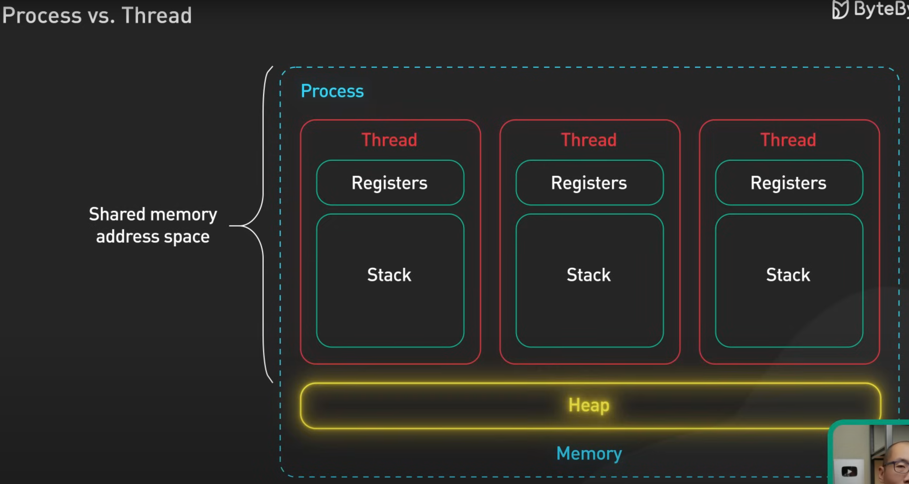

## ***1. Thread versus Task***

In C#, both `Thread` and `Task` are used for concurrent and asynchronous programming, but they serve different purposes and have distinct characteristics. Here’s a detailed comparison and examples to illustrate their differences and use cases:

### **Threads**

- **Definition**: A `Thread` represents a separate path of execution in the application. It is a low-level construct for parallel execution.
- **Usage**: Typically used when you need precise control over the execution of code in parallel, such as setting thread priorities, managing thread lifetimes, or performing thread synchronization.
- **Advantages**: Offers fine-grained control over threading behavior.
- **Disadvantages**: More complex to manage, can be resource-intensive, and lacks built-in support for the async/await pattern.

**Example**:

```csharp
using System;
using System.Threading;

public class Program
{
    public static void Main()
    {
        Thread thread = new Thread(PrintNumbers);
        thread.Start();
        
        for (int i = 1; i <= 5; i++)
        {
            Console.WriteLine($"Main thread: {i}");
            Thread.Sleep(500);
        }
        
        thread.Join(); // Wait for the thread to finish
    }

    public static void PrintNumbers()
    {
        for (int i = 1; i <= 5; i++)
        {
            Console.WriteLine($"Background thread: {i}");
            Thread.Sleep(1000);
        }
    }
}
```

In this example, a new `Thread` is created to run the `PrintNumbers` method concurrently with the main thread.

### **Tasks**

- **Definition**: A `Task` represents an asynchronous operation that can be awaited and managed by the Task Parallel Library (TPL). It is a higher-level abstraction over threads.
- **Usage**: Typically used for asynchronous programming, especially when combined with the async/await pattern. It simplifies writing concurrent and parallel code.
- **Advantages**: Easier to use and manage, integrates well with async/await, supports continuation tasks, and provides better resource management.
- **Disadvantages**: Less control over low-level thread behavior.

**Example**:

```csharp
using System;
using System.Threading.Tasks;

public class Program
{
    public static async Task Main()
    {
        Task task = PrintNumbersAsync();
        
        for (int i = 1; i <= 5; i++)
        {
            Console.WriteLine($"Main thread: {i}");
            await Task.Delay(500);
        }
        
        await task; // Wait for the task to complete
    }

    public static async Task PrintNumbersAsync()
    {
        for (int i = 1; i <= 5; i++)
        {
            Console.WriteLine($"Task: {i}");
            await Task.Delay(1000);
        }
    }
}
```

In this example, a `Task` is created to run the `PrintNumbersAsync` method asynchronously, allowing the main thread to continue executing other code and await the task's completion.

### **Key Differences**

| Feature              | Thread                                        | Task                                      |
|----------------------|-----------------------------------------------|-------------------------------------------|
| **Definition**       | Represents a separate path of execution       | Represents an asynchronous operation      |
| **Abstraction Level**| Low-level                                     | High-level                                |
| **Control**          | Fine-grained control over threading behavior  | Managed by the Task Parallel Library (TPL)|
| **Ease of Use**      | More complex to manage                        | Easier to use with async/await            |
| **Resource Management** | Manual handling                           | Managed by the runtime                    |
| **Continuation Support** | No built-in support                       | Supports continuation tasks               |
| **Integration**      | Not integrated with async/await               | Integrated with async/await               |

### **When to Use Each**

- **Use `Thread`**: When you need precise control over thread execution, such as setting priorities or handling thread synchronization manually.
- **Use `Task`**: When you need to perform asynchronous operations, especially when using the async/await pattern. Tasks are generally preferred for most concurrent and asynchronous programming scenarios due to their ease of use and better resource management.

By understanding the differences between `Thread` and `Task`, you can choose the appropriate tool for your specific needs in concurrent and asynchronous programming in C#.

## ***2. Process Versus Thread***

In C#, both processes and threads are used for concurrent execution, but they serve different purposes and have distinct characteristics. Here’s a detailed comparison along with examples to illustrate their differences:



### **Processes**

- **Definition**: A process is an instance of a running application. It has its own memory space, system resources, and execution context. Processes are isolated from each other, which ensures stability and security.
- **Usage**: Suitable for running multiple instances of an application or performing isolated tasks that do not need to share memory.
- **Communication**: Inter-process communication (IPC) mechanisms like pipes, sockets, or shared memory are required to share data between processes.
- **Overhead**: Creating a process has a higher overhead compared to creating a thread, as it involves allocating separate memory and resources.

**Example**:

```csharp
using System;
using System.Diagnostics;

public class Program
{
    public static void Main()
    {
        Process process = new Process();
        process.StartInfo.FileName = "notepad.exe";
        process.Start();

        Console.WriteLine("Notepad started. Press any key to exit.");
        Console.ReadKey();
        
        if (!process.HasExited)
        {
            process.Kill(); // Terminate the process
        }
    }
}
```

In this example, a new process is started to run the Notepad application.

### **Threads**

- **Definition**: A thread is a smaller unit of execution within a process. Multiple threads within the same process share the same memory space and resources.
- **Usage**: Suitable for performing multiple tasks within the same application, especially when tasks need to share data.
- **Communication**: Threads within the same process can easily share data through shared memory.
- **Overhead**: Creating a thread has a lower overhead compared to creating a process, as threads share the same memory and resources.

**Example**:

```csharp
using System;
using System.Threading;

public class Program
{
    public static void Main()
    {
        Thread thread = new Thread(PrintNumbers);
        thread.Start();

        for (int i = 1; i <= 5; i++)
        {
            Console.WriteLine($"Main thread: {i}");
            Thread.Sleep(500);
        }

        thread.Join(); // Wait for the thread to finish
    }

    public static void PrintNumbers()
    {
        for (int i = 1; i <= 5; i++)
        {
            Console.WriteLine($"Background thread: {i}");
            Thread.Sleep(1000);
        }
    }
}
```

In this example, a new thread is created to run the `PrintNumbers` method concurrently with the main thread.

### **Key Differences**

| Feature             | Process                                      | Thread                                        |
|---------------------|----------------------------------------------|----------------------------------------------|
| **Definition**      | Independent running instance of an application | Smaller unit of execution within a process    |
| **Memory Space**    | Separate memory space                         | Shared memory space within the process       |
| **Isolation**       | Isolated from other processes                 | Not isolated, shares resources with other threads in the process |
| **Communication**   | Requires IPC mechanisms                       | Shares data through shared memory            |
| **Overhead**        | Higher overhead for creation and management   | Lower overhead for creation and management   |
| **Usage**           | Running multiple instances of applications    | Performing multiple tasks within the same application |

### **Summary**

- **Processes**: Use when you need isolated execution environments, such as running multiple instances of applications. Processes have separate memory and resources, which ensures stability and security but comes with higher overhead.
- **Threads**: Use when you need concurrent execution within the same application, such as performing multiple tasks that need to share data. Threads share the same memory and resources, which makes them more lightweight but requires careful synchronization.

By understanding the differences between processes and threads, you can choose the appropriate mechanism for your specific use case in C#.
